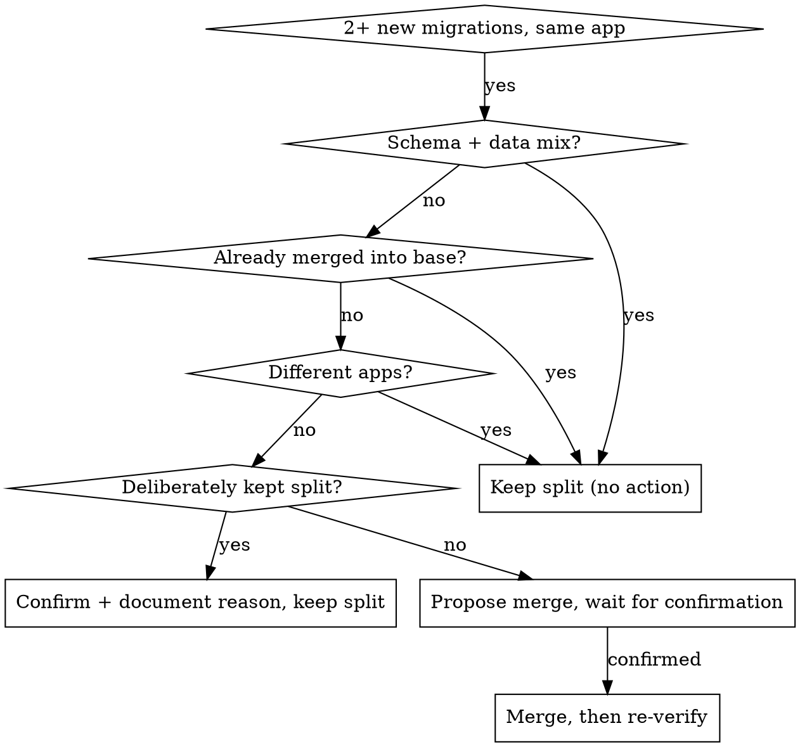

# Django Migration Standards

## One Migration Per Task

A "task" is the set of new files under `apps/<app>/migrations/` that exist in the current branch but not at its base — one ticket, one branch, per `.claude/rules/branching.md`. Scope is **per app, per branch**: a task adding tables in two different steps of a plan must still land as one migration file per app, not one file per step.

### Decision at a glance



The three "keep split" leaves are the **silent exceptions** below — no proposal, no question. "Deliberately kept split" is the **HITL exception** — allowed, but only with a stated reason and explicit confirmation. Everything else funnels into the propose-and-wait flow.

### Detection — run live, every time

**Invariant:** identify every migration file this task has introduced, using both repository history and the working tree — neither alone is sufficient. Always recompute the task base fresh before checking for redundant migrations; a base resolved earlier in the session is not safe to reuse once a rebase has happened.

The commands below are one way to satisfy that invariant — not the only implementation, but the one that works reliably today.

1. Resolve the actual tracked base, not a hardcoded `dev`:
   ```bash
   git rev-parse --abbrev-ref --symbolic-full-name @{u}
   ```
   Fall back to the base branch named in the task/ticket (per `branching.md`) if there is no upstream configured yet. If there is also no ticket (an ad-hoc demo/spike/training branch, not real feature or fix work), fall back to `dev` — the same default `branching.md` gives new feature work with no discovered-bug signal — and say explicitly that you're guessing the base because neither an upstream nor a ticket was available.
2. Diff new migration files since the merge-base:
   ```bash
   git merge-base HEAD origin/<base>
   git diff --name-status --diff-filter=A <merge-base>..HEAD -- 'apps/*/migrations/*.py'
   ```
3. Also check the working tree — a committed-only diff misses migrations that haven't been committed yet:
   ```bash
   git status --porcelain -- 'apps/*/migrations/*.py'
   ```
4. Group the combined result by app. Any app with **2 or more** new migration files is a trigger.

### Default action — always propose, HITL by default

Never auto-merge silently. When a trigger fires:

1. Show the redundant files' operations and a proposed single combined file (operations concatenated in original order).
2. Name the merged file using the lowest of the deleted files' numeric prefixes, followed by a concise, deterministic, snake_case description of the combined operations (e.g. two files `0006_addfielda.py` and `0007_addfieldb.py` merging `CreateModel('DemoWorkshopA')` and `CreateModel('DemoWorkshopB')` could become `0006_demoworkshopa_demoworkshopb.py`). Django's own generator naming isn't fully deterministic either, so don't promise to reproduce exactly what `makemigrations` would have generated — just keep your own choice stable: merging the same pair of files must always produce the same name.
3. Wait for explicit user confirmation before applying anything.
4. On confirmation: write the merged file, delete the redundant originals, renumber if the deleted files' numbers left a gap, and update `max_migration.txt` to the merged file — reuse the exact renumbering/`max_migration.txt` correction procedure already documented in `branching.md`'s "if you branched from the wrong place" section.
5. Before applying, inspect and repair any `dependencies` entries — in this app or others — that reference a file being deleted or renumbered. This is rarely a plain rename: watch for squashed migrations, `swappable_dependency` entries, and (occasionally) circular references between apps. Don't leave a dangling `('app', 'deleted_migration_name')` dependency.
6. Before running the verification protocol, mentally reconstruct the affected app's migration graph — numbers and `dependencies` in sequence — and confirm it's still a single valid chain with no gaps and nothing pointing at a file that no longer exists. Do this before applying, not after something fails to migrate.
7. Re-run the verification protocol (below) after merging.

**Do not use `python manage.py squashmigrations` for this.** That command collapses migrations that are already merged into a shared branch's history — a distinct, higher-risk operation with its own review process. This rule is about a task's *own, not-yet-shared* migrations; the fix is a plain hand-merge into one new file.

### Silent exceptions — do not propose a merge, do not ask

These are already settled by other rules; asking would just be noise:

- The files span a schema migration and a data (`RunPython`) migration — see **Data vs Schema Migrations** below. Keep them split, schema first.
- One of the files was already merged into the base branch before this task started — never rewrite shared history.
- The files belong to different apps.

### HITL exception — deliberately keeping same-app, same-type files split

Sometimes two same-app migrations of the same kind (both schema-only, or both data-only) genuinely need to stay separate — e.g. one is an explicit `dependencies` target that another app's migration graph points at, or the rollout is deliberately staged. This is allowed, but only via explicit confirmation:

1. State the concrete reason.
2. Ask the user to confirm keeping them split.
3. Record the reason in both files' module docstrings so the next reader (or reviewer) doesn't re-flag it.

## Data vs Schema Migrations

Never combine a schema change and a data change (`RunPython`) in the same migration file. If a task needs both, create two files — schema first, data second. This keeps rollbacks clean and avoids partial-apply failures.

## Data Migration Best Practices

- Always use `Model._base_manager` inside `RunPython` — never `Model.objects` or a custom manager like `active_objects`. The historical model from `apps.get_model()` doesn't expose custom managers unless they declare `use_in_migrations = True` (this repo never does), and the default manager can still filter (e.g. `is_active=True`) and silently miss rows. `_base_manager` is the only manager that is both always available and unfiltered.
- No raw SQL (`cursor.execute`, `connection.execute`, `RawSQL`) — Django ORM only. If raw SQL is truly necessary, flag it to the user first.
- Check existing data migrations in `apps/*/migrations/` for patterns before writing a new one.
- When lazy-loading models via `apps.get_model()`, assign to a variable named `_<ActualModelName>` (e.g. `_Degree = apps.get_model('core', 'Degree')`), then query via `_Degree._base_manager`.
- Every migration file **containing `RunPython`** starts with a module-level docstring describing what it does, followed by one blank line before the imports. One line if it fits within 120 chars; wrap at 120 otherwise.
- No inline `#` comments anywhere in a migration file — use the docstring.
- Pure schema-only files (`CreateModel`, `AddField`, `AlterField`, etc. — no `RunPython`) are exempt from the docstring rule: keep Django's default auto-generated `# Generated by Django ... on ...` header as-is, matching every other schema-only migration already in the repo. Don't add a custom docstring to a file that has no data logic to explain.

## `max_migration.txt` (MANDATORY — enforced by `django-linear-migrations`)

Every new migration file must be paired with an update to `apps/<app>/migrations/max_migration.txt`, or `python manage.py check` fails with `dlm.E004`.

- The file contains exactly one line: the newest migration's filename without `.py`.
- When adding multiple migrations to one app in one change, point it at the **highest-numbered** new file only.
- Not optional — treat it as part of writing the migration, same as `__init__.py` is part of a package.

## Migration Crash Safety & Logging

- Wrap row-level operations in a data migration in try/except so one bad row doesn't abort the whole migration.
- Log every data migration's outcome: success count, skipped count, error count.
- Use the `logging` module with the `hrdb` logger **and** `print()`, so output appears in both application logs and the migration runner's stdout:
  ```python
  import logging

  logger = logging.getLogger("hrdb")

  def forward_fn(apps, schema_editor):
      """Describe what this migration does."""
      success, skipped, errors = 0, 0, 0
      summary = f"Migration complete: {success} updated, {skipped} skipped, {errors} errors"
      logger.info(summary)
      print(summary)
  ```
- If `errors > 0`, log each failed row's PK and reason at `logger.warning` so it can be investigated post-deploy.

## Reversibility & Testing

- Every migration must be reversible unless genuinely impossible. Irreversible migrations use `dummy_reverse` from `common.utils` as the reverse function — never a bespoke `noop`. Example: `migrations.RunPython(forward_fn, dummy_reverse)`. State *why* it's irreversible in the module docstring.
- Supply a real `reverse_code` on `RunPython` whenever a meaningful inverse exists. Fall back to `dummy_reverse` only when the forward operation is genuinely one-directional (a destructive backfill, an external side effect that can't be undone).

### Mandatory verification protocol

Run these, in order, against the **local dev database** (the real Postgres DB `manage.py migrate` already targets via `local_settings.py`) — never rely on the test suite for this, see the gotcha below.

```bash
python manage.py makemigrations --check --dry-run
python manage.py check
python manage.py migrate <app> <migration_before_this_task>
python manage.py migrate <app> <new_migration>       # confirm no crash forward
python manage.py migrate <app> <migration_before_this_task>   # confirm no crash reverse
```

For data migrations, the final reverse step should also confirm `dummy_reverse` no-ops cleanly rather than silently discarding state that a real reverse would have restored — if the reverse should actually restore something, it needs real `reverse_code`, not `dummy_reverse`.

### Repo-specific gotcha — the test suite does not validate migrations

`hrdb/test_settings.py` sets `TEST: {"MIGRATE": False}`. This means `manage.py test` builds the test database schema **directly from `models.py`**, bypassing every migration file entirely. A green test suite is not evidence that a migration is correct, reversible, or even applies cleanly — only the verification protocol above (run against a real, non-test database) proves that. There is also no CI step that runs `makemigrations --check --dry-run` (migrations are explicitly excluded from lint/Sonar in `.gitlab-ci.yml`) — this protocol is the only check that exists.
