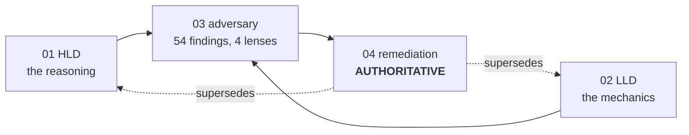
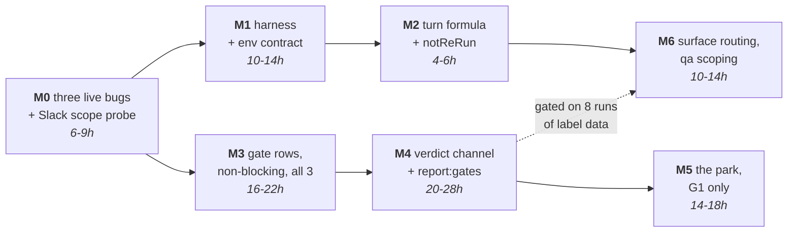

# Human gates for Oneshot — design set

Four documents. Written 2026-09-01 by a design fleet: five grounding readers over this repo, three
competing high-level designs judged by two adversarial judges, three low-level design authors, four
red teams, one remediation pass. Every empirical claim was replayed against `state/oneshot.db` and
the run journals before it was allowed to stand.

**Diagram 0 — how the four documents relate.** 01 and 02 are the design as proposed; 03 is what four
red teams did to it; 04 is the ruling and wins wherever it disagrees.

**Read in this order.**

| # | File | What it is |
|---|---|---|
| 1 | `01-hld.md` | The high-level design: the gate model, the confidence model, the measurement system, durability, the human channel, the UI-verification plan, the beads/Gastown ruling. |
| 2 | `02-lld.md` | The low-level design in three parts: core mechanics (tables, seam, reject path, skill call graph), the human channel (Slack tokens, scopes, grammar, poller), and the UI-verification programme. |
| 3 | `03-adversary-findings.md` | 54 findings from four red teams: distributed-systems, security, measurement validity, operator ROI. |
| 4 | `04-remediation-and-build-order.md` | **Authoritative.** Rulings on all 54, the design changes, the open-loophole register, the build order, and the four decisions. Supersedes 1 and 2 where they conflict. |

## What the review changed

Three of the four red teams independently replayed the confidence and risk scorers against the four
runs that reached the gated phases, and found the same thing: **confidence reads `high` on 12 of 12
historical gate opportunities and risk saturates at its floor on every ticket.** The 3×3 policy
matrix has roughly one reachable cell. Consequences:

- **Confidence-gated asking is replaced by randomized assignment** during calibration — one declared
  probability in `config/gates.json`, plus one non-random override (the high-scrutiny path floor,
  which always asks and always blocks). C and R survive as *predictions to be scored*, never as the
  assignment rule.
- **All three interventions are built. The park is deferred.** Every boundary writes a gate row and
  posts a real ask on a real channel with an authenticated verdict (M3–M4). Blocking the run costs
  ~30 of the ~85 hours and produces zero rows, so it lands at M5 — informed by what the first
  verdicts actually say. The cost of that deferral is stated plainly in §8(b) and in loophole 3.
- **A verdict may add, never subtract.** A gated phase runs `bypassPermissions` with unguarded Bash
  on the same filesystem as the state DB, so a session can forge its own approval. The fix that
  works is removing the incentive: a verdict can add a finding, add a case, or reject — it can never
  suppress a blocker or drop a case from `qualityGate()`'s operands.
- **The park, when it ships, is a phase-list invariant**, not a status flag: no phase may be stepped
  over while a gate row names it with no `applied_at`. A status on a non-atomically written journal
  desynchronises on a hard SIGINT, a boot reap, or the `rm -rf state/` that `src/lib/db.ts:2` blesses.

## Build order

| M | What | Hours | Blocking? |
|---|---|---|---|
| M0 | Three live bugs: heartbeat off `tick()`, sleep-discontinuity reap guard, atomic journal/artifact writes. Plus the one-hour Slack scope probe. | 6–9 | ships first regardless |
| M1 | The Playwright harness + the env contract. The measured 300→75 turn drop, made deliberate. | 10–14 | — |
| M2 | Turn formula scaled by case count; mandatory `notReRun[]`. | 4–6 | — |
| M3 | Gate rows for all three gates, non-blocking, with asks posted. | 16–22 | no park |
| M4 | The verdict channel, the desk review surface, `npm run report:gates`. | 20–28 | no park |
| M5 | The park — G1 only, behind the phase-list invariant and randomized assignment. | 14–18 | the park |
| M6 | `surface` routing, qa scoping, ui-evidence curation. | 10–14 | after ≥8 runs of label data |

M0–M4 = 56–79 h for the complete dataset. Through M5 = 70–97 h for the full stated ask.

**Diagram 4 — build order and what depends on what.** M0 is three bugs live in the shipped system
today; two of them corrupt any gate data collected before they land, which is why nothing else may go
first. M1–M2 are the UI-verification programme and need no human anywhere.

## The decisions that are yours

1. **Is the requirement "measure my four skills" or "a human must be able to stop a bad plan"?**
   If the second, M5 moves ahead of M4 and the estimate grows. See §8(b).
2. **Volume.** Seven runs exist, all inside one 25-hour burst. At that rate the instrument needs
   months before any threshold legitimately moves. See §10 of the HLD.
3. **A second rater for G3.** You write the skills, run the pipeline and supply every label. The
   report prints `raters=1` on every page and cannot be silenced until that changes.
