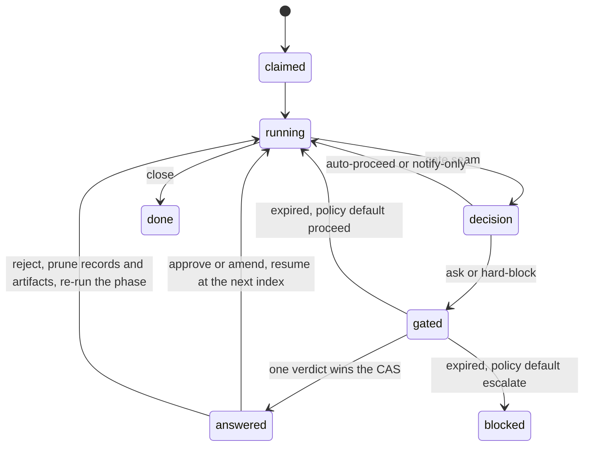
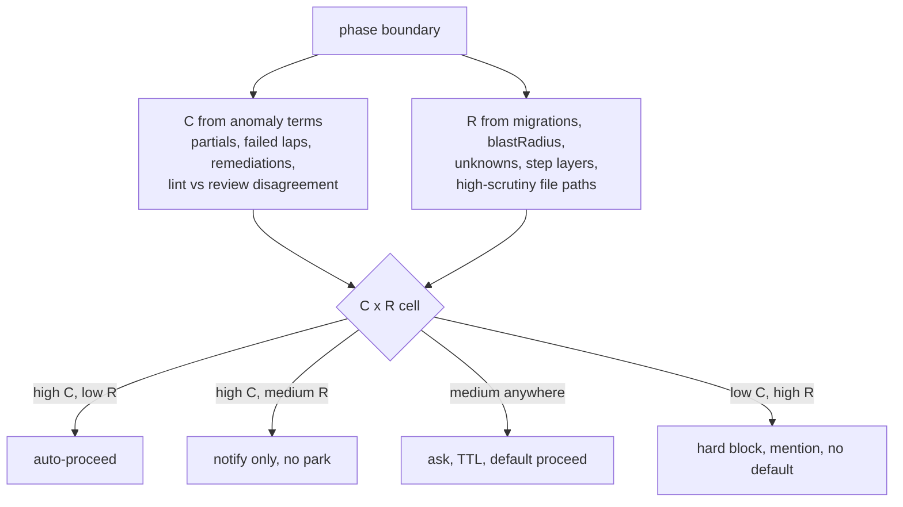

<!-- Deliverable 1 of 2. Written 2026-09-01. -->
> **Status:** superseded in parts by `04-remediation-and-build-order.md`, which is the
> authoritative ruling after the adversarial review. Read this for the reasoning; read 04 for
> what is actually being built. The rulings that overturn sections here are marked in 04 §2.

# Confidence-Gated Human Intervention in Oneshot — High-Level Design

*All paths are under `/Users/hassam.azam/Documents/oneshot/`. Citations are given in full.*

## 1. Thesis and the single invariant

Three human gates are being added to a pipeline whose entire value proposition is that nobody watches it. If they are built as approval checkpoints they will cost Hassam hours and return latency. Built correctly they are an instrument: each interruption emits a labelled comparison between what the machine believed and what a human judged, and that dataset is what eventually lets the gates retire themselves. The machinery required is small — Oneshot already parks runs, already releases leases on a terminal status, already resumes from a journal with full phase history — so the design is almost entirely reuse. What is missing is a *reason to stop that is not a failure*, a durable home for the question, and a verdict payload rich enough to be worth collecting.

**The invariant everything follows from: a gate is a park, never a hold. A gated run holds no dispatch slot, no port lease, no promotion lease, and no conductor liveness; the gate row is the lock and the verdict lives outside every process.** From this single rule follows the seam (conductor-side, not inside a session), the new run status (`gated`, not `blocked`), the lock mechanism (`isClaimed(iid) || gateOpen(iid)`), the transport (polling, not Socket Mode), the warm-server treatment (a preemptible cache, not a lease), and the placement (all three gates before `verify`).

**Spine and grafts.** The chassis is *minimal-seam* — it is the only candidate whose claim/liveness mechanics survive reading `/Users/hassam.azam/Documents/oneshot/src/lib/db.ts:216` and `:433`, where both `activeRunsFleet()` and `isClaimed()` filter on a *live* owner, so a parked run outlives its conductor and returns to the watcher board unless the gate row itself is the lock. Into that chassis go *evidence-economy*'s instrument (set-difference verdicts, `skill_sha`, Wilson bounds, outcome-based rater reliability) and *async-throughput*'s throughput discipline (preemptible warm lease, one timeout-default per pipeline, a holdout sample).

## 2. What changes and what does not

| # | Phase | Touched | How |
|---|---|---|---|
| 0 | recall | no | `recall.priorTickets[]` overlap feeds the risk score, read-only |
| 1 | research | no | `unknowns[]` / `blastRadius[]` feed risk, read-only |
| 2 | plan | **yes** | **G1** fires at the boundary after it |
| 3 | implement | **yes** | effort threaded per-run; no gate; scored by consequence |
| 4 | testcases | **yes** | **G3**; schema gains `surface`; human ratifies `blast` |
| 5 | review | **yes** | **G2**; subagent count scales with risk; sub-threshold findings spawn issues |
| 6 | verify | **yes** | `maxTurns = base + perCase × n`; surface routing; warm server; shared harness |
| 7 | ui-evidence | **yes** | reuses the warm server; teardown contradiction fixed |
| 8 | mr | no | — |
| 9 | merge | **no, permanently** | gate-free by hard rule |
| 10 | deploy | **no, permanently** | gate-free by hard rule |
| 11 | qa | **yes** | `notReRun[]` in the artifact if the approved list is subsetted |
| 12 | demo | no | — |
| 13 | memorize | optional | memory-card compaction (a beads steal) |
| 14 | document | no | — |
| 15 | close | no | — |

**Files that change:** `src/lib/db.ts` (gates table, `gateOpen`), `src/conductor/runner.ts` (the seam, `gated` status, park/resume), `src/conductor/watcher.ts` (claimability), `src/index.ts` (heartbeat off `tick()`, `reconcileGates`), `src/lib/artifacts.ts` (atomic writes, `gatedOn`), `src/lib/slack.ts` (+`conversations.replies`), `src/conductor/schemas.ts` (+`surface`, `notReRun`), `scripts/unblock.ts` (the shared pruner), `config/phases.json`, `config/slack.json`, `src/phases/prompts.ts`, `skills/local-browser-verify/SKILL.md`. **New:** `src/lib/gates.ts`, `scripts/gate.ts`, `scripts/export-gates.ts`, `skills/local-browser-verify/scripts/harness.js`.

## 3. The gate model

A gate cannot live inside a session. A phase that waits dies on `cfg.timeoutMin` (`/Users/hassam.azam/Documents/oneshot/src/conductor/phase.ts:250`; `plan` gets 20 minutes at `/Users/hassam.azam/Documents/oneshot/config/phases.json:26`), burns turns polling (`/Users/hassam.azam/Documents/oneshot/src/conductor/phase.ts:273`), and is denied the very write that would record its verdict the moment the operator pauses (`/Users/hassam.azam/Documents/oneshot/hooks/pause-check.cjs:25`).

**The seam is one place:** `/Users/hassam.azam/Documents/oneshot/src/conductor/runner.ts:697`–`:703`, between `publishPending` and the abort check. By then every artifact is on disk, `prior[]` is populated, and `publishPending` has already put the plan and the case list on the GitLab ticket the human will read (`/Users/hassam.azam/Documents/oneshot/src/lib/publish.ts:177`, `:195`). A gate emits the existing `Control` union (`/Users/hassam.azam/Documents/oneshot/src/conductor/runner.ts:258`) — no new control primitive.

**Three questions, two parks.** G1 fires after `plan` (n=2). G2 and G3 fire together after the `check` group, because `testcases` and `review` are one contiguous parallel group joined once at `/Users/hassam.azam/Documents/oneshot/src/conductor/runner.ts:522` and reconciled once at `:642`–`:688` (`/Users/hassam.azam/Documents/oneshot/config/phases.json:42`, `:50`). One card carries both artifacts and collects both verdicts. On a later review lap the group degrades to `review` alone (`/Users/hassam.azam/Documents/oneshot/config/phases.json:51`); G3 is not re-asked because `gate_id = sha1(iid | gate | sha256(artifact bytes))` re-derives the same, already-applied row.

All three sit before `verify` (n=6), the first `needsPort` phase (`/Users/hassam.azam/Documents/oneshot/config/phases.json:61`), and before the promotion window that opens at `merge`. **No gate may ever sit at or after `merge`**: a park there freezes every conductor's merge→deploy→qa window (`/Users/hassam.azam/Documents/oneshot/src/lib/promotion.ts:86`) and `holdIfUnattributed` writes `state/PAUSE-DEPLOY` on reclaim (`/Users/hassam.azam/Documents/oneshot/src/lib/promotion.ts:241`), halting the fleet.

**Run states.** Today `claimed|running|blocked|done|aborted` (`/Users/hassam.azam/Documents/oneshot/src/lib/db.ts:27`). Add `gated`. It cannot reuse `blocked`: `BLOCK_COOLDOWN_MS` refuses re-claim for 60 minutes (`/Users/hassam.azam/Documents/oneshot/src/conductor/runner.ts:90`, `:245`), so a five-minute answer would wait fifty-five, and the `Needs Human` swap makes the watcher skip the ticket forever (`/Users/hassam.azam/Documents/oneshot/src/conductor/watcher.ts:67`).

```
                    ┌──────────────────────────────────────────────┐
  claimed ─► running ─► [seam runner.ts:697]                        │
                    │      │                                        │
                    │      ├─ auto/notify ──────────► advance ──────┘
                    │      └─ ask/block
                    │           │
                    │      finish(j,'gated'):  port reaped+released (runner.ts:1290)
                    │                          promotion released  (runner.ts:1292)
                    │                          worktree KEPT       (runner.ts:1340)
                    │                          Loop label KEPT, no cooldown
                    ▼
                 GATED ── gate row state='open' ──► reconcileGates()
                    │         │                        ├─ GitLab note (ask_note_id)
                    │         │                        └─ Slack thread (ask_ts)
                    │         │
                    │    verdict lands (Slack reply | GitLab note | scripts/gate.ts)
                    │         │  CAS: UPDATE gates SET verdict=… WHERE gate_id=? AND state='open'
                    │         ▼
                    │     ANSWERED ──► watcher sees gateOpen()=false ──► claimTicket
                    │         │        decideResume('gated') = resume, same runId, full history
                    │         ├─ approve/amend ──► resume at next index
                    │         └─ reject ────────► prune records + delete artifacts
                    │                             (unblock.ts:241-253 doomed/artifactsOf)
                    │                             resume re-runs exactly what was pruned
                    ├─ expires_at, policy default = proceed ──► resume (counts against the
                    │                                            one-timeout-per-pipeline cap)
                    ├─ expires_at, policy default = escalate ─► blocked + @mention
                    └─ operator abort ──► aborted (gate row survives, re-asked on resume)
```

**Diagram A — the run lifecycle as originally designed.** The same machine as the ASCII art above, drawn properly.

> Superseded by `04` §2: the `aborted` re-ask edge is deleted as false (resume enters at i=0 and
> `shouldSkip` walks past every `ok` record), the park moves behind a loop invariant, and G2/G3 stop
> parking at all. See Diagram 1 in `04` for what is actually being built.



**The lock while parked is the gate row, not the run row.** `isClaimed()` (`/Users/hassam.azam/Documents/oneshot/src/lib/db.ts:433`) gains one clause: `OR gateOpen(iid)`. Because `activeRowsFor` filters to `claimed|running` with a live owner (`/Users/hassam.azam/Documents/oneshot/src/lib/db.ts:304`), a `gated` row is already invisible to both `isClaimed()` and `activeRunsFleet()` — so the ticket stops consuming a fleet slot the moment it parks, and the `gateOpen` clause keeps it off the watcher's candidate list (`/Users/hassam.azam/Documents/oneshot/src/conductor/watcher.ts:73`) without requiring the asking conductor to stay alive. The instant the gate is answered the ordinary watcher path re-offers the ticket; any conductor, including one booted after a reboot, picks it up. This deletes the need for a second dispatch path that would bypass `freeSlots()`, `quotaParked()`, the PAUSE check and the abort signal at `/Users/hassam.azam/Documents/oneshot/src/index.ts:250`–`:270`.

**A reject is not a phase failure.** Routing it through `afterFailure()` (`/Users/hassam.azam/Documents/oneshot/src/conductor/runner.ts:844`) would spend `maxLaps` and mislabel the record. Nor may it use `forced.add` — `forced` is an in-memory `Set` rebuilt per `runTicket` (`/Users/hassam.azam/Documents/oneshot/src/conductor/runner.ts:406`) that evaporates on the park. A reject **deletes phase records and their artifacts**, and it does so through `scripts/unblock.ts`'s existing `doomed` / `artifactsOf` logic (`/Users/hassam.azam/Documents/oneshot/scripts/unblock.ts:198`, `:241`) as the single pruner. Pruning records without deleting artifacts resumes into a stale artifact wearing a green record — the exact run #16 shape that reached `merge` as two false fails.

## 4. Confidence, risk, and effort

**The agent never reports its own confidence.** Phase schemas are `additionalProperties:false`, so it cannot smuggle a field in, and thresholds are never printed into a prompt. The conductor computes both scores from artifacts already on disk.

The first thing to say is what does *not* work. Effort fraction has no dynamic range on the three gated phases: in `state/oneshot.db` `phase_runs`, `plan` used 19/23/18/14 turns against a cap of 50 (`/Users/hassam.azam/Documents/oneshot/config/phases.json:25`), `review` 43/41/37/30 against 70 (`:49`), `testcases` 15/28/24/23 against 40 (`:41`). Cap exhaustion is a `verify` phenomenon and `verify` is ungated. Worse, `/Users/hassam.azam/Documents/oneshot/src/lib/report.ts:19` already documents that `turns` is untrustworthy here, and three `turns=0` records exist on sessions that did real work. **So turn fraction is not the confidence axis. A zero or absent turn count is treated as UNKNOWN and forces a gate; it never reads as high confidence.**

| Axis | Terms (all existing) |
|---|---|
| **Confidence C** | *Anomaly terms (machine-measured, agent cannot lower):* existence of `<phase>-partial.json` (`/Users/hassam.azam/Documents/oneshot/src/conductor/runner.ts:594`) → C floored; `failedLapsOf` (`/Users/hassam.azam/Documents/oneshot/src/lib/artifacts.ts:165`); `journal.remediations[].category` and `.fixed` (`/Users/hassam.azam/Documents/oneshot/src/lib/artifacts.ts:53`); `turns`/`weighted` used only as a *floor-setter*, and only when non-zero. *Corroboration terms:* `recall.priorTickets[].gotchas[]` overlap (`/Users/hassam.azam/Documents/oneshot/src/conductor/schemas.ts:52`) and `plan.reuse[]` (`:84`) raise C; at G2, `findings.verdict` (`:147`) is written by a different session than `implement.lintClean` (`:141`), and disagreement between them lowers C — the same cross-check `qualityGate()` already uses as a merge veto (`/Users/hassam.azam/Documents/oneshot/src/conductor/codephases.ts:819`). |
| **Risk R** | `plan.migrations` (`/Users/hassam.azam/Documents/oneshot/src/conductor/schemas.ts:99`); `plan.risks[]` (`:100`); `research.blastRadius[]` (`:77`); `research.unknowns[]` (`:78`); `plan.steps[].layer` (`:94`); **at G1, `plan.steps[].files`** — not `implement.filesChanged[]`, which does not exist yet at n=2 — intersected with the ERP's own high-scrutiny set (`apps/auth/`, `common/permissions.py`, payroll, leaves); at G2/G3, blocker/major `findings[].severity` (`:155`) and high-`blast` case count (`:126`). |

| C \ R | **Low** | **Medium** | **High** |
|---|---|---|---|
| **High** | auto-proceed (holdout-sampled) | notify-only, no park | ask · 4h · default **proceed** |
| **Medium** | notify-only | ask · 4h · default **proceed** | ask · 8h · default **escalate** |
| **Low** | ask · 4h · default proceed | ask · 8h · default escalate | **hard-block**, no default, `@mention` |

**Diagram B — how a boundary was to be classified.**

> **Deleted by `04` §2.** Replayed against the four real runs, C reads `high` on 12 of 12 gate
> opportunities and R saturates at its floor on 4 of 4, so exactly one cell is reachable. Replaced by a
> single declared `askProbability` plus one non-random `riskFloor` override. C and R survive only as
> predictions that get scored.



**Anti-gaming is structural, not procedural.** Agent-authored fields are *monotone raise-only*: declaring more unknowns or more risks can only increase oversight and effort, never decrease it. The cheap cells are reachable only via machine-measured anomaly terms plus file-path triggers the agent does not control — any plan step touching `apps/auth/`, `common/permissions.py`, payroll or leaves forces R=high regardless of what the plan says about itself. Under-declaring is therefore the only exploitable direction, and it is the direction the measurement system punishes hardest: an under-declared plan that a human rejects, or that later produces `verify.regressions[]` (`/Users/hassam.azam/Documents/oneshot/src/conductor/schemas.ts:186`), is the largest calibration penalty available.

**Effort scales off the same pair, and never through `config/models.json`.** `/Users/hassam.azam/Documents/oneshot/config/models.json:13` states overrides are for one-off experiments and must stay empty, and `modelFor()` re-reads the file on every call (`/Users/hassam.azam/Documents/oneshot/src/lib/config.ts:237`) — a runtime write would be a shared global across three conductors that silently re-tiers a concurrent run and corrupts `PhaseRecord.model`, the very telemetry the confidence model reads. Effort is a **per-run value threaded through the `PhaseConfig` handed to `phase.ts`**: a tier override (`review`/`ui-evidence` demote one step at high C + low R), reviewer subagent count (1→3 with R, against the three declared at `/Users/hassam.azam/Documents/oneshot/config/phases.json:55`), and `verify.maxTurns = base + perCase × cases.length` read from the approved list, replacing the flat 450 at `:58`. Note `/Users/hassam.azam/Documents/oneshot/config/budgets.json:11` has token ceilings off, so effort scaling buys wall clock and shared-window headroom, not a shorter budget.

## 5. The measurement system

**Each gate row records, immutably at ask time:** `gate_id`, `run_id`, `iid`, `gate`, `phase`, `artifact_sha`, **`skill_sha`** (the git sha of the skill file that produced the artifact — skills live under `~/Documents/erp/.claude` per `/Users/hassam.azam/Documents/oneshot/config/project.json:14` and change underneath the pipeline; a score not attributable to a version is a mixture), `confidence`, `risk`, `policy_cell`, `effort_granted`, `holdout` flag, `asked_at`, `ask_channel`, `ask_note_id`, `ask_ts`. **On answer:** `verdict`, `verdict_by`, `verdict_at`, `verdict_source_id`, `latency_ms`, and `deltas_json`.

**`deltas_json` is the point.** A thumbs-up on a review carries almost no information about review quality, and there are twelve gate-eligible artifacts in the whole history of this system. So verdicts are **set differences**: at G2 the human names which findings are noise and which defects the review missed; at G3 which cases were added, removed, or re-labelled (`blast` and `surface`). One 20-case list yields twenty labelled judgements from the same human minute instead of one bit — roughly a twentyfold increase in information per interruption, and information-per-gate is the binding constraint on the entire enterprise.

| Skill | Gate | Scored as |
|---|---|---|
| plan | G1 | approve-without-edits rate, conditional on risk band, plus edit distance over `plan.steps[]` |
| code review | G2 | **detection**: precision and recall of `findings[]` against the human's union |
| qa | G3 | **detection**: precision and recall of `cases[]`, plus label agreement on `blast`/`surface` |
| dev | none | **consequence only**: blocker/major findings per lap, `implement.addressedFindings[]` convergence, `verify.regressions[]`, `qa.verdict` (`/Users/hassam.azam/Documents/oneshot/src/conductor/schemas.ts:256`), `failedLapsOf('implement')` |

Say the asymmetry out loud in every report: **dev has no gate and is measured by consequence, weaker data than the other three.** Inventing a fourth gate in front of the most expensive phase in the pipeline would buy the worst data in the set.

**Validity.** *Anchoring:* the ask omits the computed C/R band, the policy cell, and the gate's own reasoning. It does **not** attempt to withhold the artifact's reasoning — `plan.approach` (`/Users/hassam.azam/Documents/oneshot/src/conductor/schemas.ts:88`) *is* the argument for the plan, and on a flat mrkdwn message (`/Users/hassam.azam/Documents/oneshot/src/lib/slack.ts:101`) there is no click to gate a reveal on. The achievable control is an omission, and it is free. *Rubber-stamping:* the primary detector is **outcome-based** — approvals later contradicted by `verify.regressions[]` or a `qa` fail are charged to a separate rater-reliability track, never to the skill. `latency_ms` is recorded and flagged but is **not** the primary detector and never down-weights a row to zero: over a polling transport it measures notification-to-attention, not deliberation. *Selection bias:* if gates fire only where C is low, the scores describe the agent at its worst and the auto-proceed cell is never observed. A **holdout** forces gates on decisions the machine would have taken alone. It must be *blocking* — a consequence-free label is drawn from a different psychological regime and cannot debias a blocking one — and it is budgeted as an **absolute count per week (2)**, not a percentage, so it is bounded in operator time and does not scale with run volume.

**Calibration period.** Phase 0: every gate asks, no auto cells, until 20 answered gates exist per skill. Given base rates below, that is weeks to months, not days — and the report must **refuse to render any score below its minimum n**.

**State the base rates, unprompted, in the first report.** Seven runs total: 1 done, 5 blocked, 1 aborted. `plan` ok 4/4, `review` ok 4/5, `testcases` ok 4/6, and every failure was *downstream* of the gates. The three requested gates sit on the three most reliable phases in the pipeline. That is not an argument against building them; it is the context without which any early number will be read as measuring something it cannot yet measure.

**Graduated autonomy, with catches.** Per `(skill, risk band)` — never pooled, because ticket difficulty is the dominant confound — hold a **Wilson lower bound** on clean-approval rate. When the LB clears a threshold over a declared minimum n, that cell relaxes exactly one step (hard-block → ask → notify → auto). Catches: any reject or downstream escape ratchets it back immediately (asymmetric by design — a false relaxation costs more than a redundant gate); auto cells are never exempt from the holdout; **at most one timeout-default per pipeline**, the second parks; and the ratio of timed-out to answered gates is a first-class health metric — above ~30% the gates are theatre and every score downstream of them is fiction. Confidence itself is scored with Brier plus a reliability diagram per C decile, rendered by a **new** `npm run report:gates` surface rather than inside `src/lib/report.ts`, whose stated scope deliberately omits cost and weight columns (`/Users/hassam.azam/Documents/oneshot/src/lib/report.ts:6`). And `npm run export:gates` appends closed rows to a git-tracked JSONL, because `state/oneshot.db` is declared deletable cache (`/Users/hassam.azam/Documents/oneshot/src/lib/db.ts:2`).

## 6. Durability

Three stores, three jobs. **GitLab holds the ask and the verdict** — it survives a `state/` wipe and is already authoritative. **SQLite holds coordination and dedupe**, treated as reconstructible because better-sqlite3 runs `synchronous=NORMAL`: durable against process death, not against power loss. **The journal holds a pointer only** (`gatedOn`).

Delivery is at-least-once with idempotent presentation; **application is at-most-once** via a single `BEGIN IMMEDIATE` CAS — `UPDATE gates SET verdict=… WHERE gate_id=? AND state='open'`, act only when `changes===1` — the shape already used by `releasePromotion` (`/Users/hassam.azam/Documents/oneshot/src/lib/promotion.ts:378`) and `reclaim`'s conditional delete (`:277`), plus `UNIQUE(verdict_source_id)`. There is **no outbox table: the gate row is the outbox**, exactly the reconcile-don't-queue argument at `/Users/hassam.azam/Documents/oneshot/src/lib/publish.ts:12`. `reconcileGates()` runs from `tick()` beside `heartbeat()` (`/Users/hassam.azam/Documents/oneshot/src/index.ts:247`) and at the phase boundary where `publishPending` already sits.

| Failure | Mechanism |
|---|---|
| VPN / GitLab down | `PAUSE-NETWORK` (`/Users/hassam.azam/Documents/oneshot/src/lib/reachability.ts:42`) blocks GitLab; Slack is on the public internet and unaffected. The ask retries free next tick because the row is the queue. GitLab half guarded by `netState()==='ok'` as `scan()` does (`/Users/hassam.azam/Documents/oneshot/src/conductor/watcher.ts:35`). |
| Slack down | `/Users/hassam.azam/Documents/oneshot/src/lib/slack.ts:55` degrades to the unconfigured shape; the GitLab note carries the ask. Both down past `expires_at` → policy default. |
| Sleep / reboot | Nothing waits in memory. Slack history and GitLab notes *are* the durable queue; the first tick after wake reads the backlog. This is the whole reason the transport is polling. |
| Conductor crash | The gate row is unowned and the ask is a GitLab note; any conductor reconciles. The run holds no port and no promotion lease, so `buryRow` (`/Users/hassam.azam/Documents/oneshot/src/lib/db.ts:323`) has nothing to strip. |
| Fleet (3 conductors) | All three poll; `INSERT OR IGNORE` on `verdict_source_id` plus the CAS makes application exactly-once — strictly better than Socket Mode's arbitrary single delivery. |
| Duplicate answers | Second answer fails the CAS, is stored as `superseded`, never applied. Edited Slack messages return the same `ts`; the bot replies that edits are not read. |

**Three prerequisites this design does not get to skip**, all independently correct. (i) **Heartbeat off `tick()`** — `heartbeat()` fires only from `/Users/hassam.azam/Documents/oneshot/src/index.ts:247` and `drain()`'s interval, so a `--ticket` run goes silent for hours, after which `conductorLive` is false (`/Users/hassam.azam/Documents/oneshot/src/lib/singleton.ts:56`) and a peer's `claimTicket` buries a live run's port lease and promotion lock (`/Users/hassam.azam/Documents/oneshot/src/lib/db.ts:350`). Fix: `setInterval(heartbeat, 15_000).unref()` armed in `main()`. (ii) **`reconcileForeignRuns` must refuse to reap across a wall-clock discontinuity** larger than 2×TTL, or the first boot after an eight-hour sleep buries every in-flight run on the machine. (iii) **Atomic writes** for `run.json` and artifacts — tmp + `renameSync` in `/Users/hassam.azam/Documents/oneshot/src/lib/artifacts.ts:116`, because a truncated journal reads as `null` and `decideResume` restarts the ticket from phase 0 without archiving (`/Users/hassam.azam/Documents/oneshot/src/conductor/runner.ts:238`).

## 7. The human channel

**Primary: a threaded reply under the existing per-ticket Slack card**, read by polling `conversations.replies(ask_ts)`; `slackTs` already survives restart on the journal (`/Users/hassam.azam/Documents/oneshot/src/lib/artifacts.ts:90`) and the card is already edited in place (`/Users/hassam.azam/Documents/oneshot/src/lib/slack.ts:132`), so a pending gate resolves to `✅ approved by @hassam · 14:02` in the same message with no Block Kit change. Poll interval rides `TICK_MS` normally and drops to ~10s only while a gate is open.

**Transport is polling, not Socket Mode.** This machine is Node 20 with no `WebSocket` global and no `ws` in the lockfile, and `npm install` is blocked while the FortiClient VPN is up (`/Users/hassam.azam/Documents/oneshot/.env.example:26`) — a failure this repo has already paid for twice. More decisively, Socket Mode does not replay an eight-hour disconnect, so a listener-only design silently loses every overnight verdict. The cost is real and named: **buttons and modals are impossible without it**, so the verdict grammar is text, reusing `/Users/hassam.azam/Documents/oneshot/config/slack.json:25`'s verbs plus `approve|amend|reject`, with set-difference payloads given as terse id lists against ids printed in the ask. Both security invariants at `config/slack.json:20` hold — allowlisted actor, full token consumption — and free text is redacted through `/Users/hassam.azam/Documents/oneshot/src/lib/report.ts:94` before storage and never reaches a prompt as instruction.

**Fallback: a GitLab issue note** (`/Users/hassam.azam/Documents/oneshot/src/lib/gitlab.ts:127`, written via `:138`), scanned for an explicit marker because that reader is unpaginated at 100. The two channels fail independently — GitLab behind the tunnel, Slack on the open internet — which is the actual argument for carrying both. **Escape hatch: `npm run gate -- <iid> --verdict … --as <person>`**, a sibling of `scripts/unblock.ts`. `--as` is mandatory: a verdict with no actor is unusable training data, and `/Users/hassam.azam/Documents/oneshot/src/lib/db.ts:71`'s `events` table has no actor column.

## 8. UI verification

`verify` + `ui-evidence` + `qa` are 44.7% of phase-minutes and 47.9% of turns. **The gates make this cheaper, and G3 is why:** it is the only point in the pipeline where a long human wait and a long machine wait can overlap for free.

1. **Warm the environment during the park.** At gate-open, start the detached dev server and pre-generate per-case driver bodies. A ten-minute turnaround absorbs the compile that cost run #20 28.4 minutes (38% of its verify span). The port is taken as a **preemptible warm lease**: `takeFreePort` (`/Users/hassam.azam/Documents/oneshot/src/lib/worktrees.ts:143`) reclaims warm leases before failing, so warmth is a cache another run may evict, never a lock — this is what keeps the invariant in §1 intact. The lease carries `{worktree, HEAD sha}` and is invalidated mandatorily on any `implement` commit, because `skills/local-browser-verify/SKILL.md:20` exists precisely because a stale bundle reads **green**, and a stale-bundle pass would poison G2 and G3 simultaneously.
2. **Promote the throwaway driver to a shipped harness** (`skills/local-browser-verify/scripts/harness.js`): `record()`, `shot()`, `pickDate()`, `selectMuiOption()`, the `CASE <id> PASS|FAIL` printer, the partial writer. Run #16's re-run went 300 turns → 75 on an identical list purely from a surviving harness.
3. **The human ratifies the cost labels.** Add a required `surface: 'ui'|'api'|'orm'` beside `blast` (`/Users/hassam.azam/Documents/oneshot/src/conductor/schemas.ts:126`). `verify` batches non-`ui` cases into one script; only `ui` touches Playwright. The strongest objection — that the agent mislabels a case to dodge a hard flow — is exactly what a human signature removes, and it makes the label itself a scored datum.
4. **`maxTurns` becomes contractual** at G3, and `qa` re-runs high-blast plus everything `verify` could not run locally.

**The non-negotiable constraint:** any narrowing of execution must be written into the artifact the human signed — `qa.json` carries `notReRun: [ids]` and the ticket note prints it. A gate whose approved list is silently subsetted converts a human signature into false coverage, and the qa score would then be measuring a list that never ran. Two free fixes ship alongside: the teardown contradiction (`/Users/hassam.azam/Documents/oneshot/src/phases/prompts.ts:851` says leave the server up, `skills/local-browser-verify/SKILL.md:102` says kill it, and the skill wins, costing `ui-evidence` ~48% of its budget) and passing the absolute Playwright path instead of a `find /` (`/Users/hassam.azam/Documents/oneshot/src/phases/prompts.ts:886`).

## 9. Beads / Gastown

**Steal three ideas, install neither system.** Beads would add a second tracker beside GitLab — which `/Users/hassam.azam/Documents/oneshot/config/project.json:18` makes the entire external state — and a second claim protocol beside `claimTicket()`. `bd update --claim` has no `owner_seen_at`, no PID liveness, and no dead-owner reaping, so a crashed conductor's claim sticks forever: precisely the litter problem `/Users/hassam.azam/Documents/oneshot/src/lib/db.ts:409` exists to solve. Its Dolt sync rides the same tunnel already breakered, so the offline gain is zero; a three-writer fleet needs a supervised `dolt sql-server` daemon against a doctrine that forbids run-time dependency resolution; and it buys a dependency graph for a 16-node line whose edges are declared in `config/phases.json`. Its 66-schema-migration history and the accidental v1.2.0/v1.2.1 release make a `brew upgrade` an overnight-run killer. Gastown is anti-additive: long-lived Polecat sessions with persistent identity are the architecture Oneshot deliberately removed, and on the one thing needed here — a scheduled human approval gate — it has no public answer at all.

Steal: (a) **the gate row *is* the blocked-on edge**, released by a verdict — the shape, not the store; (b) **`discovered-from` follow-ups** — sub-threshold `findings` become new `Loop`-labelled GitLab issues instead of a cycle lap that re-pays `implement` + `verify`, the single biggest lever on R8; (c) **JSONL export** so the gate dataset outlives `rm -rf state/`. Falsifiable revisit trigger: beads earns reconsideration when the fleet spans more than one machine, or work spans more than one repo.

## 10. Open questions for Hassam

1. **Holdout design.** A blocking holdout is the only sample from the same regime as real gates, but it asks you to review things the machine got right. A non-blocking shadow label is free but cannot debias. **Recommendation: blocking, budgeted as an absolute 2 gates/week**, not a percentage — bounded in your time, independent of run volume, and never retired. If you decline it, we stop reporting calibrated confidence, because it will no longer be measured on the population that ships.

2. **Run volume.** Seven runs exist. At current volume the instrument needs months before any threshold legitimately moves. **Recommendation: deliberately raise volume** — a nightly claim of low-risk backlog tickets purely to feed the instrument. If you would rather not, we ship the gates as gates and treat the measurement as a long-horizon by-product, and the report says so.

3. **A second rater on G3.** You write the skills, operate the pipeline, and supply every label; skill strength is confounded with your own priors. `skill_sha` and the rater-reliability track make the confound visible but do not remove it. **Recommendation: recruit one real QA for G3.** It is the only genuine fix and it doubles G3's label volume.

4. **Socket Mode later.** It would buy modals — clean structured `deltas_json` instead of terse id lists — at the cost of a `ws` install under the VPN and a Node consideration. **Recommendation: defer, and decide after 30 answered gates.** If the text grammar is the bottleneck, add Socket Mode as a *latency and structure layer* writing into the same gate row, with polling as the reconciler behind it; never as the system of record.

5. **`qa` subsetting.** Running high-blast plus locally-unrunnable cases is worth ~20 minutes a ticket and is *more* discriminating than today, but it contradicts the stated `_why` at `/Users/hassam.axam@` — `/Users/hassam.azam/Documents/oneshot/config/phases.json:45` — which justifies one shared list. **Recommendation: take it, rewrite that `_why` rather than contradicting it, and make `notReRun[]` mandatory in `qa.json` and on the ticket note.**

6. **Ticket surface for the ask.** Note-only keeps `Loop` in and `Ready For Deployment` out, honouring `/Users/hassam.azam/Documents/oneshot/config/project.json:18`; a `Needs Review` label would be more visible to anyone who is not you but re-introduces intermediate board state. **Recommendation: note-only for v1.** The honest counter-argument, if you want the label, is that a gate label is *human input*, not the inter-agent consensus substrate that `docs/PLAN.md:16` deleted — but it still needs its own `_why` before it ships.
