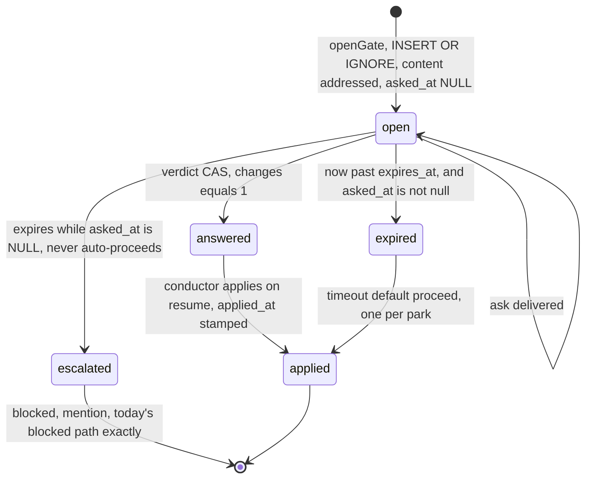
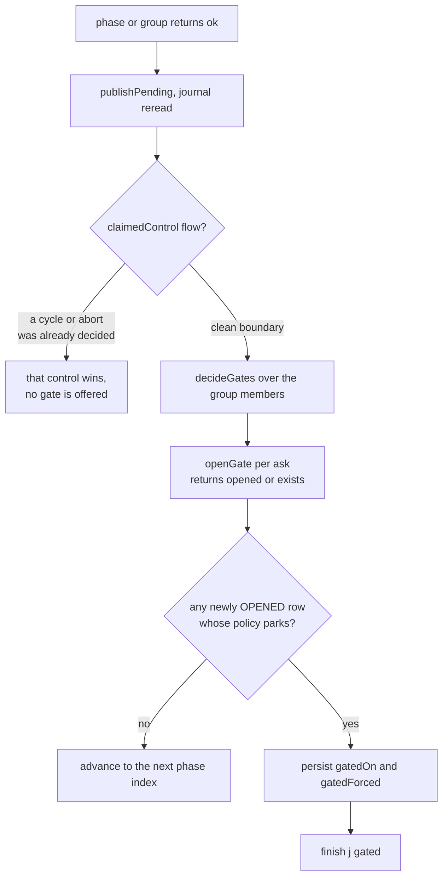
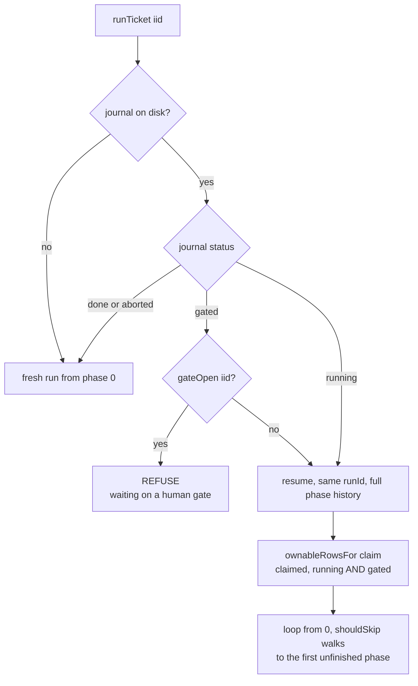
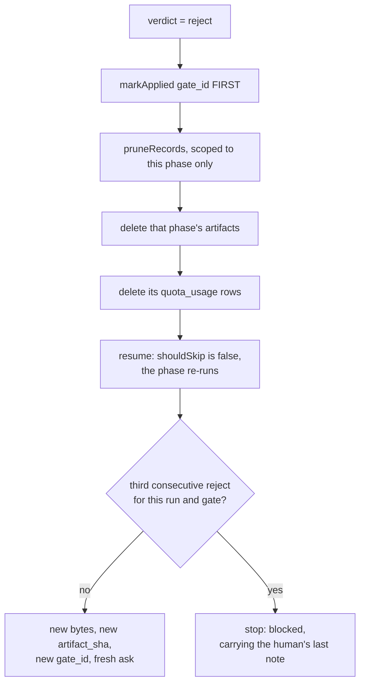
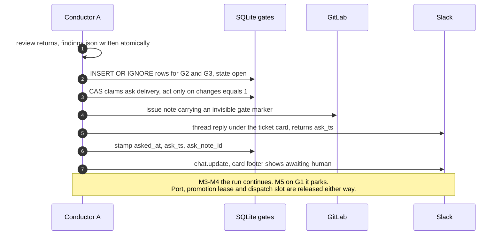
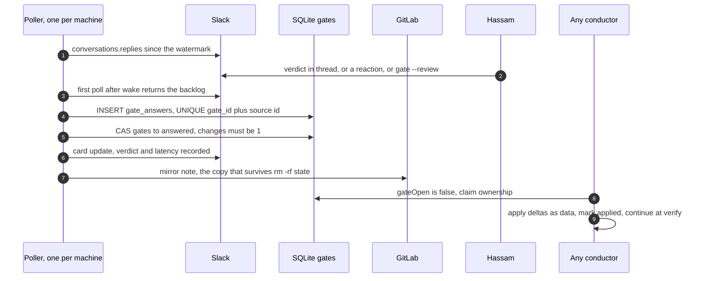
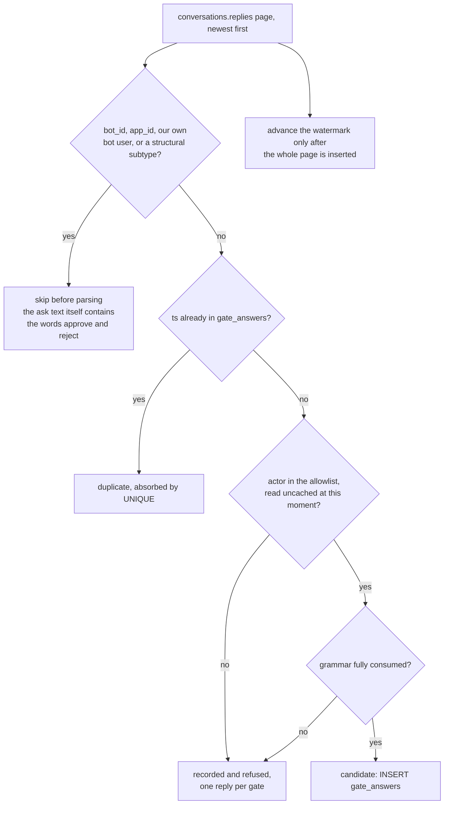
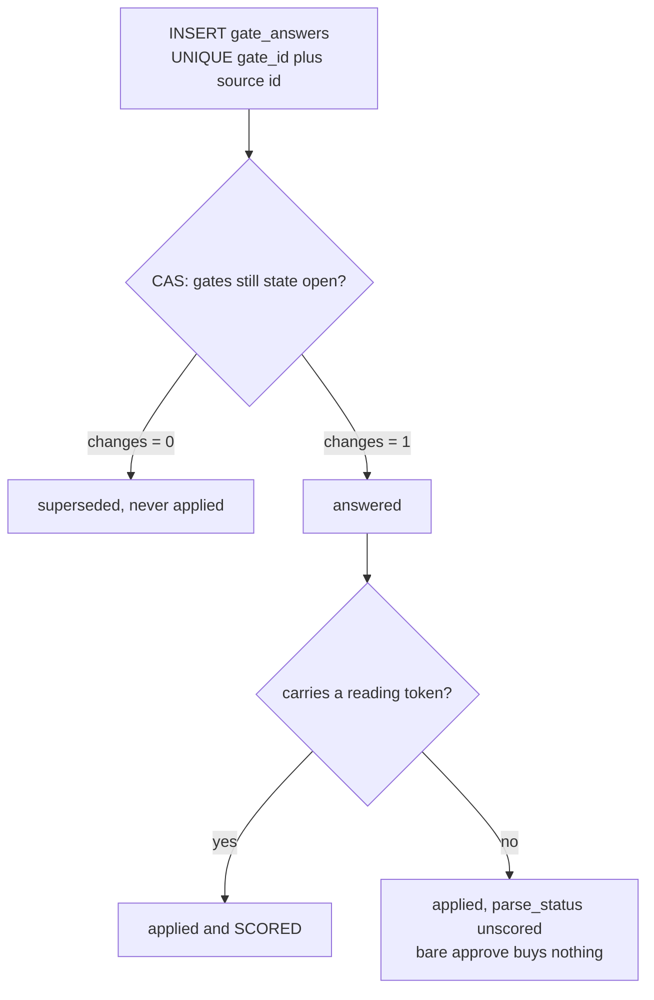
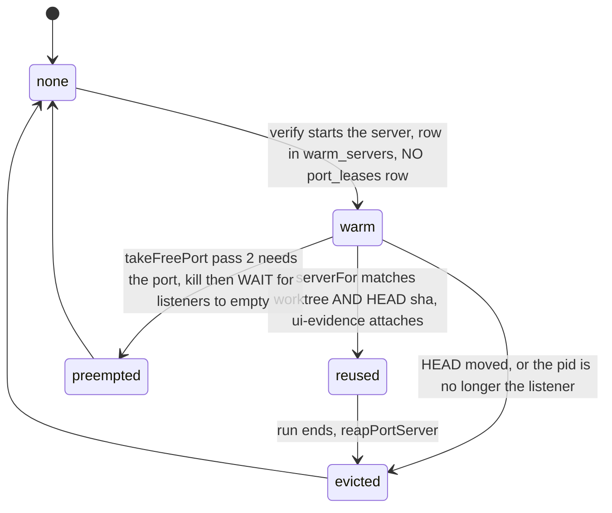
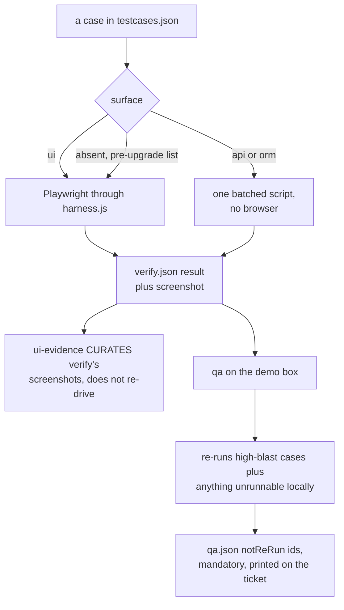

<!-- Deliverable 2 of 2. Written 2026-09-01. -->
> **Status:** superseded in parts by `04-remediation-and-build-order.md` §3. Part 1 is core
> mechanics, Part 2 is the human channel and Slack credentials, Part 3 is the UI-verification
> programme.

# Oneshot Confidence Gates — Low-Level Design, Part 1: Core Mechanics

All paths under `/Users/hassam.azam/Documents/oneshot/` unless prefixed. Every citation is `file:line` against the tree as read.

---

## 1. The `gates` table

### DDL

Appended to the single `db.exec` block that ends at `src/lib/db.ts:114`, immediately after `promotion_lock`.

```sql
CREATE TABLE IF NOT EXISTS gates (
  gate_id        TEXT    PRIMARY KEY,        -- sha1(iid|gate|artifact_sha): re-entering a phase with the same bytes re-derives the same row
  run_id         TEXT    NOT NULL,           -- which run parked; gatesFor() and the effort replay key on it
  iid            INTEGER NOT NULL,           -- gateOpen(iid) is called from isClaimed() on every scan, so the ticket must be a column not a join
  gate           TEXT    NOT NULL,           -- 'G1'|'G2'|'G3' — the QUESTION, stable across artifact rewrites
  phase          TEXT    NOT NULL,           -- plan|review|testcases: what a reject prunes
  phase_index    INTEGER NOT NULL,           -- index in phases() at park time; the reject path's window, and the report's anchor
  lap            INTEGER NOT NULL,           -- which lap produced the artifact; a G2 on lap 2 is a different datum from lap 0
  artifact       TEXT    NOT NULL,           -- file NAME, because review writes findings.json (config/phases.json:54)
  artifact_sha   TEXT    NOT NULL,           -- sha256 of the exact bytes the human was shown
  skill_sha      TEXT        NULL,           -- git sha of the skill dir that produced it; NULL when SKILLS_ROOT is not a git checkout
  confidence     REAL    NOT NULL,           -- computed C, immutable at ask time (the calibration x-axis)
  risk           REAL    NOT NULL,           -- computed R, immutable at ask time
  conf_band      TEXT    NOT NULL,           -- high|medium|low|unknown — 'unknown' is turns=0 and never reads as high
  risk_band      TEXT    NOT NULL,           -- low|medium|high
  policy_cell    TEXT    NOT NULL,           -- auto|notify|ask|block — what the table decided BEFORE the holdout override
  score_json     TEXT    NOT NULL,           -- term-by-term breakdown; without it a score is unauditable a month later
  effort_json    TEXT    NOT NULL,           -- the PhaseConfig overrides the resume must apply (§6)
  holdout        INTEGER NOT NULL DEFAULT 0, -- 1 = this gate was forced on a decision the machine would have taken alone
  state          TEXT    NOT NULL,           -- open|answered|applied|expired|superseded
  opened_at      INTEGER NOT NULL,           -- park time; latency is measured from asked_at, not this
  expires_at     INTEGER NOT NULL,           -- absolute, never a duration — the lesson of quota.ts:230-245
  timeout_policy TEXT    NOT NULL,           -- proceed|escalate, decided at ask time so a stale reconciler cannot re-decide it
  asked_at       INTEGER     NULL,           -- NULL until DELIVERED; this is the only witness that the ask landed
  ask_channel    TEXT        NULL,           -- 'slack'|'gitlab'|'both'
  ask_note_id    INTEGER     NULL,           -- GitLab note id — the copy that survives a state/ wipe
  ask_ts         TEXT        NULL,           -- Slack thread anchor for conversations.replies polling
  verdict        TEXT        NULL,           -- approve|amend|reject
  verdict_by     TEXT        NULL,           -- the actor; events(db.ts:71-80) has no actor column, so it must live here
  verdict_at     INTEGER     NULL,
  verdict_source TEXT        NULL,           -- slack|gitlab|cli|timeout
  verdict_source_id TEXT     NULL,           -- Slack ts / GitLab note id — the dedupe key
  latency_ms     INTEGER     NULL,           -- verdict_at - asked_at; flagged, never a down-weight (polling transport)
  deltas_json    TEXT        NULL,           -- the set differences; the actual payload (HLD §5)
  applied_at     INTEGER     NULL            -- when the CAS won; distinct from verdict_at, which is when the human spoke
);
CREATE INDEX IF NOT EXISTS gates_iid   ON gates(iid);
CREATE INDEX IF NOT EXISTS gates_state ON gates(state);
CREATE INDEX IF NOT EXISTS gates_run   ON gates(run_id);

CREATE TABLE IF NOT EXISTS gate_answers (
  id          INTEGER PRIMARY KEY AUTOINCREMENT,
  gate_id     TEXT    NOT NULL,
  source      TEXT    NOT NULL,
  source_id   TEXT    NOT NULL,  -- UNIQUE below: one Slack reply ingests once however many conductors saw it
  actor       TEXT    NOT NULL,
  verdict     TEXT    NOT NULL,
  deltas_json TEXT,
  seen_at     INTEGER NOT NULL,
  outcome     TEXT    NOT NULL   -- applied|superseded — every observed answer is kept, only one is applied
);
CREATE INDEX IF NOT EXISTS gate_answers_gate ON gate_answers(gate_id);
```

### Where it goes, and why that half and not the other

`db.exec` at `db.ts:22-114` runs on **every** open with `CREATE TABLE IF NOT EXISTS`. A brand-new table therefore belongs there and nowhere else: an existing `state/oneshot.db` gets it at the next open for the cost of a catalogue miss, exactly as `promotion_lock` (`db.ts:108-113`) already does.

`migrate()` (`db.ts:125-145`) takes the two UNIQUE indexes, and only those:

```ts
  // In migrate(), beside runs_one_active_per_iid and for its stated reason.
  try {
    db.exec(`CREATE UNIQUE INDEX IF NOT EXISTS gates_one_open_per_run
      ON gates(run_id, gate) WHERE state = 'open'`);
    db.exec(`CREATE UNIQUE INDEX IF NOT EXISTS gate_answers_source
      ON gate_answers(source_id)`);
  } catch (err) {
    log.warn('could not create the gate uniqueness indexes — a run already has two open gates ' +
      'for one question; npm run gate -- <iid> --list shows them', { error: (err as Error).message });
  }
```

The reason is the one written at `db.ts:138-144`: a `CREATE UNIQUE INDEX` inside the big `db.exec` cannot be caught per-statement, so a database that already violates the constraint would make **every conductor fail to open the file**. In `migrate()` it degrades to a warning, which is the difference between a degraded fleet and a dead one. Any column added to `gates` later goes in `migrate()` too, as `ALTER TABLE … ADD COLUMN` — SQLite rewrites no rows.

### What makes application exactly-once

Four things, in layers:

1. **`gate_id` is derived from content.** `sha1(iid | gate | sha256(artifact bytes))`. Re-entering the seam with the same artifact re-derives the row; `openGate` is an `INSERT … ON CONFLICT DO NOTHING`. This is `publish.ts:12-23`'s key discipline made two-way, and it is what makes a degraded `check` group on lap 2 (`config/phases.json:51`) not re-ask G3.
2. **`gates_one_open_per_run`** — a *different* artifact for the same `(run_id, gate)` cannot open a second question. The opener supersedes the stale row inside the same IMMEDIATE transaction.
3. **`gate_answers_source`** — one Slack reply seen by three polling conductors ingests once.
4. **The CAS.** Even past all three, `UPDATE … WHERE gate_id=? AND state='open'` with `changes === 1` is the only thing that acts.

**Diagram C — the gate row lifecycle.** Every transition out of `open` is a compare-and-swap; only a
statement that reports `changes === 1` is allowed to act.



An answer that loses the CAS is not discarded: it lands in `gate_answers` with
`parse_status='superseded'` and is never applied. Every observed answer is kept; exactly one acts.

### Upgrading a live database with three conductors on it

No `ALTER` on an existing table, so no row rewrite and no long lock. `CREATE TABLE/INDEX IF NOT EXISTS` takes the WAL write lock for microseconds; a peer that collides waits out `busy_timeout = 5000` (`db.ts:20`) and proceeds. Peers still running the **old** code never name `gates`, so their prepared statements are unaffected apart from one `SQLITE_SCHEMA` re-prepare, which better-sqlite3 handles internally. The rollout is therefore: upgrade one conductor, restart it, let it create the table; the other two keep working and pick the table up whenever they next restart. There is no window in which a gate is half-installed, because no old-code path reads or writes the table and no new-code path assumes the table pre-dates it.

---

## 2. `src/lib/gates.ts`

```ts
/**
 * Human gates: the question, the durable place it waits, and the one statement
 * that decides an answer.
 *
 * A gate cannot live inside a session. A phase that waits dies on its own
 * timeoutMin (phase.ts:250 — plan gets 20 minutes, config/phases.json:26), burns
 * turns polling (phase.ts:273), and is denied the write that would record its
 * verdict the moment the operator pauses (hooks/pause-check.cjs:25). So the
 * question is a ROW and the run terminates around it.
 *
 * The row is also the outbox. There is no queue table for the same reason
 * publish.ts:12-23 has none: the desired state IS the work list, so a failed
 * post retries free on the next tick and a crash between the post and the stamp
 * costs at most one duplicate ask.
 */
export type GateName = 'G1' | 'G2' | 'G3';
export type GateState = 'open' | 'answered' | 'applied' | 'expired' | 'superseded';
export type Verdict = 'approve' | 'amend' | 'reject';

export interface GateRow { /* one field per column in §1 */ }

/**
 * The gate's identity, derived from what the human will actually read.
 *
 * Content-addressed on purpose. `review` cycling back to `implement` produces a
 * NEW findings.json and therefore a new question; a degraded check group
 * (config/phases.json:51) re-enters with the SAME testcases.json bytes and
 * re-derives a gate_id that is already `applied`, so G3 is not asked twice for
 * a list nobody rewrote. Asking a human the same question twice is how a human
 * stops reading the questions.
 */
export function gateIdFor(iid: number, gate: GateName, artifactSha: string): string;

/** sha256 of an artifact's bytes on disk, or null when it is not there. */
export function artifactSha(iid: number, name: string): string | null;

/**
 * Park a question, or find it already parked.
 *
 * IMMEDIATE, because this is a read-then-write pair: it must see whether an
 * older artifact left an open row for this (run, gate) and supersede it before
 * inserting. A DEFERRED transaction does not lose that race politely — it
 * throws SQLITE_BUSY_SNAPSHOT without ever consulting busy_timeout (db.ts:336).
 */
export function openGate(input: OpenGateInput): 'opened' | 'exists';

/**
 * Is this ticket waiting on a person?
 *
 * The lock while a run is parked, and the ONLY one. A 'gated' run row is
 * invisible to activeRowsFor()'s claimed|running filter (db.ts:304), so
 * isClaimed() and activeRunsFleet() both stop seeing it the instant it parks —
 * which is the point: the ticket gives its fleet slot back and the gate row,
 * not a live conductor, is what keeps the watcher off it (watcher.ts:73).
 *
 * A plain autocommit read. No transaction and no liveness check: this is called
 * once per candidate per scan, and a process.kill inside a write lock is the
 * mistake db.ts:293 exists to name.
 */
export function gateOpen(iid: number): boolean;

/** Every open row, for the reconciler. Ordered oldest first so the backlog drains in order. */
export function pendingGates(): GateRow[];

/** Every gate this run has ever opened — the effort replay on resume, and the report. */
export function gatesFor(runId: string): GateRow[];

/**
 * Turn one delivered answer into at most one effect.
 *
 * Delivery is at-least-once by construction: three conductors poll the same
 * Slack thread and the same GitLab note, and a sleep replays the whole backlog
 * on wake. Application must be at-most-once, because applying a verdict twice
 * advances the pipeline twice — a second implement, a second MR.
 *
 * So this is a CAS, in the shape releasePromotion (promotion.ts:378) and
 * reclaim's conditional delete (promotion.ts:277) already use: the state test is
 * inside the statement, not before it, and nothing acts unless the statement
 * itself says it changed a row. A second answer is recorded as superseded and
 * never applied — including one that arrives while the first is still being
 * written, because both are inside the same IMMEDIATE lock.
 */
export function applyVerdict(a: Answer): 'applied' | 'superseded' | 'missing';

/**
 * Move gates past their deadline, and say which policy they carried.
 *
 * A gate whose ask never landed — Slack was down at park time and the reconciler
 * has retried four hundred times — must become visible rather than silently
 * permanent. That is the shape quota.ts:230-245 calls "the worst a failure can
 * take here: indistinguishable from working correctly."
 */
export function expireGates(at?: number): GateRow[];
```

The CAS, verbatim:

```ts
const applyCas = db.transaction((a: Answer): 'applied' | 'superseded' | 'missing' => {
  const row = db.prepare('SELECT state, asked_at FROM gates WHERE gate_id = ?')
    .get(a.gateId) as { state: string; asked_at: number | null } | undefined;
  if (!row) return 'missing';

  const ingested = db.prepare(
    `INSERT OR IGNORE INTO gate_answers
       (gate_id, source, source_id, actor, verdict, deltas_json, seen_at, outcome)
     VALUES (?, ?, ?, ?, ?, ?, ?, 'superseded')`,
  ).run(a.gateId, a.source, a.sourceId, a.actor, a.verdict,
        a.deltas ? JSON.stringify(a.deltas) : null, a.seenAt).changes;
  if (ingested === 0) return 'superseded';          // this exact event was already seen

  const changed = db.prepare(
    `UPDATE gates
        SET state = 'answered', verdict = ?, verdict_by = ?, verdict_at = ?,
            verdict_source = ?, verdict_source_id = ?, deltas_json = ?,
            latency_ms = CASE WHEN asked_at IS NULL THEN NULL ELSE ? - asked_at END
      WHERE gate_id = ? AND state = 'open'`,
  ).run(a.verdict, a.actor, a.seenAt, a.source, a.sourceId,
        a.deltas ? JSON.stringify(a.deltas) : null, a.seenAt, a.gateId).changes;

  if (changed !== 1) return 'superseded';
  db.prepare("UPDATE gate_answers SET outcome = 'applied' WHERE source_id = ?").run(a.sourceId);
  return 'applied';
});
export const applyVerdict = (a: Answer) => applyCas.immediate(a);
```

**Transaction boundaries.** `openGate`, `applyVerdict`, `expireGates` and `markApplied` are `.immediate()` — each is read-then-write and each is contended by three processes. `gateOpen`, `pendingGates`, `gatesFor` are plain autocommit reads. Every IMMEDIATE body is three statements or fewer, for the reason spelled out at `db.ts:346-348`: better-sqlite3 is synchronous, so time inside the lock is time every peer's event loop is stopped.

---

## 3. The runner seam

### Where

`src/conductor/runner.ts:690-711`, which today reads:

```ts
690    await updateCard(j.slackTs ?? '', cardState(j));
...
696    await publishPending({ iid, runId, journal: j });
697    j = readJournal(iid) ?? j;
698
699    if (opts.signal?.aborted) {
700      return finish(j, 'aborted', 'the conductor asked this run to stop');
701    }
702
703    const claimed = flow[0];
```

The insert goes between `:697` and `:699` — every artifact is on disk, `prior[]` is populated (`:684`), and `publishPending` has already put the plan (`publish.ts:177`) and the case list (`publish.ts:195`) on the ticket the human is about to read.

```ts
    // The gate. It sits here and only here: after the group's single join
    // (:522) and its single reconciliation (:642-688), so the `check` group's
    // two artifacts are decided together and produce ONE park with two
    // questions. A gate is not a failure, so it never touches afterFailure()
    // and never spends a lap.
    if (!claimedControl(flow)) {
      const asks = decideGates({ iid, runId, journal: j, members, list, prior });
      for (const ask of asks) openGate(ask);
      if (asks.some((a) => a.parks)) {
        j = updateJournal(iid, {
          gatedOn: asks.filter((a) => a.parks).map((a) => a.gateId),
          gatedForced: [...forced],
        }) ?? j;
        return finish(j, 'gated', gateReason(asks));
      }
    }
```

`claimedControl(flow)` is `flow.length > 0` — a gate is offered only on a clean boundary. If `review` returned `changes-requested` the phase already failed and cycled (`:670-679`); there is nothing to ask a human, and asking would be asking them to confirm a decision the machine already made correctly.

**Diagram D — the seam, and why a gate is never a failure.** It sits after the group's single join and
single reconciliation, so `testcases` and `review` are decided together and produce one park with two
questions. It synthesises its own `Control` and never reaches `afterFailure()`, which is what makes a
gate unable to spend a lap.



`gatedForced` is not cosmetic. `forced` is an in-memory Set rebuilt per `runTicket`; a second-lap gate
parks with `mr`, `merge`, `deploy` and `qa` in it, all still carrying `ok` records, and without
persisting it the resumed run walks to `close` having deployed nothing.

### The Control union and the new status

`Control` keeps all four kinds (`:258-262`); its stop status gains one member:

```ts
  | { kind: 'stop'; status: 'blocked' | 'aborted' | 'gated'; reason: string };
```

and with it `RunOutcome.status` (`:126`), `finish()`'s parameter (`:1272`), and `RunJournal.status` (`artifacts.ts:71`), which also gains `gatedOn?: string[]` and `gatedForced?: string[]`. Nothing else changes shape — `tsc --noEmit` under `npm run check` enumerates every site that must learn the new member, which is the point of doing it as a union widening rather than a boolean.

### `finish(j,'gated')` versus the blocked path

`finish` (`:1271-1345`) needs three guarded lines, and everything else is already correct:

| Concern | Blocked | Gated | Mechanism |
|---|---|---|---|
| `blockedAt` | set (`:1276`) | **not set** | guard becomes `if (status === 'blocked')` — unchanged, and that is precisely why `gated` skips the 60-minute `BLOCK_COOLDOWN_MS` refusal at `:245-247` |
| Port reap + release | `:1290-1291` | **same, unconditional** | free and idempotent; all three gates sit before `verify` (`config/phases.json:61`) so there is no port to reap, but leaving the call unconditional means a fourth gate placed later cannot silently strand one |
| Promotion release | `:1292` | **same** | `releasePromotion` is one conditional DELETE (`promotion.ts:378`), so calling it when nothing is held costs a no-op |
| Worktree | kept (`:1340` guards on `done`) | **kept, unchanged** | the resume needs it; the guard is already right |
| Label | `Loop → Needs Human` (`:1309`) | **untouched** | swapping to `blocked` would make the watcher skip the ticket forever (`watcher.ts:67-72`) |
| Alert | always (`:1307`) | **only when `policy_cell === 'block'`** | `config/slack.json:20` reserves the unprompted @mention; a routine ask gets a thread reply |
| Run report | `:1326` | **written** | the parked state is exactly what someone opens the report to understand |
| `scratch/` | reaped (`:1339`) | **reaped** | regenerable by definition |

The blocked branch at `:1306-1312` therefore stays as-is and a sibling `else if (status === 'gated')` posts the card and the thread.

### `decideResume`

```ts
  if (existing.status === 'gated') {
    // Belt and braces beside the watcher's gateOpen() clause: --ticket
    // dispatches straight to runTicket (index.ts:273) and never passes the
    // watcher at all, which is the exact hole the claim at :300-302 exists for.
    if (gateOpen(existing.iid)) {
      return { kind: 'refuse', reason: 'waiting on a human gate — npm run gate -- <iid> --list' };
    }
    return { kind: 'resume', journal: existing };
  }
```

Same `runId`, full phase history, and then the ordinary ownership test at `:324-336`. `isClaimed` (`db.ts:433`) gains one clause — `return activeRowsFor(iid).some(...) || gateOpen(iid);` — and that is the whole watcher change.

**Diagram E — `decideResume`, including the `--ticket` hole.** `--ticket` dispatches straight to
`runTicket` and never passes the watcher, so the gate test is repeated here rather than trusted from
`isClaimed`.



### Re-entry at the right index, with lap / forced / prior intact

- **Index.** Nothing restores it. `shouldSkip` (`:718`) is `!forced.has(name) && phaseSucceeded(iid, name)`, and `phaseSucceeded` is true for any `ok`/`warned` lap (`artifacts.ts:172`), so a resumed run walks from 0, steps over everything finished, and lands on the first unfinished phase — which is `gate.phase_index + 1` for an approve and `gate.phase_index` for a reject, because the reject deleted that phase's records. `phase_index` is stored for the reject window and the report, not to drive the loop.
- **`prior[]`** rebuilds from disk at `:458` for every skipped phase. Free.
- **`lap`** is `lapsOf(iid, name)` (`artifacts.ts:151`), read off the journal. Free.
- **`forced` is the one thing that is NOT free, and this is a live defect.** It is an in-memory `Set` rebuilt per `runTicket` (`:406`) and populated by `nextIndex` (`:904-908`). A **second-lap G2** — reached after a `qa` cycle forced `implement…qa` — parks with `forced` holding `mr`, `merge`, `deploy`, `qa`, all of which still carry `ok` records. On resume that set is gone, `shouldSkip` is true for all four, and the run walks to `close` having deployed nothing. This is `ground-control-flow.md:56` made concrete. The fix is one field and two lines: persist `gatedForced` in `finish()` (above) and rehydrate it at `:406`:

```ts
  const forced = new Set<string>(j.status === 'running' ? (j.gatedForced ?? []) : []);
  if (j.gatedForced) updateJournal(iid, { gatedForced: undefined });
```

Cleared on rehydrate so a later crash cannot resurrect a stale window.

### Parallel groups

`testcases` and `review` are one contiguous group (`config/phases.json:42`, `:50`), dispatched at `:522` and reconciled at `:642-688`. The seam sits after both, so `decideGates` sees `findings.json` and `testcases.json` in the same pass and returns **two ask rows and one park**. On a later review lap the group degrades to `review` alone (`config/phases.json:51`); `decideGates` still evaluates both, but G3's `gateIdFor` hashes the unchanged `testcases.json` and `openGate` returns `'exists'` on an `applied` row, so only G2 parks.

---

## 4. The reject path

### The shared pruner

`scripts/unblock.ts:198-203` (`artifactsOf`) and `:241-253` (the `doomed` predicate) move verbatim into a new `src/lib/prune.ts`, together with `KEPT_STATUSES` — which is presently duplicated at `unblock.ts:53` and `runner.ts:115`, with the duplication itself documented as deliberate. Consolidating it makes the comment a docstring instead of a promise.

```ts
// src/lib/prune.ts
export const KEPT_STATUSES: ReadonlySet<PhaseRecord['status']>;
export function artifactsOf(iid: number, phase: string): string[];        // unblock.ts:198-203, unchanged
export function doomedRecords(
  j: RunJournal, opts: { only?: string; forcePhase?: string },
): Set<PhaseRecord>;                                                       // unblock.ts:241-253, unchanged
/** Journal first, artifacts second — the ordering unblock.ts:335-343 argues for. */
export function pruneRecords(
  iid: number, opts: { only?: string; forcePhase?: string },
): { dropped: number; files: string[] };
```

`unblock.ts` then reads `const doomed = doomedRecords(journal, { only, forcePhase })` and keeps everything a reject must **not** do: the quota refund (`:345-349`), the port-lease delete (`:351-353`), the orphan-row bury (`:359-361`), and the `blocked → entry` label swap (`:363`).

### What a reject does

```ts
// applied at the top of runTicket, before the loop, for each applied gate
if (g.verdict === 'reject') {
  // --force-phase semantics: the record is 'ok' and the artifact is the thing
  // the human rejected. Pruning records without deleting the artifact resumes
  // into a stale artifact wearing a green record — the run #16 shape.
  pruneRecords(iid, { forcePhase: g.phase });
  markApplied(g.gate_id);
}
```

Nothing else. The `Loop` label stays on, no quota is refunded (the tokens were genuinely spent, and `unblock`'s refund exists for a lap that produced nothing), no lease is touched (none is held), and the human's `deltas_json` is injected into the re-run's prompt as *data* — the `amend` payload becomes a "the reviewer said this about your last attempt" block, never an instruction chain.

**Diagram F — the reject path.** `markApplied` runs *before* the prune, so a crash between them
re-prunes nothing the human already approved.



A reject writes no `failed` record and never touches `afterFailure()`, so it cannot consume `maxLaps`
or `maxRetries`. The bound at three is the analogue of `MAX_REMEDIATIONS = 2`: a cause that survives
two corrections was not the cause the corrections addressed.

### Proof a reject cannot spend `maxLaps` or become a phase failure

- `failedLapsOf` (`artifacts.ts:165-169`) counts records whose `status === 'failed'`. A reject **deletes** records; it writes none.
- `maxRetries` and `maxLaps` are read only inside `afterFailure()` (`:858-885`), which is reached only from `:679` (a phase result with `out.ok === false`) and `:840`. The gated phase's result was `ok`, already recorded at `:643-654`; the seam synthesises its own Control and never calls `afterFailure`.
- The `hardStop` and `blocked`-with-retry branches (`:669-677`) are likewise unreachable — both require `!r.out.ok`.
- `statusForFailure` (`:264-268`) is never invoked for a gate.

### A reject on the second lap

The re-authored plan produces new bytes → a new `artifact_sha` → a new `gate_id` → a fresh row and a fresh ask. That is correct and must stay so; the second question is genuinely about a different artifact. What must **not** stay unbounded is the loop. `decideGates` counts prior rejects for the same `(run_id, gate)` via `gatesFor(runId)`, and on the **third** consecutive reject returns `{kind:'stop', status:'blocked'}` with the human's last note in the reason. The bound and its reason are the analogue of `MAX_REMEDIATIONS = 2` (`:107`): a cause that survives two corrections was not the cause the corrections addressed, and the third rejection is worth a person's whole attention rather than another lap.

---

## 5. Confidence and risk

A pure function in `src/lib/confidence.ts`. Impure edges — `readArtifact`, `existsSync` for `<phase>-partial.json`, the skill `git rev-parse` — are collected by the caller at the seam and handed in, so the scorer is a total function over plain data and testable without a database.

```ts
export interface ScoreInput {
  gate: GateName;
  phase: string;
  journal: RunJournal;                                   // laps, remediations, PhaseRecord.turns
  artifacts: Record<string, Record<string, unknown> | null>;  // recall|research|plan|implement|findings|testcases
  partials: Record<string, boolean>;                     // phase -> <phase>-partial.json exists
  maxTurns: number;                                      // the cap this lap actually ran under
}
export interface Score {
  confidence: number; risk: number;
  confBand: 'high' | 'medium' | 'low' | 'unknown';
  riskBand: 'low' | 'medium' | 'high';
  cell: PolicyCell;
  terms: Array<{ axis: 'C' | 'R'; term: string; delta: number; from: string }>;
}
export function scoreGate(input: ScoreInput): Score;
```

**Confidence.** Starts at `1.0`; anomaly terms are machine-measured and the agent cannot lower them.

| Term | Δ | Source |
|---|---|---|
| `<phase>-partial.json` exists | `C = min(C, 0.25)` | `runner.ts:594` — the phase died at its cap wearing an `ok` record |
| each `failedLapsOf(phase)` | `−0.20`, floor `−0.40` | `artifacts.ts:165` |
| each remediation, `fixed:false` | `−0.25` | `artifacts.ts:53-63` |
| each remediation, `fixed:true` | `−0.10` | a run that healed itself is a different story (`:1296-1304`) |
| `turns / maxTurns > 0.9` | `C = min(C, 0.40)` | floor-setter only, never a raise |
| **`turns` is 0 or absent** | `confBand = 'unknown'` | `report.ts:19` documents `turns` as untrustworthy here and three `turns=0` records exist on sessions that worked. UNKNOWN forces an ask; it never reads as high |
| G2 only: `findings.verdict === 'approve'` while `implement.lintClean === false` | `−0.30` | `schemas.ts:147` vs `:141`, written by different sessions — the cross-check `qualityGate()` already trusts as a merge veto (`codephases.ts:819`) |
| `recall.priorTickets[].gotchas` overlapping this ticket's files | `+0.10` | `schemas.ts:52` |
| `plan.reuse.length ≥ 1` | `+0.05` | `schemas.ts:84` |

Corroboration is capped so that no combination of agent-authored fields can raise `C` above `0.9` once any anomaly term has fired.

**Risk.** Starts at `0`, additive, clamped to `[0,1]`.

| Term | Δ | Source |
|---|---|---|
| `plan.migrations === true` | `+0.25` | `schemas.ts:99` |
| each `research.blastRadius[]` | `+0.05`, cap `0.20` | `schemas.ts:77` |
| each `research.unknowns[]` | `+0.07`, cap `0.21` | `schemas.ts:78` |
| `plan.risks.length ≥ 3` | `+0.10` | `schemas.ts:100` |
| any `plan.steps[].layer === 'migration'` | `+0.10` | `schemas.ts:94` |
| **any `plan.steps[].files` under `apps/auth/`, `common/permissions.py`, `apps/payroll/`, `apps/leaves/`, `apps/project_logs/`** | `R = max(R, 0.85)` | the ERP's own high-scrutiny set. At G1 this must be `plan.steps[].files` — `implement.filesChanged[]` (`schemas.ts:138`) does not exist yet at n=2 |
| G2/G3: each blocker/major finding | `+0.15`, cap `0.30` | `schemas.ts:155` |
| G2/G3: `high`-blast cases ≥ 5 | `+0.10` | `schemas.ts:126` |

Every agent-authored term is **monotone raise-only**: declaring more unknowns, more risks or more findings can only increase oversight. Under-declaring is the sole exploitable direction, and it is the one the measurement system punishes hardest.

**Bands and the policy cell.**

```ts
const BAND_C = (c: number) => (c >= 0.75 ? 'high' : c >= 0.45 ? 'medium' : 'low');
const BAND_R = (r: number) => (r >= 0.60 ? 'high' : r >= 0.30 ? 'medium' : 'low');

const POLICY: Record<string, Record<string, PolicyCell>> = {
  high:    { low: A('auto',   0,   'proceed'), medium: A('notify', 0, 'proceed'),
             high: A('ask',   240, 'proceed') },
  medium:  { low: A('notify', 0,   'proceed'), medium: A('ask',    240, 'proceed'),
             high: A('ask',   480, 'escalate') },
  low:     { low: A('ask',    240, 'proceed'), medium: A('ask',    480, 'escalate'),
             high: A('block', 0,   'none') },
  unknown: { low: A('ask',    240, 'proceed'), medium: A('ask',    480, 'escalate'),
             high: A('block', 0,   'none') },   // UNKNOWN is the Low row. Never auto, never notify.
};
```

The holdout override sits **outside** the pure function, in `decideGates`, because it reads a count from SQLite: when `cell.action` is `auto` or `notify` and fewer than 2 holdout gates were opened in the trailing 7 days, the action is promoted to `ask` and `holdout = 1`. Absolute count, not a percentage — bounded in the operator's time, independent of run volume.

**Tests** live in `scripts/verify-gates.ts`, invoked by a new `npm run gates:verify` and chained into `npm run verify` beside `deps:verify` / `hooks:verify` / `doctor`. The repo has no Jest and never will — `package.json:11-25` shows the convention is a `scripts/verify-*.ts` that asserts and exits non-zero. The scorer block is table-driven over synthetic journals and asserts: every policy cell is reachable; `turns:0` always yields `unknown`; adding an `unknown` never lowers `R`; adding a `reuse` entry never raises `R`; a high-scrutiny file path always produces `riskBand === 'high'` regardless of every other field.

---

## 6. Effort threading

`config/models.json:13` states the overrides map is for one-off experiments and must stay empty, and `modelFor()` re-reads the file on every call (`config.ts:237`). A runtime write would be a shared global across three conductors that re-tiers a concurrent run and corrupts `PhaseRecord.model` (`:649`) — the exact telemetry the confidence model reads. So effort is threaded as a **per-run `PhaseConfig` override**, never as config.

The entire override surface is three call sites that read `cfg`: `modelFor(p)` at `:770` reads `phase.tier`; `phase.ts:273` reads `cfg.maxTurns`; `phase.ts:250` reads `cfg.timeoutMin`. Handing `runOne` a modified object covers all three.

```ts
// runner.ts, before the loop
const effort: EffortGrant = foldEffort(gatesFor(runId));   // deterministic, replayed on every resume

function withEffort(p: PhaseConfig): PhaseConfig {
  const e = effort[p.name];
  if (!e) return p;
  return { ...p, ...(e.tier ? { tier: e.tier } : {}), ...(e.maxTurns ? { maxTurns: e.maxTurns } : {}),
           ...(e.timeoutMin ? { timeoutMin: e.timeoutMin } : {}) };
}
// :770  const rowId = phaseStart(runId, p.name, lap, modelFor(withEffort(p)));
// :771  const out = await runPhase({ ..., cfg: withEffort(p), ... });
```

**Tier demotion.** `review` and `ui-evidence` only, one step (`heavy → standard`, `standard → light`), when `confBand === 'high' && riskBand === 'low'` and the gate was not a holdout. Never `implement` (measured by consequence, and the most expensive lap to redo), never `plan` (the artifact under measurement), never `verify` (the only phase where cap exhaustion is real).

**Reviewer subagents.** `config/phases.json:55` declares three, and `cfg.agents` is read by **no code** — the list that actually reaches the model is computed in `prompts.ts:701-705` from `layersOf(implement.filesChanged)`, with `util-reuse-agent` unconditional. The knob is therefore `PromptCtx`: add `effort?: EffortGrant` (built at `:765`) and have the review builder filter its `agents` array. Rule: `riskBand === 'high'` → all three; `medium` → drop `util-reuse-agent` (DRY findings are never blockers and are cheap to catch later); `low` → the single layer agent the diff justifies. `prompts.ts:707-710`'s own note — three sequential Task calls is three times the wall clock for the same signal — is the argument for making the count a variable rather than a constant.

**`verify.maxTurns = base + perCase × n`,** read from the approved list at G3, replacing the flat 450 at `config/phases.json:58`. Derivation from the real numbers: measured turns/case are 14.3 (#16 cold, died at cap), 10.8 (#20), 8.0 (#21), and **3.75** (#16 re-run on a surviving harness). Bring-up is 21–42% of tool calls and is fixed cost, not per-case; the four slowest calls in #20 are webpack compile polls totalling 28.4 min. So:

```
maxTurns   = clamp(60 + 14 × n, 120, 450)
timeoutMin = min(150, 40 + 5.5 × n)
```

`base = 60` is bring-up plus report assembly; `perCase = 14` is today's cold-driver cost with headroom above #20's 10.8. A 20-case list gets 340 turns (above #16's fatal 300, below the current 450); an 8-case list gets 172 instead of reserving 450 for a run that used 160 (#21). Once the shipped harness has two runs under it, `perCase` drops to 8 — as an amendment to `_why_turns` at `config/phases.json:59`, never as a contradiction of it. `timeoutMin` must scale with the same `n` or the turn cap is decorative: #20's 19 cases took 74.5 min against the formula's 144.

---

## 7. The skill call graph

Resolution rule: `claudedir.ts` composes `.claude/skills/` with **context-repo-first** (`claudedir.ts:24-28`), context = `~/Documents/erp/.claude` (`config.ts:304`), topped up from `oneshot/skills/`. Sessions run `settingSources:['project']`, so a skill that is in neither tree does not exist for a phase. `graphify-knowledge-graph` is excluded by name (`claudedir.ts:61-67`).

| n | phase | kind | tier | cwd | skills (source) | subagents | inputs | output (schema) | gate | changes under this design |
|---|---|---|---|---|---|---|---|---|---|---|
| 0 | recall | session | light | conductor | `ticket-recall` (ERP) | — | ticket | `recall.json` (RECALL) | — | read-only C input: `priorTickets[].gotchas` |
| 1 | research | session | heavy | worktree | `ticket-research` (ERP) | — | recall | `research.json` (RESEARCH) | — | read-only R input: `blastRadius`, `unknowns` |
| 2 | plan | session | heavy | worktree | `planning-methodology`, `util-reuse-methodology` (ERP) | — | recall, research | `plan.json` (PLAN) | **G1** | parks after; `steps[].files` becomes load-bearing for R |
| 3 | implement | session | heavy | worktree | `django-backend-standards`, `django-migration-standards`, `react-frontend-standards`, `django-query-optimisation`, `python-linting`, `script-writing-standards` (ERP) | `backend-agent`, `frontend-agent` (ERP `.claude/agents`) | plan, findings | `implement.json` (IMPLEMENT) | — | no gate, by design; consumes G1 `amend` deltas as data |
| 4 | testcases | session | heavy | worktree | `test-case-writing` (ERP) | — | plan, implement | `testcases.json` (TESTCASES) | **G3** | schema gains `surface`; human ratifies `blast` |
| 5 | review | session | heavy | worktree | `erp-code-review`, `dead-code-sweep` (ERP) | `backend-reviewer-agent`, `frontend-reviewer-agent`, `util-reuse-agent` | implement, plan, research | `findings.json` (FINDINGS) | **G2** | agent count scales with R; tier demotes at high-C/low-R |
| 6 | verify | session | standard | worktree | `local-browser-verify` (**oneshot**) | — | testcases, implement | `verify.json` (VERIFY) | — | `maxTurns` formula; surface routing; warm server; shared harness |
| 7 | ui-evidence | session | standard | worktree | `ui-evidence-pack` (**oneshot**) | — | verify, testcases | `ui-evidence.json` (UI_EVIDENCE) | — | reuses the warm server; teardown contradiction fixed |
| 8 | mr | session | standard | worktree | `mr-metadata`, `mr-change-logger` (ERP) | — | implement, verify | `mr.json` (MR) | — | none |
| 9 | merge | **code** | — | — | none | — | mr, verify, findings | `merge.json` | **never** | none (gate-free by hard rule) |
| 10 | deploy | session | standard | conductor | none declared | — | merge | `deploy.json` (DEPLOY) | **never** | none |
| 11 | qa | session | heavy | conductor | `demo-server-qa` (**oneshot**) | — | testcases, deploy | `qa.json` (QA) | — | `notReRun[]` becomes mandatory when the list is subsetted |
| 12 | demo | session | standard | conductor | `create-demo` — **resolves from neither tree** | — | qa, ui-evidence | `demo.json` (DEMO) | — | flagged (below) |
| 13 | memorize | session | light | conductor | `ticket-memory-write` (**oneshot**) | — | whole journal | `memorize.json` (MEMORIZE) | — | optional memory-card compaction |
| 14 | document | session | light | conductor | `mr-documentation` (**oneshot**), `ui-evidence-pack` (**oneshot**) | — | everything | `document.json` (DOCUMENT) | — | none |
| 15 | close | **code** | — | — | none | — | everything | `close.json` | — | close note prints gate verdicts |
| 16 | remediate | session | heavy | conductor | `self-remediation` (**oneshot**) | — | the block | `remediate.json` (REMEDIATE) | — | none — a gate is not a block and never reaches it |

**Finding, unrelated to gates but surfaced by building this table:** `demo` declares `create-demo` (`config/phases.json:104`), which lives at user scope (`~/.claude/skills/create-demo`) and is in neither `SKILLS_ROOT` nor `oneshot/skills/`. With `settingSources:['project']` it cannot resolve, and the prompt's hedge at `prompts.ts:1387` ("Try the `create-demo` skill first") is what has been silently absorbing the miss — the same invisible loss `claudedir.ts:9-13` was written to end.

### Skill files that must be edited or created

| File | Change |
|---|---|
| **NEW** `skills/local-browser-verify/scripts/harness.js` | `record()`, `shot()`, `pickDate()`, `selectMuiOption()`, the `CASE <id> PASS\|FAIL` printer, the `verify-partial.json` writer in exact `CASE_RESULT` shape (`schemas.ts:167-180`). The agent authors per-case bodies only. This is the 300→75 turn drop. |
| `skills/local-browser-verify/SKILL.md:102-106` | **Invert the teardown.** It currently says "Kill the server you started"; `prompts.ts:851` says leave it up for the next phase. The skill wins today and costs `ui-evidence` ~48% of its budget. Replace with: leave the server, register it as a preemptible warm lease, and kill it on any `implement` commit. |
| `skills/local-browser-verify/SKILL.md` (new section) | Surface routing: `orm`/`api` cases batch into one shell script, only `ui` touches Playwright. Plus the absolute Playwright path instead of the `find /` that cost 2.0 min twice. |
| `skills/ui-evidence-pack/SKILL.md` | Reuse the warm server; never re-pay the compile; state which states (empty/loading/error/denied) the harness must capture so folding capture into verify does not lose them. |
| `skills/demo-server-qa/SKILL.md` | The subsetting contract: high-blast plus every case verify could not run locally, and `notReRun[]` is mandatory in `qa.json` and on the ticket note. |
| `~/Documents/erp/.claude/skills/test-case-writing/SKILL.md` | Emit `surface: 'ui'\|'api'\|'orm'` beside `blast`, and say that a human ratifies both at G3. |
| `~/Documents/erp/.claude/skills/erp-code-review/SKILL.md` | Finding ids must be stable across laps (already relied on by `prompts.ts:721-729`); sub-threshold findings become `discovered-from` follow-up issues rather than a cycle lap. |
| `~/Documents/erp/.claude/skills/planning-methodology/SKILL.md` | `steps[].files` must be exhaustive — the G1 risk floor keys on it, and an omitted `common/permissions.py` is the one way to reach a cheap policy cell that the design otherwise forecloses. |

---

## 8. New scripts

Both follow `scripts/unblock.ts`: `parseArgs` returning `Args | string`, a `usage()` block, the `G/Y/R/D/B/X` colour constants (`unblock.ts:43`), `--dry-run`, a refusal printed before the first write, and `logEvent` on success.

### `scripts/gate.ts` — `npm run gate`

```
npm run gate -- <iid> [--gate G1|G2|G3] --verdict approve|amend|reject --as <person>
               [--note "<text>"] [--add TC-21,TC-22] [--drop F-03] 
               [--relabel TC-04:blast=medium,TC-09:surface=orm] [--list] [--dry-run]
```

`--as` is **mandatory** and has no default: a verdict with no actor is unusable training data, and `events` (`db.ts:71-80`) has no actor column to fall back on. `--gate` may be omitted when exactly one gate is open for the ticket. `--list` prints open gates and exits 0.

Exit codes: `0` applied or nothing to do · `1` usage error · `2` no open gate for that ticket · `3` superseded — someone answered first, and the winning verdict is printed · `4` refused because a live conductor owns an in-flight row for the iid (`unblock.ts:279-290`'s ownership test, reused verbatim).

It refuses to: answer a gate that is not `open`; answer for a journal whose status is `done` (`unblock.ts:264-272`'s reasoning applies unchanged); relabel a case id that is not in the artifact; swap any GitLab label; or unblock a `blocked` run — for which it prints `npm run unblock -- <iid>` and exits 1.

### `scripts/export-gates.ts` — `npm run export:gates`

```
npm run export:gates -- [--since <iso8601>] [--out data/gates.jsonl] [--all] [--dry-run]
```

Appends closed rows (`applied`, `expired`, `superseded`) to a **git-tracked** `data/gates.jsonl`, because `db.ts:2-4` declares `state/` a deletable cache and a dataset that dies with `rm -rf state/` is not a dataset. Dedupes against `gate_id`s already in the file; append-only, never rewrites. It refuses to export an `open` gate (an unanswered question is not a datum) and refuses to write outside the repo. Exit `0` on success including zero new rows, `1` on usage or an unwritable target.

---

## 9. Test plan

| Harness | What it must now prove |
|---|---|
| `npm run check` (`tsc --noEmit` + `node --check hooks/*.cjs`) | The `Control`/`RunJournal`/`RunOutcome` union widening is exhaustive — tsc enumerates every site that must learn `'gated'`, which is why the status is a union member and not a boolean. Hooks are untouched and must stay so. |
| `npm run hooks:verify` | Regression only: a gate parks the conductor, never a session, so no hook may need to learn about it. A new hook case here would mean the seam moved inside a session. |
| `npm run fleet:verify` | Unchanged assertions must still pass with `gateOpen()` in `isClaimed()` — specifically SATURATED and DISTRIBUTED, since a gate row must not narrow the fleet's capacity for tickets that have none. |
| `npm run doctor` | New section: open gates, oldest ask, delivered-but-unanswered count, expired-not-reconciled count, and the **timeout:answer ratio** — above ~30% the gates are theatre and every score downstream is fiction. |
| **NEW** `npm run gates:verify` → `scripts/verify-gates.ts` | Below. |

`scripts/verify-gates.ts` is modelled on `scripts/verify-fleet.ts` — real spawned children against the real database, an absurd iid range (`BASE_IID = 991000`) and a `cleanup()` that removes its own rows, so it is safe to run while conductors are working (`verify-fleet.ts:26-29`).

1. **ONE VERDICT** — *the race test the design turns on.* Three child processes call `applyVerdict` for one `gate_id` at the same instant with **distinct** `source_id`s. Assert: exactly one returns `applied`, two return `superseded`; `gates.verdict` matches the winner; `gate_answers` holds three rows, one `applied` and two `superseded`. Then repeat with an **identical** `source_id` across all three and assert one row and two `superseded` — proving the unique index and the CAS are independent defences rather than the same one twice.
2. **IDEMPOTENT ASK** — three processes call `openGate` with the same content; one row, and two `'exists'`.
3. **NO SECOND OPEN** — a second, different artifact for the same `(run_id, gate)` supersedes the first rather than opening a second `open` row (`gates_one_open_per_run`).
4. **PARK IS NOT A HOLD** — after `finish(j,'gated')`, assert zero rows in `port_leases` and zero in `promotion_lock` for the run, and that `activeRunsFleet()` does not count it.
5. **LOCK IS THE ROW** — `isClaimed(iid)` is true while the gate is open with **no live owner anywhere**, and false the instant the CAS applies.
6. **EXPIRY IS ONCE** — `expireGates()` moves exactly one row and returns nothing on a second call.
7. **SCORER** — the table-driven pure-function block from §5, in the same script because the repo has one place to put an assertion and it is a `verify-*` script.

`npm run verify` becomes `deps:verify && hooks:verify && gates:verify && doctor`.

---

# LLD Part 2 — The human channel

*Every path is under `/Users/hassam.azam/Documents/oneshot/` unless written in full. Line citations are exact against the current tree.*

---

## 1. One intervention, end to end: G2

**Setting.** Ticket #8607 ("Project Logs sub-team filter"), run `r-8607-…`, conductor **A** of three. Phase 5 `review` has just returned. `testcases` (n=4) and `review` (n=5) are one parallel group joined at `src/conductor/runner.ts:522` and reconciled at `:642`–`:688` (`config/phases.json:42`, `:50`), so one park carries both G2 and G3. This walkthrough follows G2's verdict; G3 rides the same card and the same park with its own row and its own CAS.

### The timeline

| # | Actor | What happens |
|---|---|---|
| 1 | phase.ts | `review` session ends. Output validated against `FINDINGS_SCHEMA` (`src/conductor/schemas.ts:146`–`:165`) → 4 findings, `verdict: "changes-requested"`. |
| 2 | artifacts.ts | `state/runs/8607/findings.json` written. **Change required:** `writeArtifact` is a bare `writeFileSync` (`src/lib/artifacts.ts:211`–`:216`); it becomes tmp + `renameSync`, because the gate id is a hash of these bytes and a torn file mints a different gate on every read. |
| 3 | runner.ts:684–688 | `prior['review'] = data`; journal record appended `status:'ok'`; milestone thread reply posted for both group members (`isMilestone`, `runner.ts:1366`). |
| 4 | runner.ts:690 | `updateCard(j.slackTs, cardState(j))` — `chat.update` (`src/lib/slack.ts:132`). |
| 5 | runner.ts:696 | `publishPending` posts the **testcases CSV** to the ticket (`src/lib/publish.ts:194`–`:213`). **`findings.json` is not published today** — `SPECS` carries `plan`, `testcases`, `verify`, `ui-evidence`, `qa`, `qa-followups`, `demo` (`publish.ts:179`–`:303`) and no `review`. A `review` spec must be added, or G2's ask has no durable GitLab copy of the thing being judged. |
| 6 | **gates.ts — the seam** (`runner.ts:697`–`:703`) | `maybeGate(j, group=['testcases','review'])`. Computes `artifact_sha = sha256(bytes)`, `gate_id = sha1("8607\|G2\|<artifact_sha>")`, `skill_sha = git sha of ~/Documents/erp/.claude/skills/erp-code-review/SKILL.md`, then C and R per HLD §4. Cell = `ask · 4h`. Holdout budget checked (2/week, absolute). |
| 7 | SQLite | One `db.transaction(…).immediate()`: two `INSERT OR IGNORE INTO gates` rows (G2, G3), `state='open'`, `expires_at = now + 4h`, all ask-time columns frozen (`confidence`, `risk`, `policy_cell`, `effort_granted`, `holdout`, `skill_sha`). Idempotent by content, so a re-entry with the same bytes re-derives the same row. |
| 8 | artifacts.ts | `updateJournal(8607, { gatedOn: [g2, g3] })` — the journal holds a **pointer only**, never the answer. |
| 9 | gates.ts | `reconcileGates()` runs inline. **Delivery is claimed before it is attempted:** `UPDATE gates SET ask_claimed_by=?, ask_claimed_at=? WHERE gate_id=? AND (ask_claimed_at IS NULL OR ask_claimed_at < ?-120000)`, act only on `changes===1`. Same CAS shape as `releasePromotion` (`src/lib/promotion.ts:378`). A crash between claim and stamp re-posts at most one note after 120 s — exactly `publish.ts:22`'s tolerance. |
| 10 | GitLab | `addIssueNote(8607, askBody)` (`src/lib/gitlab.ts:138`) with an invisible marker first line: `<!-- oneshot:gate v=1 id=<gate_id> gate=G2 run=<run_id> -->`. Returns `{id}` → `ask_note_id`. Guarded by `netState()==='ok'` the way `scan()` guards itself (`src/conductor/watcher.ts:35`). |
| 11 | Slack | `threadTs(j.slackTs, askText)` — a **new** export in `slack.ts`, because `thread()` returns `Promise<void>` (`slack.ts:138`) and the gate needs the reply's own `ts` as its poll anchor. Mirrors `postCard` (`slack.ts:124`). → `ask_ts`. |
| 12 | SQLite | `UPDATE gates SET asked_at=?, ask_ts=?, ask_note_id=?, ask_channel='slack+gitlab' WHERE gate_id=?`. |
| 13 | Slack | `updateCard` — the card footer gains `⏳ awaiting human · G2 review · G3 cases`. `CardState` (`slack.ts:85`) gains an optional `gate` field; `renderCard` (`:101`) gains three lines. |
| 14 | runner.ts | `finish(j, 'gated', 'awaiting human verdict on review + testcases')`. `finish`'s status union (`runner.ts:1272`) gains `'gated'`. Inside: journal + `updateRun(status:'gated', ended_at, owner_seen_at)`; `logEvent('run_gated')`; `reapPortServer` + `releasePort` + `releasePromotion` called unconditionally (`runner.ts:1290`–`:1292`) — all three are no-ops at n=5, and are called anyway so the §1 invariant survives a future gate that does hold a resource. **Not** done: `blockedAt` (no `BLOCK_COOLDOWN_MS`, `runner.ts:90`), `alert()`, `swapLabel` — `Loop` stays on (`config/project.json:18`), and no `writeRunReport` (`runner.ts:1326`), because the run is not over. Worktree kept. |
| 15 | index.ts | `runTicket` returns; the `running` map drops the run; `freeSlots()` (`src/index.ts:236`) recovers a slot. `activeRunsFleet()` filters `claimed\|running` (`src/lib/db.ts:216`) so the gated row is already invisible; `isClaimed()` (`db.ts:433`) gains `OR gateOpen(iid)` so the watcher (`watcher.ts:73`) does not re-offer the ticket. **Conductor A can now die without consequence.** |
| 16 | poller | The elected poller (§3) calls `conversations.replies` against `ask_ts` at the hot interval. Nothing yet. Nudge at 50 % of TTL via `thread()`, guarded by a `nudged_at` column. |
| 17 | human | 22:14, laptop asleep. Hassam replies in-thread: `g2 amend noise F-03 missed apps/project_logs/serializers.py:118:major; g3 approve # F-03 is the documented pattern` |
| 18 | poller, 09:02 next morning | First poll after wake returns the backlog. Message filtered (§3), authorised (§7), parsed (§4). |
| 19 | SQLite | `INSERT INTO gate_answers(verdict_source_id, gate_id, actor, raw_sha256, note_redacted, parsed_json, parse_status, received_at)` — `UNIQUE(verdict_source_id)` is the at-least-once absorber. |
| 20 | SQLite | Per clause, one `IMMEDIATE` CAS: `UPDATE gates SET verdict=?, verdict_by=?, verdict_at=?, verdict_source_id=?, deltas_json=?, latency_ms=?, state='answered' WHERE gate_id=? AND state='open'`; act only on `changes===1`. G2 and G3 are separate rows, so a half-parsed pair cannot half-apply. |
| 21 | Slack | `chat.update` the card: `✅ G2 amended · 1 noise, 1 missed — @hassam 22:14 · parked 4h11m`. Optional `reactions.add ✅` on the human's own message (needs `reactions:write`). |
| 22 | GitLab | `addIssueNote` mirroring the applied verdict, marker `<!-- oneshot:verdict id=<gate_id> -->`. This is the copy that survives `rm -rf state/` (`db.ts:2`). |
| 23 | watcher, ≤60 s later | `gateOpen(8607)` is false; `scan()` offers the ticket; **any** conductor — B, or one booted this morning — takes it. `decideResume` sees journal status `'gated'` → resume, **same runId, full phase history**, via `claimOwnership` (`db.ts:382`). |
| 24 | runner, on resume | Verdict applied before the loop advances. `amend` on G2 writes `deltas_json` into the journal's remediation-adjacent record and marks `F-03` suppressed for the `implement` cycle lap; the human's `missed` entry is injected as a synthetic finding `F-05` (severity from the locref) so the next `implement` lap addresses it via the existing `addressedFindings[]` contract (`schemas.ts:143`). Gate row → `state='applied'`. `gatedOn` cleared. Loop continues at index 6 (`verify`). |

**Diagram G·1 — one intervention, the ask.** From the review artifact landing to the run
parking (M5) or continuing (M3–M4). Everything here happens inside one conductor's phase boundary.



**Diagram G·2 — one intervention, the verdict and the resume.** Between the ask above and the poll
below, nothing is held and no process needs to be alive — the conductor that asked may be dead.



### Unhappy paths

**The human never answers.** At `expires_at` the reconciler moves the row to `expired` and applies the cell default. `proceed` → `verdict='timeout-proceed'`, `verdict_by='(timeout)'`, and it burns the **one timeout-default per pipeline** allowance; a second timeout in the same run parks as `blocked` with `alert()` instead. `escalate` → `finish(j,'blocked')` with `swapLabel` to `Needs Human` and the `@mention` — i.e. today's blocked path exactly, with the 60-minute cooldown that path already has. The timed-out : answered ratio is a first-class metric; above ~30 % the gates are theatre.

**The human answers twice.** Second answer's `verdict_source_id` is new (a different `ts`), so the `gate_answers` INSERT succeeds; the CAS returns `changes===0`; the row is stored `parse_status='superseded'` and never applied. One thread reply, guarded by a `replied` flag: *"verdict recorded 22:14 by @hassam; this reply was not applied."* **An edit is a different case and worse:** an edited Slack message reuses its `ts`, so `verdict_source_id` collides, the INSERT fails, and the edit is invisible. The bot must say so once per gate — silent invisibility here is how a human comes to believe he changed an answer he did not.

**The human answers while the conductor is dead.** The ordinary path, not a lossy one. Nothing is pushed into a process; the reply is in Slack's own history and (optionally) in a GitLab note. The next conductor to boot reads it from `poll_watermark`. This is the entire argument for polling over Socket Mode, which does not replay a disconnect.

**The laptop sleeps mid-gate.** Same as above, plus one rule the HLD implies and must be spelled out: **`expires_at` is not evaluated on the first tick after a wall-clock discontinuity.** If `now - last_tick_at > 2 × CONDUCTOR_TTL_MS`, `reconcileGates` skips expiry for that pass and forces one full poll cycle first. Without it, the first boot after a three-day trip expires every gate that was answered on day one. Same guard, same reason as the `reconcileForeignRuns` fix in the durability brief.

**Two conductors poll the same reply.** Normally impossible — one poller holds the lease (§3) — but the lease is a rate-limit optimisation, **not** the correctness mechanism. Correctness is two constraints: `UNIQUE(verdict_source_id)` on `gate_answers`, and the `state='open'` CAS on `gates`. Both conductors read the message; one INSERT wins, the other takes `SQLITE_CONSTRAINT` and drops it; even if both got past, only one CAS returns `changes===1`.

### G1 and G3, only what differs

**G1 (after `plan`, n=2).** A single-phase boundary, not a group join — one gate row, one card. The ask is cheap because `publishPending` has already attached `plan-8607.md` to the ticket (`publish.ts:178`–`:193`), so the Slack message is a pointer plus the step ids. Risk uses `plan.steps[].files` (`schemas.ts:94`), not `implement.filesChanged[]`, which does not exist at n=2. **Reject is the interesting path:** prune the `plan` record and delete `plan.json` + `plan-partial.json` through `unblock.ts`'s `doomed`/`artifactsOf` (`scripts/unblock.ts:198`, `:241`–`:253`), refund the quota rows, resume re-runs `plan` — and the only thing that crosses into the re-run prompt is the closed `rejectCodes` enum (§4). Nothing downstream exists yet, so the prune is trivially safe.

**G3 (after `testcases`, n=4).** Shares G2's park, card and thread; separate row, separate CAS. Payload is a set difference over `TC-` ids plus `blast`/`surface` relabels. On `amend` the **conductor** rewrites `testcases.json` to the approved list and archives the agent's original as `testcases.agent.json`; the gate row's `artifact_sha` still points at the agent version, so scoring is unambiguous while `verify` and `qa` execute the list the human signed — which is what `config/phases.json:45` demands ("verify and qa must execute the SAME list"). `verify.maxTurns = base + perCase × approved.length` is computed here and is contractual. On a later review lap the group degrades to `review` alone (`phases.json:51`) and G3 is not re-asked: unchanged `testcases.json` bytes re-derive the same `gate_id`, which is already `applied`.

---

## 2. Slack credentials — the authoritative table

### Tokens

| Token | Type | Env var | v1? | What breaks without it |
|---|---|---|---|---|
| Bot token | `xoxb-` | `SLACK_BOT_TOKEN` (`.env.example:38`, read at `slack.ts:30`) | **Yes** | Everything. Card, ask, nudge, resolution edit, refusal reply, and the entire inbound transport (`conversations.replies`). Without it `slackEnabled()` is false (`slack.ts:32`) and gates fall back to GitLab-only, which dies in exactly the VPN outage you need it in. |
| App-level token | `xapp-` | `SLACK_APP_TOKEN` (`.env.example:41`) | **No** | Only `apps.connections.open`. Buys buttons and modals; costs a `ws` dependency (`npm install` is blocked under FortiClient, `.env.example:26`–`:30`) and cannot be the system of record because Socket Mode does not replay a disconnect. Deferred, per HLD §10.4. |
| User token | `xoxp-` | — | **No, refuse** | Its only powers are posting as the human and reading channels the bot is not in. Both are anti-features: the audit record must say the bot spoke, and a verdict attributable to the wrong actor is worthless training data. |
| Signing secret | — | — | **No** | Only verifies inbound HTTP from the Events API. Polling has no inbound HTTP, so there is nothing to verify. |

### Scopes

| Scope | Exact method | Feature | v1? |
|---|---|---|---|
| `chat:write` | `chat.postMessage`, `chat.update` | Card, ask, nudge, refusal, resolution edit | **Yes** |
| `channels:history` | `conversations.replies`, `conversations.history` | **The transport.** Reading verdicts. | **Yes** |
| `groups:history` | same, private channel | Only if the gate channel is private | Conditional |
| `channels:read` | `conversations.info` | `is_member` / `is_private` check → `not_in_channel` becomes a doctor FAIL instead of an `ok:false` swallowed at `slack.ts:52` | **Yes** |
| `reactions:write` | `reactions.add` | 👀 receipt on the human's reply, ✅ on resolution — the only "I heard you" that costs no message | Optional |
| `reactions:read` | `reactions.get` | Emoji-as-verdict | **No.** A 👍 cannot carry a set difference, and the set difference is the entire information yield. |
| `users:read` | `users.info` | `U…` → display name | **No.** `config/slack.json:22`'s `_names: {}` exists precisely so this scope is never requested. |
| `files:write` | `files.getUploadURLExternal` → PUT → `files.completeUploadExternal` | Screenshots inside the thread | **No.** `publish.ts:161`–`:175` + `gitlab.ts:167` already upload evidence to GitLab and return render markdown; link it. |
| `im:history` / `im:write` | `conversations.history` on a DM | DM verdicts / DM nudges | **No, refuse.** A DM verdict has no shared audit trail. |
| `chat:write.public` | `chat.postMessage` to an uninvited public channel | Convenience | **No.** Invite the bot once; narrower surface. |
| `commands`, `app_mentions:read` | slash / `app_mention` | — | **No.** Public request URL, or unnecessary under polling (`requireMention`, `slack.json:45`, is a pure text filter). |
| `connections:write` (app-level) | `apps.connections.open` | Socket Mode | **No**, deferred |

**Against what `.env.example` claims.** The scope list lives at **`.env.example:36`–`:37`** (`:39`–`:41` is the app-level token block): *chat:write, chat:write.public, files:write, channels:history, channels:read, reactions:read.* Compared with v1's requirement — `chat:write`, `channels:history`, `channels:read`, plus optional `reactions:write` — **the design needs at most one new scope, and zero if the ✅ receipt is dropped.** Three claimed scopes (`chat:write.public`, `files:write`, `reactions:read`) are unneeded and should be removed from the comment so it stops describing an install nobody made.

**But the comment is not the install.** A scope change forces a workspace reinstall and mints a new `xoxb`. `dotenv` loads once at module init (`src/lib/config.ts:21`) and `envOr` reads `process.env` (`:38`–`:46`), so a running conductor never sees the new value: three conductors, three mid-ticket restarts. Worse, if token rotation is enabled the old token is invalidated immediately, every Slack call returns `invalid_auth`, and `slack.ts:52` logs the code and swallows it — a silent Slack blackout across the whole fleet. Therefore: `token_rotation_enabled: false`, scope changes only in a quiet window, all three restarted, `npm run doctor` immediately after.

### App manifest

```yaml
display_information:
  name: Oneshot
  description: One orchestrator, one label — ticket to Ready For Deployment.
  background_color: "#1f2933"
features:
  bot_user:
    display_name: oneshot
    always_online: false
  # slash_commands: NOT USED — each entry requires `url:` (public HTTPS) unless
  # Socket Mode is enabled, and it is not. Verdicts are thread replies.
  # shortcuts: NOT USED — same delivery constraint.
oauth_config:
  scopes:
    bot:
      - chat:write
      - channels:history      # groups:history instead, if the channel is private
      - channels:read
      - reactions:write       # drop if the ✅ receipt is dropped
settings:
  # event_subscriptions: NOT USED — `request_url` is mandatory and must be a
  # publicly reachable HTTPS endpoint. This machine sits behind FortiClient with
  # no ingress. Polling reads the same messages with no inbound path at all.
  # interactivity: NOT USED — `is_enabled: true` requires `request_url` too.
  # THIS IS THE FIELD THAT DECIDES WHETHER BUTTONS EXIST. Without it there is no
  # block_actions and no trigger_id, therefore no modals — which is why the
  # verdict grammar in §4 is text and not a form.
  org_deploy_enabled: false
  socket_mode_enabled: false
  token_rotation_enabled: false
```

---

## 3. The polling reconciler

**Module: `src/lib/gates.ts`**, exporting `openGate()`, `reconcileGates()`, `applyVerdict()`, `parseVerdict()`, `gateOpen(iid)`. Called from two places and no scheduler: `tick()` beside `heartbeat()`/`renewPromotion()` (`src/index.ts:247`–`:248`) and the phase-boundary seam where `publishPending` already sits (`runner.ts:696`). Reads are wrapped in `netState()==='ok'` for the GitLab half only; the Slack half runs regardless, because Slack is on the open internet and GitLab is behind the tunnel — that independence is the point of carrying both.

**The Slack read.** `GET conversations.replies?channel=<C…>&ts=<ask_ts>&oldest=<poll_watermark>&inclusive=false&limit=50`, following `response_metadata.next_cursor` until exhausted. `poll_watermark` is the highest `ts` seen in that thread, persisted on the gate row and updated **only after** every message in the page has been inserted into `gate_answers` — so a crash mid-page re-reads the page rather than skipping it. On a cold start after a week, `oldest = asked_at` bounds the read to the gate's own lifetime; the reconciler never reads a week of channel history because it never reads the *channel*, only the thread it anchored.

**Rate limits, and the thing that changes the design.** `conversations.replies` is documented Tier 3 (~50 req/min per method per workspace). Three conductors × N open gates at a 10-second interval is `3 × N × 6` calls/min — **N = 3 open gates saturates Tier 3 before pagination**. Worse: Slack moved `conversations.history` and `conversations.replies` to a restricted tier — 1 request/minute, ≤15 objects — for non-Marketplace apps created after 2025-05-29. A newly created Oneshot app gets that limit, and at 10 s the poller would spend its budget on 429s that `slack.ts:49`–`:53` logs as a code and discards, with no `Retry-After` handling anywhere in the module.

Three consequences, all mandatory:

1. **One poller per machine.** A `gate_poller` lease row, CAS-renewed each tick, breakable at `3 × TICK_MS` — the exact shape of `promotion.ts:322` and `:377`–`:383`. This takes the fleet multiplier from 3× to 1×. It is an optimisation, not a correctness mechanism: correctness stays with `UNIQUE(verdict_source_id)` and the `state='open'` CAS.
2. **`call()` learns `Retry-After`.** On HTTP 429 or `error:'ratelimited'`, sleep the header value (default 30 s) and back off; a fixed poll interval that ignores 429 converts a rate limit into a permanent outage.
3. **`pollFloorMs`.** A configured floor the adaptive schedule may never go below, defaulting to 60 s until `doctor` proves the app is on the generous tier.

**Adaptive interval**, clamped to `pollFloorMs`: `hot` 10 s for the first 10 minutes after `asked_at` (the human is probably at his desk), `warm` 30 s to one hour, `cold` 120 s thereafter. Zero open gates → no polling at all, which is the common case and the reason inbound costs nothing at every moment except the one that matters.

**Dedupe key.** `verdict_source_id = "slack:" + channel_id + ":" + message.ts`. A Slack `ts` is unique **per channel**, not globally, so the channel must be in the key — a workspace with two gate channels would otherwise collide. Derivation rules:

- **Edits reuse `ts`** and add an `edited: {user, ts}` object. The key is unchanged, so the INSERT fails and the edit is ignored — deliberately, and announced once per gate.
- **Bot echoes:** skip any message with `bot_id`, `app_id`, `subtype === 'bot_message'`, or `user === <our bot user id from auth.test>`. Non-negotiable: the ask's own text contains the words `approve`, `amend` and `reject` in its instructions, so a parser that read bot messages would approve its own gate.
- **`thread_broadcast`:** a reply broadcast to the channel appears once in `conversations.replies` and once in `conversations.history`. Since the poller reads only replies, it sees it once; and if a channel-level scan is ever added, the `ts` key already collapses the duplicate.
- **Structural subtypes** (`channel_join`, `message_changed`, `message_deleted`, `tombstone`) are skipped before authorisation; only `message` with no subtype, or `thread_broadcast`, is a candidate.

**At-least-once → at-most-once.** Read (may repeat) → `INSERT INTO gate_answers` with `UNIQUE(verdict_source_id)` (absorbs the repeat) → parse (pure) → one `IMMEDIATE` CAS on `gates` (absorbs everything else) → act only on `changes===1`. Every side effect — the card edit, the GitLab mirror note, the journal write — happens *after* a winning CAS and is itself idempotent by key.

---

**Diagram H·1 — verdict ingestion, the filters.** At-least-once delivery: a page may be read
twice, by two conductors, across a sleep. Everything that is not a candidate is dropped before parsing.



**Diagram H·2 — verdict ingestion, the application.** At-most-once application: the INSERT absorbs
redelivery, the CAS absorbs everything else, and only a verdict carrying a reading token is scored.



An edited Slack message reuses its `ts`, so the INSERT collides and the edit is invisible. The bot says
so once per gate — silent invisibility is how someone comes to believe they changed an answer they did not.

## 4. The verdict grammar

It extends `config/slack.json:25`'s verb map with `approve | amend | reject` and preserves both invariants stated at `slack.json:20` verbatim: **allowlisted sender, and every token consumed** — *"'run 8607 and delete all branches' is not a partial command, it is not a command at all."*

Total consumption is unlivable without an escape valve, so the grammar gives free text one designated, explicitly non-executing home: everything after `#`.

```
reply     ::= clause { ";" clause } [ note ]
clause    ::= target SP verdict { SP payload }
target    ::= "g1" | "g2" | "g3"                 ; aliases: plan|review|cases
verdict   ::= "approve" | "amend" | "reject"     ; aliases: ok, lgtm | fix, edit | redo, no
payload   ::= "noise"   SP idlist                ; G2 — findings that are false positives
            | "missed"  SP locref { "," locref } ; G2 — defects the review did not find
            | "drop"    SP idlist                ; G3 — cases to remove
            | "add"     SP addspec { "," addspec}; G3 — cases to add
            | "blast"   SP relabel { "," relabel}; G3
            | "surface" SP relabel { "," relabel}; G3
            | "why"     SP codelist              ; reject only; closed enum
idlist    ::= id { "," id }
id        ::= /F-[0-9]{2}/ | /TC-[0-9]{2}/       ; must exist in the asked artifact
locref    ::= path ":" line [ ":" severity ]
relabel   ::= id "=" ("high"|"medium"|"low"|"ui"|"api"|"orm")
addspec   ::= '"' scenario '"' [ "@" surface ] [ "!" blast ]
codelist  ::= code { "," code }                  ; members of gates.json.rejectCodes
severity  ::= "blocker"|"major"|"minor"|"suggestion"
note      ::= "#" any-text                       ; redacted, stored, never applied, never prompted
```

Filler (`slack.json:42`) is dropped before tokenising, extended by **class** rather than by list: a token consisting solely of emoji or `:shortcodes:` is filler. Justification against the invariant: the invariant exists so that no unrecognised *instruction* survives into an action, and an emoji is not an instruction and cannot form a partial command. `maxTextLen: 200` (`slack.json:43`) is raised to `maxGateTextLen: 600` for gate replies only — 200 was sized for a one-verb command surface and cannot hold eight case ids.

### Eight worked messages

| # | Message | Parse |
|---|---|---|
| 1 | `g2 approve` | `[{g:G2, v:approve, deltas:{noise:[],missed:[]}}]` |
| 2 | `g2 amend noise F-03,F-04` | `{g:G2, v:amend, noise:[F-03,F-04], implicitKeep:[F-01,F-02]}` |
| 3 | `g2 amend noise F-03 missed apps/project_logs/serializers.py:118:major` | `{g:G2, v:amend, noise:[F-03], missed:[{file:'apps/project_logs/serializers.py',line:118,severity:'major'}]}` |
| 4 | `g3 amend drop TC-07,TC-08 blast TC-02=high` | `{g:G3, v:amend, drop:[TC-07,TC-08], blast:{TC-02:'high'}}` |
| 5 | `g2 approve; g3 amend surface TC-04=api,TC-05=api # no browser needed for these` | two clauses, two CASes; `note_redacted:"no browser needed for these"` |
| 6 | `g1 reject why wrong-layer,missing-migration # filter belongs in the manager` | `{g:G1, v:reject, why:['wrong-layer','missing-migration']}` → prune + re-run `plan` |
| 7 | `g3 amend add "Verify that a lead sees only their own sub-teams"@ui!high 👍` | `{g:G3, v:amend, add:[{scenario:…, surface:'ui', blast:'high'}]}`; the emoji is filler |
| 8 | `g2 amend noise F-03 F-04` | **REFUSED** — `F-04` is unconsumed (missing comma). Nothing applies. |

**Refusal behaviour.** Any unconsumed token, any unknown id, any id absent from the asked artifact, any `why` code outside the enum → the whole message is void, **never partially applied**. One threaded reply names the exact offending token (passed through `redact()`, `src/lib/report.ts:109`, before being echoed — a human may paste a credential) and prints the one-line grammar. The answer row is stored `parse_status='refused'` so a redelivery does not re-refuse; at most `maxRefusalsPerGate: 3` replies per gate, after which the bot records silently. The gate stays open.

**Why free text never reaches a prompt.** The `#` tail is redacted through `report.ts:94`–`:107` (`xox[baprs]-`, `glpat-`, `sk-ant-`, `gh[pousr]_`, `Bearer`, and env-shaped credential names) *before persistence*, then rendered only into the ticket note and the JSONL export. It never enters `src/phases/prompts.ts`. The reason is the privilege gradient: a phase session holds write scope over the worktree and GitLab MCP tools, and text arriving from a channel any workspace member can post into, injected into that prompt, is an injection surface with commit and MR rights. The allowlist bounds *who may command*; it does not bound *what a careless allowlisted human pastes*, and redaction bounds credentials, not instructions. The **only** human input that crosses into a prompt is a `rejectCodes` enum member — and it crosses as a value the conductor looked up in `config/gates.json`, not as a string the human authored.

---

## 5. The ask message

**mrkdwn, not Block Kit — and the constraint is half-real.** Buttons and modals genuinely are impossible (`block_actions` and `trigger_id` exist only over a public request URL or Socket Mode), but Block Kit is also a *layout* system usable with plain `chat.postMessage`. The case against using it anyway: `renderCard` returns a string (`slack.ts:101`) and `updateCard` sends `text` (`slack.ts:132`), so `blocks` means a second rendering path in the one module whose `_why` (`slack.ts:19`–`:24`) is *"status reporting must never cost more than the work it reports on"*; a `blocks` message with no `text` fallback renders as an empty mobile push; and one mrkdwn renderer serves **both** the Slack ask and the GitLab note, which must say the same thing. **Decision: mrkdwn for v1.** Revisit with Socket Mode, when Block Kit stops being typography.

**Deliberately omitted, to protect the measurement:** the computed confidence and risk, the policy cell, the effort granted, the holdout flag, any prior approval rate for this skill, and any phrasing that reports the machine's belief about its own output. The artifact's *own* reasoning is not withheld — `plan.approach` (`schemas.ts:88`) is the argument for the plan and hiding it would be hiding the thing under review. One further omission: **the ask prints the deadline but never the default.** `default proceed` versus `default escalate` is a direct leak of the risk band; the default appears only in the 50 %-TTL nudge, by which point the human has already formed a first reading.

**G1**

```
*Gate G1 — plan* · <https://gitlab.arbisoft.com/arbisoft/workstreamai/-/issues/8607|#8607> Project Logs sub-team filter
Full plan: plan-8607.md on the ticket.

1 backend  Add `get_team_truncated_display_name` to apps/teams/utils.py
2 backend  Return `display_name` from TeamSerializer (apps/teams/serializers.py)
3 backend  Sub-team filter returns the full approvable subtree (apps/project_logs/views.py)
4 frontend FormReactSelect label `displayName || name` (containers/ProjectLogsFilters.js)
5 frontend Intersect selected node's descendants with scope (utils/logScope.js)

Migrations: none.  Reply in this thread. Deadline 14:12.
`g1 approve` · `g1 amend …` · `g1 reject why <code>,<code>`
```

**G2 + G3, one card, two verdicts**

```
*Gates G2 + G3* · <…|#8607> Project Logs sub-team filter
Review says: changes-requested · 4 findings.  Cases: 9.

*G2 — review* (findings.json on the ticket)
F-01 blocker apps/project_logs/views.py:212 — subtree query runs per row; N+1 over PersonTeam
F-02 major   apps/project_logs/serializers.py:118 — `.objects` on a soft-deletable model
F-03 minor   containers/ProjectLogsFilters.js:64 — inline sx
F-04 suggestion apps/teams/utils.py:41 — duplicate of common/team_names.py

*G3 — cases* (testcases-8607.csv on the ticket)
TC-01 ui  high   Verify that a lead sees only sub-teams under their own node
TC-02 ui  medium Verify that clearing the filter restores the full scope
TC-03 api medium Verify that /project-logs/?sub_team= rejects an out-of-scope id
… 6 more in the CSV.

Reply in this thread; both gates in one message if you like. Deadline 18:40.
`g2 approve` · `g2 amend noise F-03 missed <path>:<line>:<severity>` · `g2 reject why <code>`
`g3 approve` · `g3 amend drop TC-07 add "…"@ui!high blast TC-02=high` · `g3 reject why <code>`
```

**Resolution** is a `chat.update` on the *card* (`slack.ts:132`), not a new message — the card's footer becomes `✅ G2 amended · 1 noise, 1 missed · G3 approved — @hassam 22:14 · parked 4h11m`, and the ask message itself is left untouched as the record of what was asked.

---

## 6. GitLab fallback and the CLI escape hatch

**Marker format.** The ask note opens with an invisible `<!-- oneshot:gate v=1 id=<gate_id> gate=G2 run=<run_id> -->`. A human verdict must open its first line with the sentinel `oneshot:` — *not* `/oneshot`. GitLab parses a leading `/word` on its own line as a quick action; an unrecognised one produces a "commands did not apply" warning and can strip the line from the stored body. That failure would be invisible and would look exactly like a lost verdict.

**Scanning, given the 100-note ceiling.** `issueNotes` (`gitlab.ts:127`–`:136`) makes one unpaginated request and its own docstring calls the direction a trap (`:111`–`:126`). Two changes:

1. **Widen the type.** It returns `{id, body}` today, which makes the authorship check impossible. It must return `{id, body, created_at, system, author:{id, username}}`.
2. **Add `issueNotesSince(iid, sinceIso, maxPages = 5)`** walking `?per_page=100&order_by=created_at&sort=desc&page=N`, stopping at the first page that returns fewer than 100 rows or whose last row's `created_at < sinceIso`. A gate answer is by construction newer than `asked_at`, so the scan has a natural termination and bounded cost — it never reads a week of history, and it cannot fall off the tail of a chatty ticket.

**Authorship.** Match `author.id` (numeric, immutable) against `gates.json.allowlist.gitlab`; never `username`, which is renameable and would let a renamed account inherit the previous holder's authority. Reject `system: true` notes. Reject notes authored by the PAT's own user id (`ONESHOT_GATE_GITLAB_BOT_ID`, or one `GET /user` at boot) — the bot posts the ask, and the ask contains the grammar.

**`scripts/gate.ts`**, a sibling of `scripts/unblock.ts`:

```
npm run gate -- <iid> --verdict "<grammar string>" --as <U…|gitlab:<id>> [--dry-run]
npm run gate -- --list
```

- `--verdict` takes **the same grammar string** and runs it through the **same** `parseVerdict()` the poller uses. One parser, three channels; the CLI gets no privileged structured path, so it cannot express a verdict Slack cannot.
- `--as` is mandatory and must be in an allowlist. A verdict with no actor is unusable training data, and `events` has no actor column (`db.ts:71`–`:78`) so `logEvent` is not a substitute.
- `verdict_source_id = "cli:" + sha1(iid|gate|verdict|as|now)`; `ask_channel` recorded as `cli`; `latency_ms` NULL and the row flagged, because a CLI verdict may be typed hours after the operator read the ask and would poison the reliability track.
- Exit non-zero when the CAS returns `changes===0`, printing the winning actor and timestamp. `--dry-run` prints the parse and the diff it would apply, mirroring `unblock.ts:65`.

**Precedence across channels.** Within one reconcile pass, candidate answers are sorted by authored time (Slack `ts`, GitLab `created_at`) and the earliest wins the CAS — deterministic across conductors. Across passes, first-applied wins; a GitLab note authored at 08:00 but first read at 09:01 loses to a Slack reply authored 08:30 and read at 09:00. The losing answers are stored `superseded` and the audit record names both, so attribution is exact even when ordering is not.

---

## 7. Authorisation and abuse

**Who may answer.** `slack.allowlist` (`slack.json:21`, today `[]`) ∪ `gates.allowlist.gitlab`, optionally narrowed per gate by `gates.raters.g3` when a real QA is recruited (HLD §10.3).

**Verifying a Slack user id.** Each message returned by `conversations.replies` carries a `user` field populated by Slack from the authenticated session, not by the sender. It cannot be forged by message content, and any `username`/display name embedded in the text is ignored. The check runs **before** the parse.

**Why bot and app messages are rejected.** Any app in the channel — a GitLab integration mirroring notes, or Oneshot itself — posts text the parser would otherwise consume. The ask message literally contains `g2 approve`; without the bot filter the ask parses as its own verdict on the next poll. This is a self-approval loop, not a hypothetical, which is why the filter is structural (`bot_id`/`app_id`/`subtype`/self-id) rather than a text heuristic.

**A non-allowlisted person in the channel.** The message is recorded (source id, actor, `raw_sha256`) and never parsed, never replied to. Silence is deliberate: a refusal reply teaches an attacker the grammar, and `chat.postEphemeral` is refused outright because an ephemeral message leaves no audit trail. Unauthorised attempts surface as a counter in `npm run report:gates`.

**Per-actor rate limiting.** `maxVerdictsPerActorPerHour: 20`, computed from `gate_answers` (`SELECT COUNT(*) … WHERE actor=? AND received_at > ?-3600000`) so it is persisted and survives a reboot — the same discipline `slack.json:44` already specifies for commands. Exceeded → recorded, not parsed, one thread reply at first exceedance only.

**The audit record.** `gate_answers` carries: `actor` (Slack `U…` or `gitlab:<id>` or `cli:<id>`), `actor_name` resolved locally from `slack._names` (`slack.json:22`) so no `users:read` is needed, `channel_id`, `thread_ts`, `verdict_source_id`, `received_at` (authored time, from the channel) **and** `applied_at` (our clock, separately — the gap across a sleep is real and must not be read as deliberation), `raw_sha256`, `note_redacted`, `parsed_json`, `parse_status`, plus the gate row's frozen `artifact_sha` and `skill_sha`.

`raw_sha256` is the load-bearing trick. It is the SHA-256 of the raw message text taken *before* redaction and never stored alongside it — which honours `slack.json:20`'s *"Raw message text is never stored"* while still making any dispute settleable by re-hashing the message, which is still sitting in Slack. Tamper-evidence without storage.

---

## 8. Configuration

**`config/slack.json`** gains one block:

```json
"_comment_gate": "Inbound polling for human gate verdicts. Latency matters at exactly one moment — while a gate is open — and should cost nothing at every other, so the interval is adaptive and there is no polling at all when no gate is open.",
"gate": {
  "pollMs": { "hot": 10000, "warm": 30000, "cold": 120000 },
  "hotForMs": 600000,
  "warmForMs": 3600000,
  "pollFloorMs": 60000,
  "_why_pollFloorMs": "Slack moved conversations.history and conversations.replies to a restricted tier — 1 request/minute, 15 objects — for non-Marketplace apps created after 2025-05-29. An app created today gets that limit, and slack.ts has no Retry-After handling (slack.ts:49-53 logs the code and discards it), so a 10s poll would spend its whole budget on 429s and look exactly like a channel nobody answers. doctor probes which tier applies and prints the enforced floor.",
  "maxGateTextLen": 600,
  "_why_maxGateTextLen": "maxTextLen:200 was sized for a one-verb command surface. A G3 amend naming eight case ids does not fit in 200 characters, and a verdict truncated by a length cap is a verdict silently voided by the total-consumption rule.",
  "maxVerdictsPerActorPerHour": 20,
  "maxRefusalsPerGate": 3,
  "nudgeAtFraction": 0.5
}
```

**`config/gates.json`** (new): `enabled`; the three gate definitions (`after` phase, artifact); the C×R policy matrix and its TTLs; `maxTimeoutsPerPipeline: 1`; `holdoutPerWeek: 2` with the `_why` that an absolute count is bounded in operator time while a percentage scales with run volume; `minAnsweredBeforeRelax: 20`; `allowlist: {slack: [], gitlab: []}`; `raters: {g3: []}`; `channels: {slack, gitlab, cli}`; and `rejectCodes` — a closed enum (`wrong-layer`, `missing-migration`, `wrong-base-branch`, `misread-requirement`, `duplicates-existing-util`, `scope-too-large`, `unsafe-permission-change`, `cases-not-derived-from-ac`) whose `_why` records that this is the **only** human input permitted to cross into a phase prompt, and that it crosses as a config-looked-up enum value rather than as authored text.

**`.env.example`**, appended after the Slack block:

```
# -------------------------------------------------------------------- Gates
# A gate PARKS a run — it holds no port, no promotion lease and no conductor —
# so an unanswered gate costs latency and nothing else. Everything below only
# decides who may answer and where.
#
# Slack user ids permitted to answer (comma separated, U...). Overrides
# config/gates.json allowlist.slack. EMPTY MEANS NOBODY: every reply is recorded
# and refused, every gate runs to its deadline and takes the policy default, and
# the gates become theatre while still costing the wall clock. doctor FAILS on
# an empty list once gates are enabled.
ONESHOT_GATE_SLACK_ALLOWLIST=
# GitLab NUMERIC user ids permitted to answer on the ticket. Numeric, never
# usernames: a username is renameable, and a renamed account would silently
# inherit the previous holder's authority to approve a merge.
ONESHOT_GATE_GITLAB_ALLOWLIST=
# The PAT's own GitLab user id, so the bot's ask is never read as its own
# verdict. Blank resolves it once at boot via GET /user; set it to save the call.
ONESHOT_GATE_GITLAB_BOT_ID=
# Kill switch. `off` auto-proceeds every gate and still writes the row it would
# have asked about, so the confidence model keeps collecting while you are away.
# It disables the interruption, never the record.
ONESHOT_GATES=on
```

**New `doctor` checks** (`scripts/doctor.ts:197`–`:203` today checks only presence):

1. **Call `verifyAuth()`.** It exists at `slack.ts:161` with **zero call sites in the repo** — `npm run doctor` passes green against a revoked `xoxb`. FAIL on `invalid_auth`; print team and bot user id, and cache the bot user id for the echo filter.
2. **Assert capability, not configuration.** `conversations.replies` with a bogus `ts` on the configured channel returns `thread_not_found` when scoped and `missing_scope` (naming `needed`/`provided`) when not; same probe for `conversations.info` (`channels:read`) and `reactions.add` (`reactions:write`). Each probe is one call and names the exact missing scope. This is README:330's own lesson — *configured ≠ runs* — applied to the token.
3. **Membership.** `conversations.info` → `is_member === false` → FAIL: *"invite the bot to #channel"*, not a silent `not_in_channel` swallowed at `slack.ts:52`.
4. **Channel type.** `is_private === true` with no `groups:history` → FAIL naming the swap.
5. **Allowlist non-empty** → FAIL (upgraded from today's WARN at `doctor.ts:203`) whenever `gates.enabled`.
6. **Allowlist well-formed** — `^U[A-Z0-9]{6,}$`, and each id present in `slack._names` → WARN when a name is missing, because the audit record then degrades to a bare id.
7. **Rate tier.** Two `conversations.replies` calls 2 s apart; a 429 on the second means the restricted tier — print the enforced `pollFloorMs`.
8. **Stale gates.** Any row `state='open'` for longer than `2 × ttl` → FAIL: *"a gate has been open N hours; the reconciler is not running."*
9. **Self-approval.** `ONESHOT_GATE_GITLAB_BOT_ID` present in the GitLab allowlist → FAIL.

---

I have the code, the skills, the run journals and the database. Here is Part 3.

---

# Part 3 — The UI-verification cost programme

*Paths under `/Users/hassam.azam/Documents/oneshot/` unless stated.*

## 1. The measured baseline

Seven runs exist. Four reached `verify` (#16, #18, #20, #21); one reached `qa` (#20). Every number below is from `state/oneshot.db` `phase_runs` joined to `runs`, and from the run directories. **n is small enough that qa has no baseline at all — it has one observation.**

| phase | rows | wall (min) | turns | weighted | cap | rows at cap |
|---|---|---|---|---|---|---|
| `verify` | 7 closed (+1 never settled) | 369.8 | 851 | 13,170,536 | 450 (`config/phases.json:58`) | 1 (#16 lap0, at the then-300) |
| `ui-evidence` | 4 | 50.6 | 228 | 2,560,294 | 80 (`:67`) | **2 of 4** (#16, #21 — both `warned`) |
| `qa` | **1** | 45.7 | 42 | 1,067,261 | 140 (`:95`) | 0 |
| **sum** | | **466.1** | **1121** | **16,798,091** | | |
| all phases, same 4 runs | 91 | 1042.9 | 2341 | 33,489,605 | | |
| **share** | | **44.7%** | **47.9%** | **50.2%** | | |

Per-row `verify`: #16 lap0 99.1m/300t/4.56M **failed at cap**; #16 re-run 18.7m/75t/1.23M **ok**; #18 19.5m/105t, 120.8m/0t (the timeout that could not kill), 0.5m/5t, plus one row that never got an `ended_at` — the 4h15m wedge; #20 74.8m/206t/3.44M; #21 36.5m/160t/2.42M. Case lists: 20, 20, 19, 20.

Two facts the table alone hides.

**(a) The #16 pair is the entire argument for this programme.** Same 20 cases, same worktree, warm environment, and `.verify-scratch/run-cases.js` surviving from lap 0: **300 → 75 turns, 99.1 → 18.7 min, 4.56M → 1.23M weighted.** 4.0×, 5.3×, 3.7×. Nothing about the ticket changed.

**(b) `ui-evidence` hits its cap in half its observations and nobody notices.** `onFail: "warn"` (`config/phases.json:68`), so 80/80 turns is recorded `warned` and the run proceeds green — exactly the silent-loss shape `config/phases.json:118` documents for `document`. On #20 the artifacts directory holds **39 PNGs** while `ui-evidence.json` declares **5**.

Where the wall clock goes, from `state/hook-events.jsonl` `PreToolUse`/`PostToolUse` pairs joined positionally to the transcript's `tool_use` sequence (join is exact for #20 verify at 188 pairs; it drifts for #16, so I make no per-command claim there):

- **#20 verify, 40.0 min in-tool of a 74.8-min span.** The four longest calls are all bring-up: `for i in $(seq 1 20); do … grep -qE "Compiled successfully"` **10.01m**, `nohup bash -c 'tail -f /dev/null | npm start'` **8.34m**, `cat webpack2.log` **5.01m**, `lsof -i :3000` **5.01m** = **28.4 min, 38% of the span, 71% of in-tool time.**
- **Bring-up tool-call share** (regex over transcript commands: `npm start|runserver|webpack|Compiled|curl localhost|lsof|collectstatic|pg_ctl|postgres|celery|migrate`): verify #21 **51/157 (32%)**, #20 **65/215 (30%)**, #16 **86/472 (18%)**; ui-evidence #21 **32/78 (41%)**, #16 **31/78 (40%)**, #20 **21/66 (32%)**.
- **Browser tool-call share**: verify #16 11%, #20 8%, #21 5% — against **qa #20 at 28/40 (70%)**. qa has no environment to build; verify is mostly not driving a browser.
- **Playwright rediscovery**: `find / -maxdepth 6 -iname "playwright-core" -type d` in #20's verify transcript, `find / -maxdepth 6 -path "*/node_modules/playwright"` in #16's. Two whole-filesystem scans, ~2 min each, because `src/phases/prompts.ts:886-889` tells the session to *resolve* Playwright rather than handing it the path the conductor already sets.
- **Teardown**: #21 verify's last two tool calls are `kill 32155 21228 36778` and `kill -9 21228`. Then #21's ui-evidence restarts `npm start` (`nohup npm start > .verify-scratch/webpack5.log`, 1.74m) and spends 2.7 of its 10.3 in-tool minutes on compile-adjacent calls.

**Discrimination, measured once (n=1).** #20 verify vs qa on the same 19 ids: **12 agree (63%)**. All 7 disagreements are environment: verify passed / qa blocked on TC-01/05/08 (`finance_team_email` points at a mailbox nobody can read); verify blocked-or-skipped / qa passed on TC-03/09/14/16. **Zero disagreements were a code difference between the two builds.** Today the second execution measures the delta between two broken environments — which is the strongest argument for changing *what* qa re-runs, not for deleting it.

---

## 2. The harness — `skills/local-browser-verify/scripts/harness.js`

`.verify-scratch/run-cases.js` (30,729 B) already contains `record()`, `shot()`, `pickDate()` (react-datepicker month walking), `selectMuiOption()` (MUI listbox), the `CASE <id> PASS|FAIL` printer at line 17, and the partial writer at line 18. It also **omits every safety primitive `SKILL.md` demands**: grep it for `retry`, `waitForData`, `readByHeader` — zero hits, against `SKILL.md:64-66` (retry twice), `:67-73` (wait for data not skeletons), `:74-78` (read cells by header). The prose asked; nobody built it. And its case loop turns *any* exception into `record(id,'fail', 'ACTUAL: exception …')` — which is precisely how #16's `.react-datepicker__navigation--next` click-timeout and a leftover MUI dialog became two `fail` verdicts that `qualityGate()` (`src/conductor/codephases.ts:820-829`) refused to merge over.

### Resolution from a worktree

`src/conductor/phase.ts:211` already sets `NODE_PATH: join(ROOT, 'node_modules')` for every phase, with the reason written at `:208-210` ("Playwright lives in THIS repo's node_modules. Worktree phases resolve node modules through a symlink into the seed repo, which does not carry it"). The harness therefore ships in the Oneshot repo and is required by absolute path — one new env var beside the others in `src/lib/ids.ts:55-62`:

```ts
// src/lib/ids.ts phaseEnv()
ONESHOT_HARNESS: join(ROOT, 'skills/local-browser-verify/scripts/harness.js'),
ONESHOT_PLAYWRIGHT: join(ROOT, 'node_modules/playwright'),
```

The agent writes `const H = require(process.env.ONESHOT_HARNESS);` and never searches for anything.

### The core

```js
// skills/local-browser-verify/scripts/harness.js
const { chromium } = require(process.env.ONESHOT_PLAYWRIGHT || 'playwright');
const { writeFileSync, renameSync, existsSync, readFileSync } = require('node:fs');
const { execFileSync } = require('node:child_process');

const PARTIAL   = `${process.env.ONESHOT_RUN_DIR}/${process.env.ONESHOT_PHASE}-partial.json`;
const ARTIFACTS = `${process.env.ONESHOT_RUN_DIR}/artifacts`;
const BASE      = process.env.ONESHOT_BASE_URL || `http://localhost:${process.env.ONESHOT_PORT}`;
const STARTED   = Date.now();
const HARNESS_SHA = (() => {
  try { return execFileSync('git', ['rev-parse', 'HEAD:skills/local-browser-verify/scripts/harness.js'],
    { cwd: process.env.ONESHOT_HOME, encoding: 'utf8' }).trim(); } catch { return ''; }
})();

const byId = new Map();          // id -> {seq, ...}  LAST WRITE WINS, BY SEQ
let seq = 0;

/** The only writer. A re-record supersedes; nothing else may touch the file. */
function record(id, result, evidence, screenshot = '') {
  seq += 1;
  byId.set(id, { id, result, evidence, screenshot, seq });
  console.log(`CASE ${id} ${String(result).toUpperCase()} ${evidence}`);
  flush(false);
}

function flush(complete) {
  const payload = {
    complete, seq, startedAt: STARTED, writtenAt: Date.now(), harnessSha: HARNESS_SHA,
    results: [...byId.values()].sort((a, b) => a.seq - b.seq)
      .map(({ seq: _s, ...r }) => r),
  };
  const tmp = `${PARTIAL}.tmp`;
  writeFileSync(tmp, `${JSON.stringify(payload, null, 2)}\n`);
  renameSync(tmp, PARTIAL);           // atomic: a torn partial can never be read
}

async function shot(page, name) {
  try { await page.screenshot({ path: `${ARTIFACTS}/${name}.png`, fullPage: true }); return `${name}.png`; }
  catch { return ''; }
}

/** SKILL.md:64-66. Two retries, bounded. Passed-on-retry is a pass, noted. */
async function retry(fn, { tries = 3, gap = 1500 } = {}) {
  let last;
  for (let i = 0; i < tries; i += 1) {
    try { const v = await fn(); return { value: v, attempts: i + 1 }; }
    catch (e) { last = e; await new Promise((r) => setTimeout(r, gap)); }
  }
  throw Object.assign(last, { attempts: tries });
}

/** SKILL.md:67-73. A fixed sleep reads MUI Skeletons as empty rows. */
async function waitForData(page, rowSelector, { timeout = 60000 } = {}) {
  await page.waitForSelector('.MuiSkeleton-root', { state: 'detached', timeout }).catch(() => {});
  await page.waitForFunction(
    (s) => document.querySelectorAll(s).length > 0, rowSelector, { timeout },
  );
  await page.waitForLoadState('networkidle', { timeout }).catch(() => {});
}

/** SKILL.md:74-78. A hard column index silently lands on the wrong column. */
async function readByHeader(page, tableSelector, header, rowIndex = 0) {
  const idx = await page.$$eval(`${tableSelector} thead th`,
    (ths, h) => ths.findIndex((t) => t.textContent.trim() === h), header);
  if (idx < 0) throw new Error(`no column headed "${header}" in ${tableSelector}`);
  return (await page.$$eval(`${tableSelector} tbody tr`,
    (rows, [r, c]) => rows[r]?.children[c]?.textContent?.trim() ?? null, [rowIndex, idx]));
}

async function pickDate(page, gridTestId, target) { /* verbatim run-cases.js:34-51 */ }
async function selectMuiOption(page, trigger, text) { /* verbatim run-cases.js:74-78 */ }

const STATE = `${process.env.ONESHOT_RUN_DIR}/storage-${process.env.ONESHOT_PORT}.json`;
async function session({ email, password, fresh = false }) {
  const browser = await chromium.launch({ headless: true });
  const reuse = !fresh && existsSync(STATE);
  const ctx = await browser.newContext(reuse ? { storageState: STATE } : {});
  const page = await ctx.newPage();
  if (!reuse) {
    await page.goto(`${BASE}/login/`, { waitUntil: 'load', timeout: 30000 });
    await page.fill('[data-testid="email-field-container"] input', email);
    await page.fill('[data-testid="password-field-container"] input', password);
    await page.click('[data-testid="login-button"]');
    await page.waitForURL(/\/(home|organogram|management)\//, { timeout: 15000 });
    await ctx.storageState({ path: STATE });
  }
  return { browser, ctx, page };
}

/**
 * The driver loop. A thrown error is a DRIVER defect, not a case failure:
 * incident-2026-08-30 §4 P1 — "Record capped/timed-out cases as unknown/blocked,
 * never fail, unless there is an actual assertion mismatch."
 */
async function runCases(page, list) {
  for (const [id, fn] of list) {
    try { await fn(page, api); }
    catch (e) {
      const s = await shot(page, `${id}-driver-error`);
      record(id, 'blocked', `driver: ${e.message} (attempts=${e.attempts ?? 1}) — no assertion was evaluated`, s);
    }
  }
}

const api = { record, shot, retry, waitForData, readByHeader, pickDate, selectMuiOption,
              session, runCases, BASE, ARTIFACTS, finish: () => flush(true) };
module.exports = api;
```

### How the agent is told to use it

`src/phases/prompts.ts:908-911` ("BATCH… prints one `CASE <id> PASS|FAIL` line per case") and `:1305-1307` currently describe a protocol in prose and let each session reinvent it. Both are replaced by:

> Require the shared harness — `const H = require(process.env.ONESHOT_HARNESS)` — and write ONLY per-case bodies. It gives you `record`, `shot`, `retry`, `waitForData`, `readByHeader`, `pickDate`, `selectMuiOption`, `session` (with a cached `storageState`) and `runCases`. **Do not write your own login, your own screenshot helper, your own partial writer, or your own driver loop.** `H.record()` is the only thing that may write `<phase>-partial.json`; a case you re-run after fixing your own script must be re-recorded through `H.record()`, never corrected only in your final report. Call `H.finish()` as your last statement.

`skills/local-browser-verify/SKILL.md:51-78` gains the same paragraph, replacing the prose skeleton with the function names that implement it — the skill stops describing behaviour the driver never had.

### Why a turn-cap death can no longer produce run #16

Four mechanisms, each independent:

1. **One writer.** #16's corrections lived in `debug_tc07.js` / `debug_tc13c.js` and reached only the agent's intended final report. With `record()` as the sole writer, a corrected re-run overwrites the id in the partial at a higher `seq`.
2. **Supersede-by-seq.** `byId` is keyed on case id; the last `record()` wins. The salvage path never sees the stale value.
3. **Atomic write.** `writeFileSync(tmp)` + `renameSync` — the salvage at `src/conductor/runner.ts:595` cannot read a torn file.
4. **Freshness assertion in the conductor.** `runner.ts:595-601` currently trusts the file and additionally refuses to salvage anything with `recordedPasses === 0`. Replace both conditions:

```ts
const partial = readArtifact<{ complete?: boolean; startedAt?: number;
  results?: Array<Record<string, unknown>> }>(iid, `${r.cfg.name}-partial.json`);
// A partial written before this attempt began belongs to a previous one. Reading
// it as this attempt's verdict is the run-#16 failure, and it is a comparison,
// not a heuristic.
const fresh = (partial?.startedAt ?? 0) >= r.startedAt;
const recorded = fresh ? (partial?.results ?? []) : [];
if (recorded.length) {                      // recordedPasses>0 dropped: an
  ...                                       // all-blocked partial is still evidence
}
```

Cost of the harness: it must carry its own smoke test (`npm run test:harness`, one case against a known-good screen) precisely because a harness bug becomes systematic rather than per-run.

---

## 3. The warm-server lease

`src/lib/worktrees.ts:143-160`'s `leasePortFor` refuses any pooled port with a listener (`:153`, `occupied`), for the reason at `:147-152`. A warm server is a listener. So warmth must be a record the pool *recognises* and can *evict*, never a lease.

**The invariant: a warm server occupies no row in `port_leases`.** Every existing reclaim path (`takeFreePort`'s `DELETE … WHERE run_id NOT IN (…)` at `:76-77`, `releasePort` at `:162`, `reapPortServer` at `:122`, `finish()`'s reap at `runner.ts:1290-1291`) is untouched.

```ts
// src/lib/worktrees.ts
export interface WarmServer {
  port: number; run_id: string; worktree: string; head_sha: string;
  pid: number; started_at: number;
}

function ensureWarm(): void {
  db.exec(`CREATE TABLE IF NOT EXISTS warm_servers (
    port INTEGER PRIMARY KEY, run_id TEXT NOT NULL, worktree TEXT NOT NULL,
    head_sha TEXT NOT NULL, pid INTEGER NOT NULL, started_at INTEGER NOT NULL)`);
}

/** Kill and forget one warm server. Idempotent; never throws. */
export function evictWarm(port: number): number {
  ensureWarm();
  const row = db.prepare('SELECT * FROM warm_servers WHERE port = ?').get(port) as WarmServer | undefined;
  db.prepare('DELETE FROM warm_servers WHERE port = ?').run(port);
  if (!row) return 0;
  // Only pids that are STILL the listener: the row may name a pid the OS reused.
  const live = new Set(portListeners(port));
  let killed = 0;
  for (const pid of [row.pid, ...live]) {
    if (!live.has(pid)) continue;
    try { process.kill(pid, 'SIGTERM'); killed += 1; } catch { /* gone */ }
  }
  log.info(`evicted warm server on ${port} (${row.worktree})`);
  return killed;
}

/**
 * The warm server for a worktree, or null.
 *
 * Identity is {worktree, HEAD sha} and BOTH must match. skills/local-browser-verify
 * /SKILL.md:20-26 exists because a stale bundle reads GREEN — a server whose sha
 * is not this worktree's HEAD is not evidence about this branch, and reusing it
 * would poison verify's verdicts and, through them, gates G2 and G3.
 */
export function serverFor(worktree: string): WarmServer | null {
  ensureWarm();
  const row = db.prepare('SELECT * FROM warm_servers WHERE worktree = ?').get(worktree) as WarmServer | undefined;
  if (!row) return null;
  const head = (() => { try { return git(['rev-parse', 'HEAD'], worktree); } catch { return ''; } })();
  if (head !== row.head_sha || !portListeners(row.port).includes(row.pid)) {
    evictWarm(row.port);
    return null;
  }
  return row;
}
```

`takeFreePort` gains a second sweep — preemption before failure:

```ts
const takeFreePort = db.transaction((runId: string, pool: number[], unavailable: Set<number>,
                                     warm: Set<number>) => {
  const reaped = db.prepare(`DELETE FROM port_leases WHERE run_id NOT IN
    (SELECT run_id FROM runs WHERE status IN ('claimed','running'))`).run().changes;
  const taken = new Set((db.prepare('SELECT port FROM port_leases').all() as Array<{port:number}>)
    .map((r) => r.port));
  const grab = (port: number) => {
    db.prepare('INSERT INTO port_leases (port, run_id, leased_at) VALUES (?, ?, ?)')
      .run(port, runId, Date.now());
    return { port, reaped, preempted: warm.has(port) ? port : null };
  };
  // Pass 1: a genuinely idle port. Warmth is never destroyed while a cold port exists.
  for (const p of pool) if (!taken.has(p) && !unavailable.has(p) && !warm.has(p)) return grab(p);
  // Pass 2: only now, evict the oldest warm server rather than returning null.
  //         Warmth is a CACHE. A run must never fail to get a port because
  //         another run was holding one warm.
  const evictable = pool.filter((p) => !taken.has(p) && warm.has(p));
  if (evictable.length) {
    const oldest = db.prepare(`SELECT port FROM warm_servers WHERE port IN (${evictable.map(() => '?').join(',')})
      ORDER BY started_at ASC LIMIT 1`).get(...evictable) as { port: number };
    db.prepare('DELETE FROM warm_servers WHERE port = ?').run(oldest.port);
    return grab(oldest.port);
  }
  return { port: null as number | null, reaped, preempted: null as number | null };
});
```

and `leasePortFor` splits `occupied` into *foreign* listeners (still refused) and *our* warm servers (preemptible), killing the preempted pid **outside** the transaction — the body at `:70-73` is deliberately tiny because better-sqlite3 is synchronous:

```ts
export function leasePortFor(runId: string): number | null {
  db.exec(`CREATE TABLE IF NOT EXISTS port_leases (...)`); ensureWarm();
  const pool = portPool();
  const warmRows = db.prepare('SELECT port, pid FROM warm_servers').all() as Array<{port:number;pid:number}>;
  const warm = new Set(warmRows.filter((w) => portListeners(w.port).includes(w.pid)).map((w) => w.port));
  const occupied = new Set(pool.filter((p) => !warm.has(p) && portListeners(p).length > 0));
  const { port, reaped, preempted } = takeFreePort.immediate(runId, pool, occupied, warm);
  if (preempted !== null) reapPortServer(preempted);   // outside the txn, on purpose
  ...
}
```

**Who starts it.** The conductor, at gate-open for G3, not a session. `runner.ts` at the gate seam spawns `tail -f /dev/null | PORT=<p> npm start` detached from the leased worktree (`CLAUDE.local.md` records that a detached `npm start` needs stdin held open; `setsid` does not exist on macOS — `state/runs/16/npm-start2.log` is literally `command not found: setsid`), then inserts the `warm_servers` row with `head_sha = rev-parse HEAD`. **A session never inserts a warm row**, because a session-started server is orphaned on abort (incident §3.4: two orphan Django servers, six `tail -f /dev/null`, a 6-hour jest).

**Who reaps it.** Four reapers, all idempotent, all keyed on "is this pid still the listener":
1. `finish()` at `runner.ts:1290` — `reapPortServer(journal.port)` plus `evictWarm(journal.port)`. Unchanged semantics: every terminal status returns both.
2. `takeFreePort` pass 2 — another run needs the port.
3. `serverFor()` — sha mismatch on read.
4. Boot sweep in `reconcileForeignRuns`: delete every `warm_servers` row whose `run_id` is not in `('claimed','running','gated')`, or whose `started_at` is older than 12h, killing the listener.

**Why it cannot deadlock:** nothing ever *waits* on a warm row. There is no acquire, no queue, no timeout. `takeFreePort` either steps over warmth (pass 1) or destroys it (pass 2); a caller that finds none still gets `null`, the same capacity answer as today. **Why it cannot leak:** the row is not the authority — `portListeners()` is. A row naming a dead pid is deleted by whichever of the four reapers sees it first, and the boot sweep is unconditional.

**Mandatory invalidation on commit.** Any `implement` phase that returns non-empty `commits[]` calls `evictWarm(port)` before the next phase. This is not optional and it is not a heuristic: the whole cost of a stale bundle is that it reads green, and under the gate design a green stale verify poisons G2 and G3 at once.

---

**Diagram I — the warm server is a cache, never a lease.** The invariant is that a warm server occupies
no row in `port_leases`, so every existing reclaim path is untouched and a warm port can always be
taken back by a run that actually needs it.



Identity is `{worktree, HEAD sha}` and both must match. A stale bundle reads **green**, so reusing a
server whose sha is not this worktree's HEAD would poison verify's verdicts and, through them, the
gates that consume them.

## 4. The `surface` field

**Schema** (`src/conductor/schemas.ts:126`, sibling of `blast`, and `:135` `required`):

```ts
blast:   { type: 'string', enum: ['high', 'medium', 'low'] },
surface: { type: 'string', enum: ['ui', 'api', 'orm'],
  description: 'How this case is GRADED, not where the bug lives. ui = the assertion is about '
    + 'something rendered, and it is only true if a browser saw it. api = an HTTP response, '
    + 'status or payload. orm = a Django shell/management-command/DB assertion. If the expected '
    + 'outcome names a column, a message, a control, a state or a layout, it is ui — a value '
    + 'correct in the ORM and absent from the component is exactly the bug an orm label hides.' },
```
```ts
required: ['id','scenario','precondition','steps','expected','pass','blast','surface'],
```

`additionalProperties:false` at `schemas.ts:113` means this cannot be smuggled in or omitted; the SDK's `outputFormat` enforces it at the tool-call layer.

**Prompt** (`src/phases/prompts.ts:559`, the `testcases` builder, after the "executed three times" paragraph):

> Label every case with the `surface` it is GRADED through. `verify` routes on this: `ui` cases get a browser, `api` and `orm` cases are batched into one script. The label is a cost claim and a QA reviewer ratifies it before anything runs, so an `orm` label on a case whose `expected` names a rendered value will be caught and re-labelled. Label by the assertion, never by convenience: if you would have to look at a screen to know whether the case passed, it is `ui`.

`caseList()` (`:172-190`) prints `[${c.blast}/${c.surface}]` so the human at G3 reads the label on the same line as the scenario, and `verify`'s prompt gains: *"Only the `ui` cases need Playwright. Put every `api` and `orm` case in ONE script that runs to completion and records through `H.record()`."*

**Ratification at G3.** The human's `deltas_json` carries re-labels. Two things follow: a re-labelled case is an immediate correction (it runs the expensive way this ticket), and the re-label rate becomes the direct anti-gaming metric — if the `ui` fraction the agent declares drifts below what the human ratifies, within the same module, the label is being gamed and the routing is switched off for that module.

**Expected saving, honestly.** The case mix is the whole variable, and it is a property of the ticket. Classifying each run's `verify.json` evidence text by whether it names a browser action or a shell/ORM assertion:

| run | ticket shape | browser-graded | shell-graded | unclassifiable (blocked/skipped) |
|---|---|---|---|---|
| #16 | leave-dialog frontend fix | 19/20 | 0 | 1 |
| #21 | `populate_people_compensations` backend fix | 4/20 | 6 | 10 |
| #20 | teams billable signal | 2/19 | 8 | 9 |

#21 is the existence proof: its `verify` made **8 browser tool calls out of 157 (5%)** and graded TC-01, TC-03…TC-18 through management commands, `full_clean()`, `IntegrityError`, `showmigrations` and log lines. #16 is the counter-proof: routing saves it almost nothing.

Arithmetic, at the measured local rate of **0.25 min/turn** (#16 re-run 18.7/75; #21 36.5/160) and per-case marginals of 10 turns (`ui`, post-harness) versus 2 turns (batched):

- #21-shaped (16 non-`ui` of 20): 16 × 8 = **128 turns ≈ 32 min**.
- #16-shaped (1 non-`ui`): 8 turns ≈ **2 min**.
- Across the four observed lists (`ui` fractions ≈ 0.95, 0.95, 0.45, 0.20; mean 0.64): 0.36 × 20 × 8 ≈ **58 turns ≈ 14 min/ticket**.

For `qa` the per-turn cost is **1.09 min** (45.7 min / 42 turns, remote round trips), 4.4× verify's — so the same routing is worth more there. **That is an n=1 number and must be reported as one.**

**How to know it was real.** Not by comparing total `verify` minutes before and after — bring-up variance swamps it. Record `surface` on every `CaseResult`, then track (a) minutes-per-`ui`-case and minutes-per-non-`ui`-case separately, requiring ≥8 further runs before either is quoted; (b) the G3 re-label rate; (c) the falsifier — **any `verify.regressions[]` entry or `qa` fail on a case labelled `api`/`orm`**, which is the routing having hidden a rendering bug. One such event disables routing for that module and is a permanent line in the risk log.

---

## 5. The turn-budget formula

`config/phases.json:59` `_why_turns` says "~12 turns per case, so the cap must scale with the list" and then hard-codes 450. The incident asks for the fix by name at `docs/incident-2026-08-30-runs-16-18-20.md:141-142`: *"Consider scaling `maxTurns` with case count instead of a fixed number."*

**Derivation.** The observations do not support a pure per-case model: #20 spent 206 turns on 19 cases and #21 spent 160 on 20 — the difference is environment repair, not list length. So `base` carries repair and reporting, `perCase` carries execution:

- `perCase` from the two sessions where the environment was already up and the driver already existed: #16 re-run 75 turns / 20 cases, of which ~15 are bring-up check + report → **≈3 turns/case**; #20 `qa` 42/19 with one batched script → **≈2**. Set `perCase = 10` initially — 3× the post-harness marginal, because the harness ships *after* the formula and the pre-harness marginal is 8–15.
- `base` from the worst observed non-case work: #21's verify is one continuous repair chain (webpack proxy hunt, missing staticfiles manifest, `collectstatic`, favicon 500, Postgres not running at all) inside 160 total turns with 8 browser calls — ≈150 turns of not-case-execution. Set **`base = 160`**.

`maxTurns = clamp(base + perCase × n, base, 450)`. Checks: #16 (20) → 360 (died at 300 ✓); #20 (19) → 350 (used 206 ✓); #21 (20) → 360 (used 160 ✓); an 8-case list → **240, a 47% cut in reserved budget** against today's flat 450. Once `surface` lands, `perCase` splits: `base + 10·n_ui + 2·n_other` — #21 → 160+40+32 = 232, #20 → 214, #16 → 352.

`ui-evidence` gets the same treatment for the opposite reason — it is *under*-budgeted, hitting 80/80 in 2 of 4 runs: `base 60 + 2 × n_{blast≠low}` → 98 on #16 and #21's lists.

**Where it is applied — and it cannot be a config value.** `config/phases.json` is read by `phases()` (`src/lib/config.ts:185`) before any ticket is known; `n` comes from `testcases.json`, which does not exist until phase 4. `src/conductor/phase.ts:273` reads `cfg.maxTurns ?? 40` from the `PhaseConfig` it is handed. The `PhaseConfig` is handed at **`src/conductor/runner.ts:771-777`**, inside `runOne` (`:755`), where `prior` is already populated. So:

```ts
// src/conductor/runner.ts, runOne()
const cfg = withDerivedTurns(p, prior);          // NEW — p is otherwise unchanged
const rowId = phaseStart(runId, p.name, lap, modelFor(p));
const out = await runPhase({ iid, runId, lap, cfg, prompt: promptFor(p, ctx), ... });
```

```ts
function withDerivedTurns(p: PhaseConfig, prior: Record<string, unknown>): PhaseConfig {
  const t = p.turnScale;                          // {base, perCase, perUiCase?, max} from phases.json
  if (!t) return p;
  const cases = ((prior.testcases as { cases?: TestCase[] })?.cases) ?? [];
  if (!cases.length) return p;                    // no list yet -> the static cap, unchanged
  const ui = cases.filter((c) => c.surface === 'ui').length;
  const want = t.perUiCase
    ? t.base + t.perUiCase * ui + t.perCase * (cases.length - ui)
    : t.base + t.perCase * cases.length;
  return { ...p, maxTurns: Math.min(Math.max(want, t.base), t.max) };
}
```

New object, never a mutation of `p`: `phases()` returns the parsed config and three conductors share this process's copy of nothing, but a mutated `p` would leak across laps within a run.

`config/phases.json` keeps `maxTurns` as the fallback and gains, with its `_why`:

```json
"maxTurns": 450,
"turnScale": { "base": 160, "perCase": 10, "max": 450 },
"_why_turnScale": "maxTurns is derived per-run in runner.ts because the case count does not exist until phase 4; the static value above is the fallback for a run with no testcases.json. base=160 is the repair-and-report allowance measured on run #21 (a 160-turn verify with 8 browser calls — almost all of it webpack proxy, collectstatic, a favicon 500 and a Postgres that was not running). perCase=10 is 3x the post-harness marginal (run #16's re-run: 75 turns for 20 cases on a surviving driver). Capped at 450 so this can only ever LOWER a reservation, never raise one past a value already justified."
```

**When the approved list changes on a later lap.** `withDerivedTurns` reads `prior.testcases` at every `runOne` call, so a lap-1 `verify` after a G3 amendment recomputes automatically. Two guards: (i) the cap only ever moves *up* within a run — a lap that removed cases must not shrink a budget the previous lap proved insufficient, so the derived value is `max(derived, previousLapCap)` read from `phase_runs`; (ii) `checkQuota()` already scales the per-attempt token cap by `(lap+1)` (`config/budgets.json:25`) and `hooks/budget-gate.cjs` mirrors it via `ONESHOT_LAP` (`src/lib/ids.ts:60`), so the two gates stay in agreement without further change — but `budgets.json:11` is `enabled:false`, so today only turns and minutes bind.

---

## 6. De-duplication across `verify` / `ui-evidence` / `qa`

### What `ui-evidence` reuses instead of re-driving

Measured re-payment: **41% of #21's ui-evidence tool calls and 40% of #16's are bring-up**, and #20's artifacts hold 39 PNGs against 5 declared. Four reuses, none of which needs a browser:

1. **The warm server** (§3). `serverFor(worktree)` returns it or nothing; the phase never runs `lsof` heuristics again.
2. **`storageState`** — the harness's cached session file at `state/runs/<iid>/storage-<port>.json`. No third login. Invalidated (`fresh:true`) whenever `implement.filesChanged[]` touches `apps/auth/`, `common/permissions.py`, or any `permissions.py` — the ERP's own high-scrutiny set, so the rule is already written.
3. **verify's screenshot directory**, not its declared list. `prompts.ts:977-978` already hands over `taken[]`; add the directory listing, because the gap between 39 and 5 is the pack ui-evidence rebuilt shots it already had.
4. **The four doubt-states**, captured *during* verify. `ui-evidence-pack/SKILL.md:16-19` calls empty/loading/error/permission-denied "where a reviewer's doubt actually lives", and today ui-evidence re-drives the app to reach them. The harness captures them under instruction in verify's own pass; ui-evidence becomes selection, captioning, ordering and upload over a directory.

`config/phases.json:68` then drops `needsPort` from `ui-evidence` — freeing one of three pool slots for the whole `package` group.

### What `qa` must re-run, and why

Not "high blast" alone. The rule is the union of four sets, and it is derived from the one measurement we have:

1. **Every `high`-blast case** — `prompts.ts` makes a failing high-blast case a non-negotiable `fail` verdict; sampling around it would make the verdict meaningless.
2. **Every case `verify` recorded `blocked` or `skipped`** — on #20 this is where all of qa's discriminating power was: TC-03/09/14/16 were verify-blocked and qa-passed, 4 of the 7 disagreements.
3. **Every `ui`-surface case where the change touched settings, static assets, or permissions** — the `DEBUG=False` class. #21's `collectstatic`/Manifest failure is exactly it, and the ERP memory's `STORAGES` vs `DEFAULT_FILE_STORAGE` bug is the archetype: correct locally, silently wrong deployed.
4. **Every case when `plan.migrations` is true** — local runs against a seeded DB that may already be the right shape (`prompts.ts:880`).

Everything else — low/medium blast, non-`ui` surface, passed locally — is skipped and **named**. On #20's list that leaves ~3 of 19 skipped (16%); on #21's, ~6 of 20. **This is a 15–30% cut, not the 45–70% a blast-only rule implies**, because clause 2 pulls most of a blocked list straight back in. `config/phases.json:45`'s `_why` — which justifies one shared list so verify and qa are comparable — is not contradicted but **rewritten**: the list stays shared and the *comparison* is preserved by clause 2, since every case verify could not execute is re-run.

**The mandatory disclosure.** `QA_SCHEMA` (`schemas.ts:250-266`) gains a required field:

```ts
notReRun: strArr(
  'Every case id from the approved list you did NOT execute here, one per entry, each with '
  + 'the local result you are standing on and why re-running it on the demo box would have '
  + 'added nothing. A human approved this list; a list silently subsetted downstream converts '
  + 'that signature into coverage nobody has.'),
```

`document` prints it in the ticket note. This is the constraint HLD §8 names as non-negotiable, and it costs nothing.

### The two free fixes

**(a) The teardown contradiction.** `prompts.ts:851` says *"Start whatever is missing DETACHED with `setsid` so it survives this session — the next phase reuses it instead of re-paying the compile."* `skills/local-browser-verify/SKILL.md:102-106` says *"Kill the server you started."* The skill wins — #21's verify ends on `kill 32155 21228 36778` / `kill -9 21228`, and its ui-evidence then restarts `npm start`. Replace `SKILL.md:102-106` entirely:

```markdown
## Teardown

**Leave the app server running.** The conductor owns its lifetime: it is registered
against this worktree and this HEAD sha, it is killed automatically when the run
ends or when another run needs the port, and the phase after you reuses it instead
of re-paying the first webpack compile. Killing it costs the next phase tens of
minutes and buys nothing — the port is never freed by your kill anyway, because the
lease is a database row and not a listener.

Kill only what you started that is NOT the app server: debug scripts, stray
`tail -f /dev/null`, a Playwright process that did not exit.
```

and fix `prompts.ts:851`'s `setsid`, which does not exist on macOS (`state/runs/16/npm-start2.log`: `command not found: setsid`), to `tail -f /dev/null | npm start` with `nohup … & disown`.

**(b) The Playwright path.** `prompts.ts:886-889` today reads *"Resolve `playwright` through the `node_modules` your worktree already has and through NODE_PATH."* The worktree's `node_modules` is a symlink into `~/Documents/erp` and does not carry Playwright — which is why #20 and #16 each ran a whole-filesystem `find`. Replace with:

```
Playwright is at ${process.env.ONESHOT_PLAYWRIGHT} and the shared harness is at
${process.env.ONESHOT_HARNESS}; both are absolute and both are already in your
environment. Do not search for either — two previous runs each burned two minutes
on `find /`.
```

and add the two variables to `phaseEnv` (`src/lib/ids.ts:55-62`) beside `ONESHOT_PORT`.

---

**Diagram J — case routing, and where the same list stops being driven three times.**



Absent `surface` defaults to `ui` — fail expensive, because a pre-upgrade list routed to a shell script
would report a whole UI suite as passing without a browser ever opening.

## 7. Rollout

Each step ships alone, is measurable alone, and reverts alone.

| # | Ship | Metric that proves it | Rollback |
|---|---|---|---|
| **0** | The two free fixes (§6). `SKILL.md:102-106` rewritten, `prompts.ts:851` `setsid`→`nohup`, `prompts.ts:886-889` absolute paths, `ids.ts` two env vars. | ui-evidence bring-up tool-call share falls from the measured 32–41%; zero `find /` calls in any transcript. | `git revert`; four text edits. |
| **1** | Harness (§2) + the `runner.ts:595` freshness/supersede fix. Harness lands with its own smoke test. Prompts require it. | verify turns/case against the 8.0–15.0 pre-harness band; target ≤5, the #16 re-run's 3.75 plus margin. Zero partials read where `startedAt < phase.startedAt`. | Delete the "require the harness" paragraph; the harness file becomes inert. The `runner.ts` guard stays regardless — it is correct independently. |
| **2** | Turn formula (§5), flat `perCase`. | Reserved turns for an 8-case list: 450→240. `verify` rows at cap stays 0. `ui-evidence` rows at cap falls from 2/4 to 0. | Drop `turnScale` from `phases.json`; `withDerivedTurns` returns `p` unchanged on a missing key. |
| **3** | Warm-server lease (§3), started by the conductor at G3's gate-open. | Compile-poll minutes in `verify` (28.4 min on #20) → ~0 on any run whose G3 park exceeded the compile. Orphan count at boot sweep = 0. **Guard metric: zero verifies run against a `head_sha` ≠ worktree HEAD** — asserted, not sampled. | `evictWarm` on every insert path; `serverFor` returns null unconditionally. The pool degrades to today's behaviour exactly, because warm rows never touched `port_leases`. |
| **4** | `surface` in the schema + G3 ratification. **Label only, no routing.** | G3 re-label rate. If the human re-labels >20% of cases, routing is not safe yet and step 5 does not ship. | Field becomes optional; nothing reads it. |
| **5** | Routing on `surface`; `perCase` splits. | Minutes-per-`ui`-case vs minutes-per-non-`ui`-case, ≥8 further runs before quoting. Falsifier: any `regressions[]` or `qa` fail on an `api`/`orm` case. | One boolean in `phases.json`; the labels survive as data. |
| **6** | `ui-evidence` becomes curation; `needsPort` dropped. | ui-evidence wall clock (baseline 12.7 min mean, n=4); pack size vs artifacts-directory size — the 5-vs-39 gap should close from the top. Guard: the four doubt-states appear in the pack at ≥ today's rate. | Restore `needsPort`; restore the capture paragraph. |
| **7** | `qa` scoping + mandatory `notReRun[]`. **`notReRun[]` ships first, in step 0's spirit — it is required before any scoping exists**, defaulting to `[]`. | qa wall clock against the single 45.7-min observation, reported as n=1 until n≥4. Guard: `notReRun[]` non-empty on every scoped run and printed on the ticket. | Scope rule off; `notReRun[]` returns `[]`. |

Steps 0–2 are independent of the gates entirely and should ship before any gate machinery. Step 3's *value* depends on G3 (a park to overlap the compile with); its *correctness* does not.

---

## 8. Risk register

| Speedup | Signal lost | Bug class that slips | Guard | Guard strength |
|---|---|---|---|---|
| **Harness** (§2) | Per-run driver diversity. A harness bug is now systematic across every ticket rather than one session's mistake — #16's two false fails were driver defects, and one harness defect would produce them everywhere. | Silent mis-assertion: a `readByHeader` that resolves the wrong column, a `waitForData` that returns on a skeleton. | Harness smoke test in `npm run check`; `retry` reports `attempts`; a driver exception records `blocked`, never `fail`, so a systematic driver failure looks like mass-blocked rather than mass-fail. | **Strong.** The failure mode is loud by construction. |
| **`storageState`** | Fresh permission evaluation per case. `SKILL.md:44-49`: "half the bugs worth finding live in what the logged-in user is allowed to see." | A permissions change that a cached token masks. | `fresh:true` whenever `filesChanged[]` touches `apps/auth/`, `common/permissions.py`, or any `permissions.py`; every case whose `pass[]` includes `negative` re-logs in. | **Medium.** Path-triggered invalidation misses a permission changed via a group fixture or a settings flag. |
| **Warm server** (§3) | The "did I start this server from this checkout" check `SKILL.md:20-26` exists to force. | **A stale bundle passing a case the new code breaks — green, silent, and it poisons G2 and G3 simultaneously.** | `{worktree, head_sha}` compared on every read, not sampled; mandatory `evictWarm` on any `implement` commit; pid must still be the listener. | **Strong on the sha, weak on the bundle.** `rev-parse HEAD` proves the *checkout* moved; it does not prove webpack recompiled. A commit followed by a recompile that silently failed leaves a matching sha and a stale bundle. Mitigation: verify's first browser action reads a build marker and compares; if the app exposes none, this risk is unmitigated and must be stated in the artifact. |
| **`surface` routing** (§4) | Rendering. An `orm` case asserts a value and never looks at a screen. | **Every frontend regression on a case labelled non-`ui`.** A fix correct in the ORM and broken in the component passes. | Human ratification at G3; `blast=high` cases are `ui` by default unless the human explicitly re-labels; any `regressions[]` or `qa` fail on a non-`ui` case disables routing for that module permanently. | **Medium.** It rests on one human's labelling of ~20 cases per ticket, and HLD §10.3 already concedes he is also the author of the skill being scored. This is the single largest unhedged bet in the programme. |
| **Turn formula** (§5) | Nothing directly. It converts a tail failure into a bounded one. | A ticket whose repair burden exceeds `base` dies earlier than it would have under a flat 450. | Clamped to `[base, 450]` — it can only lower a reservation; `max(derived, previousLapCap)` so a lap never shrinks a budget the prior lap proved insufficient. | **Strong.** |
| **`ui-evidence` as curation** (§6) | Deliberate re-approach of a screen with a reviewer's eye. `ui-evidence-pack/SKILL.md:8-11` insists these are different artefacts from verify's pass/fail shots. | The pack degrades into a screenshot dump — the "pack of thirty read as carefully as a pack of zero" failure the skill names at `:22-23`. | Cap the pack; require the four doubt-states as named entries; captions still authored fresh. | **Weak.** Nothing detects a pack that got worse. The only real check is the human at G2 noticing, and by then the phase is warn-on-fail and green. Recommend keeping a hard cap and reporting pack size against artifact count every run. |
| **`qa` scoping** (§6) | The second full execution against real deploy config. | A medium-blast case that only fails against the deployed build's settings — the `DEBUG=False` / `STORAGES` class. | Clause 3 pulls exactly that class back in; `notReRun[]` mandatory in the schema and on the ticket. | **Medium.** Clause 3 depends on correctly identifying "touched settings/static/permissions" from `filesChanged[]`, which is a path heuristic. n=1 means the whole scoping rule is fitted to one observation. |
| **Screenshot reuse** | — | A stale PNG from an earlier lap presented as this lap's evidence; `ui-evidence-pack/SKILL.md:30-32` warns that a re-used filename destroys a before/after pair and nothing warns you. | Harness stamps `<case-id>-<lap>-<result>.png`; the reuse list is filtered to this lap. | **Strong**, and cheap. |

Two admissions belong in the first report, unprompted. **First: `qa` has n=1.** Every qa number in this document is one observation, and the 63% verify/qa agreement — the measurement that motivates re-scoping qa at all — comes from that single run. **Second: the largest single win is not a design, it is an artifact that already exists.** Run #16's 300→75 turns came from a file surviving in `.verify-scratch/`. Everything in §2 is the work of making that survival deliberate rather than accidental, and if only one item in this programme ships, it is that one.
