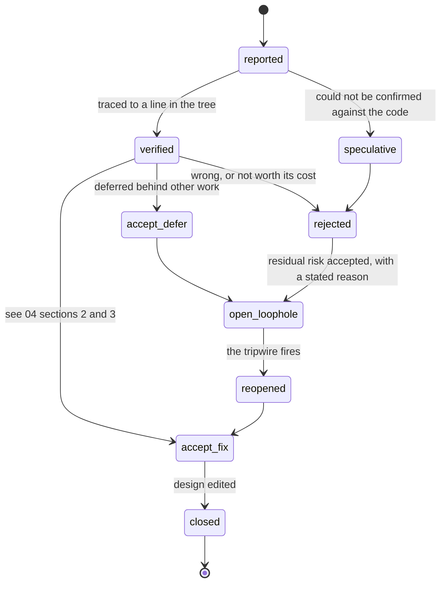

<!-- Adversarial review. Four independent lenses, 54 findings. -->
# Adversarial review of the gates design

Four red teams attacked the high- and low-level designs independently. Each was told that being
agreeable is a failure of function, and that a fabricated objection is worse than none — every
attack had to be traced to a line before it could be reported. Rulings on all of these are in
`04-remediation-and-build-order.md` §1.

---

**Diagram K — what happened to each of the 54 findings.** Nothing was dropped: a finding that is not
fixed is carried, by name, into the open-loophole register with the tripwire that would reopen it.

## Distributed-systems red team: races, split brain, lost updates, resume corruption

**Verdict.** No — not as specified. The invariant ("a gate is a park, never a hold; the gate row is the lock") is the right one, but it is enforced in exactly one place — `decideResume`'s `existing.status === 'gated'` clause — and that place is the one thing in the system that is not durable. Every other coordination primitive in this repo is an *invariant test inside the statement that acts* (`claimTicket`'s ownership test, `releasePromotion`'s conditional DELETE, `takeFreePort`'s reclaim-then-insert). The gate is the opposite: a status flag on a journal file written by a bare `writeFileSync` (`src/lib/artifacts.ts:118`), consulted only when that flag happens to read `'gated'`. A hard SIGINT during the park, a boot-time `reconcileForeignRuns` that flips the row to `aborted`, or the `rm -rf state/` that `src/lib/db.ts:2` explicitly blesses all leave the gate row behind and the journal saying something else — and then `shouldSkip` (`src/conductor/runner.ts:718`) steps over `plan`, `testcases` and `review` because `phaseSucceeded` (`src/lib/artifacts.ts:172`) is still true, and the run walks to `merge` with three questions nobody answered and no mechanism that will ever ask them again. The single biggest problem is that the design has no rule of the form "this phase may not be passed while an unapplied gate names it"; it only has "if the journal says gated, wait". Beneath that, the human channel has a deterministic data-loss bug (a two-gate reply applies one gate), the reject path silently refunds every retry budget in the run, and the two LLD parts specify two mutually incompatible `gate_answers` tables and two different `verify.maxTurns` formulas.

**If one change were forced before shipping.** Stop treating the park as a status and make it an invariant over the phase list. Today the gate is enforced in one place — `decideResume`'s `existing.status === 'gated'` clause — and every durability failure this system already documents (a non-atomic `writeJournal` at `src/lib/artifacts.ts:118`, a boot-time `reconcileForeignRuns` that rewrites the status to `aborted`, the `rm -rf state/` blessed at `src/lib/db.ts:2`) desynchronises that flag from the gate row and lets `shouldSkip`/`phaseSucceeded` walk the run straight past three unanswered questions to `merge`. Before shipping: put the check inside the loop, immediately before `shouldSkip` at `runner.ts:718` — "refuse to step over phase P while any `gates` row for this iid names P and has no `applied_at`" — so a gate is a property of the work, not of a JSON field, and it survives every crash, wipe and manual `--ticket` dispatch. That is the same discipline as `claimTicket`'s ownership test and `releasePromotion`'s conditional DELETE, and it is the only change that makes "ship unreviewed code" unreachable rather than merely unlikely.

### A-01 — One reply answering two gates applies only the first

| | |
|---|---|
| Severity | **fatal** (certain) |
| Target | LLD CORE §1 (gate_answers DDL) + §2 (applyCas verbatim) vs LLD CHANNEL §4 worked example #5 |

**Mechanism.** `verdict_source_id = "slack:" + channel_id + ":" + message.ts` (CHANNEL §3) is per-MESSAGE, and `CREATE UNIQUE INDEX gate_answers_source ON gate_answers(source_id)` (CORE §1) is on `source_id` alone. CORE §2's verbatim `applyCas` runs `INSERT OR IGNORE INTO gate_answers … VALUES(gate_id, source, source_id, …)` and then `if (ingested === 0) return 'superseded';` BEFORE the CAS. CHANNEL §4 example #5 is `g2 approve; g3 amend surface TC-04=api,TC-05=api # …` — two clauses, one `ts`. The G2 clause inserts and applies. The G3 clause carries the identical `source_id`, the INSERT is ignored, `ingested === 0`, and applyVerdict returns 'superseded' without ever reaching `UPDATE gates … WHERE gate_id=? AND state='open'`. G3 stays open, times out at `expires_at`, and takes the policy default. The final `UPDATE gate_answers SET outcome='applied' WHERE source_id = ?` also keys on source_id alone, so it stamps the wrong row. The human has been told (in the ask message itself: "both gates in one message if you like") that this works.

**What let it through.** The dedupe key was designed against the wrong unit. "One Slack reply ingests once however many conductors saw it" is a statement about *transport* duplication; the design then reused that key for *application* identity, where the unit is (gate, answer), not (message).

**Fix.** `UNIQUE(gate_id, source_id)`, and make the final outcome stamp `WHERE gate_id = ? AND source_id = ?`. Add a case to `scripts/verify-gates.ts` ONE VERDICT: one source_id, two distinct gate_ids, assert two 'applied'.

### A-02 — Any park that loses its journal status ships the gate unasked

| | |
|---|---|
| Severity | **fatal** (certain) |
| Target | src/conductor/runner.ts:237-254 (decideResume), :718-719 (shouldSkip), src/lib/artifacts.ts:172-176; LLD CORE §3 decideResume clause |

**Mechanism.** The only thing that stops a resume walking past a gated phase is the new `if (existing.status === 'gated') { if (gateOpen(iid)) refuse; }` clause. Three ordinary sequences leave the gate row `open` and the journal saying something else. (1) Second SIGINT: `src/index.ts:425-429` hard-exits on the second signal; the seam has already committed the `gates` INSERT but `finish(j,'gated')` has not yet reached `writeJournal`, so the journal still says `running`. Next boot, `reconcileForeignRuns` (`src/lib/db.ts:409-424`) selects `status IN ('claimed','running')` and buries the run row to `aborted`. `decideResume` reads journal `'running'` → resume; the gate clause never fires. (2) Operator abort during a park: HLD §3's own diagram says "operator abort ──► aborted (gate row survives, re-asked on resume)" — but resume enters the loop at i=0, `shouldSkip` is `!forced.has(name) && phaseSucceeded(iid, name)`, and `plan`/`testcases`/`review` all carry `ok` records, so the loop `continue`s at :460 and the seam at :697 is never reached. Nothing re-asks. (3) `rm -rf state/oneshot.db`, declared legal at `src/lib/db.ts:2-4`: the `gates` table is recreated empty, `gateOpen(iid)` is false, `decideResume` resumes even on status `'gated'`, and the same skip walk applies. In all three the run reaches `mr` → `merge` → `deploy` with an unreviewed plan and an unreviewed review, and — because `--ticket` bypasses `scan()` entirely (`src/index.ts:264-275`) — with no watcher-side check either.

**What let it through.** The design treats the park as an event with a state flag rather than as an invariant over the phase list. It assumes `journal.status` and the gate row cannot disagree, but the journal is a non-atomic `writeFileSync` (`src/lib/artifacts.ts:118`) and the gate row is a committed SQLite write — they disagree on exactly the crash boundary that matters.

**Fix.** Move the check into the loop, not the entry: before `shouldSkip` steps over phase P, refuse to advance if any `gates` row for this iid names P with `state IN ('open','answered')` and no `applied_at`. That makes the gate a property of the phase list, survives every journal status, and is the same shape as the ownership test inside `claimTicket`. Additionally, extend the `decideResume` gate check to every resumable status, not just `'gated'`.

### A-03 — A human reject silently refunds every retry and cycle budget in the run

| | |
|---|---|
| Severity | **fatal** (certain) |
| Target | LLD CORE §4 ("What a reject does") + scripts/unblock.ts:241-253 |

**Mechanism.** `pruneRecords(iid, { forcePhase: g.phase })` reuses `doomedRecords` verbatim. That predicate is `(forcePhase !== undefined && rec.phase === forcePhase) || (!KEPT_STATUSES.has(rec.status) && (only === undefined || rec.phase === only))`. With `forcePhase` set and `only` undefined — exactly the reject call — the SECOND disjunct fires for every record in the journal whose status is not ok/warned/skipped, across every phase. So a G2 reject deletes all `review` records AND every `failed` record of `implement`, `verify`, `qa` and `review`. `failedLapsOf` (`src/lib/artifacts.ts:165-169`) counts precisely `status === 'failed'`, and it is the sole input to `afterFailure`'s budgets at `runner.ts:856,860,878`. After one reject, `implement`'s `maxRetries: 2`, `review`'s `maxLaps: 3`, `verify`'s and `qa`'s `maxLaps: 2` are all back to zero. A run that had already burned its review cycles can now burn three more, and the `MAX_REMEDIATIONS` reasoning at `runner.ts:95-107` ("a cause that survives two corrections was not the cause the corrections addressed") is voided by a keystroke in Slack.

**What let it through.** §4 proves the reject cannot SPEND maxLaps and stops there. It never asks whether the reject REFUNDS them. `unblock.ts`'s predicate is correct in its own context — a human running unblock on a dead run wants the failed history cleared — and lifting it verbatim into a live run inherits a semantic that was never intended to run mid-pipeline.

**Fix.** `pruneRecords` must take an explicit phase set and prune only that: `doomedRecords(j, { only: g.phase, forcePhase: g.phase })`, or a dedicated predicate `rec.phase === phase`. Assert it in `verify-gates.ts`: after a reject on G2, `failedLapsOf(iid,'implement')` is unchanged.

### A-04 — claimOwnership cannot see a gated row, so two conductors resume the same run

| | |
|---|---|
| Severity | **major** (certain) |
| Target | src/lib/db.ts:304 (activeRowsFor), :382-393 (claimOwnership); LLD CORE §3 |

**Mechanism.** `activeRowsFor` filters `status IN ('claimed','running')`. A parked run's row is `'gated'`, so `claimOwnership`'s `foreign` list is empty and it returns true unconditionally — for anyone who asks. The moment the CAS flips the last gate to `answered`, `gateOpen(iid)` is false and both conductor A and conductor B see the ticket claimable on the same 60s tick (`src/index.ts:277,320`). Both call `runTicket`; both `decideResume` → resume with the same `runId`; both reach `claimOwnership(iid, runId, owner)` and both are told yes, because neither can see a row the status filter excludes. The window closes only when the first reaches `updateRun(status:'running')` at `runner.ts:358`, one `writeJournal` fs call later. This is the precise failure the docstring at `db.ts:364-380` says was fixed — "a uniqueness constraint cannot catch that either: nothing is inserted, both are UPDATEs" — and `runs_one_active_per_iid` (`db.ts:139-140`) is partial on `('claimed','running')` so it does not catch it now either.

**What let it through.** The design adds a run status without auditing the two places that enumerate statuses. HLD §3 argues the gated row must be invisible to `activeRunsFleet()` so the slot is returned — correct — and then assumes that same invisibility is harmless in `claimOwnership`, where it is the opposite of harmless.

**Fix.** Split the two queries. `activeRunsFleet()` keeps its `claimed|running` filter (capacity). `claimOwnership`/`claimTicket` get an `ownableRowsFor(iid)` that includes `'gated'`, so a gated row with a live owner refuses and a gated row with a dead owner is buried. Add a `verify-fleet` case: two children resume one gated run, exactly one wins.

### A-05 — gate_id omits run_id while every index, replay and reject keys on it

| | |
|---|---|
| Severity | **major** (certain) |
| Target | LLD CORE §1 (gate_id = sha1(iid|gate|artifact_sha)) vs gates.run_id, gates_one_open_per_run, gatesFor(runId) |

**Mechanism.** The primary key is content-addressed on `(iid, gate, artifact_sha)`; `run_id` is a mere column. Two consequences. (a) `gates_one_open_per_run` is `UNIQUE(run_id, gate) WHERE state='open'`, so an open row from run A does not block run B opening its own for the same iid — but `gateOpen(iid)` is iid-scoped, so after run B's gate is answered the ticket stays invisible to `scan()` (`watcher.ts:73` via the new `isClaimed` clause) until run A's stale row hits `expires_at`, 4–8 hours later. Answering the gate you were asked does not release the lock. (b) `openGate` is `INSERT … ON CONFLICT DO NOTHING` on the PK, so a second run for the same iid whose phase reproduces the same artifact bytes re-derives an `applied` row belonging to a dead run: the verdict of run A is silently taken as the verdict for run B's artifact, while `gatesFor(runId)` for run B returns nothing, so the effort replay and the reject-count bound ("third consecutive reject") both see an empty history.

**What let it through.** Content addressing was chosen to solve one real problem — not re-asking G3 when the degraded `check` group re-enters with identical bytes — and was then promoted to the identity of the row without checking that identity against the run-scoped indexes and readers built on top of it.

**Fix.** `gate_id = sha1(run_id | gate | artifact_sha)`, and solve the degraded-group case explicitly instead: before opening, look up `(run_id, gate, artifact_sha)` and skip if it is already `applied`. Then `gateOpen(iid)` and `gatesFor(runId)` describe the same population.

### A-06 — G3 is re-asked on every later review lap whenever it was amended

| | |
|---|---|
| Severity | **major** (certain) |
| Target | LLD CORE §3 ("Parallel groups") contradicted by LLD CHANNEL §1 (G3 amend rewrites testcases.json) |

**Mechanism.** CORE §3 asserts: "On a later review lap the group degrades to `review` alone (`config/phases.json:51`); `decideGates` still evaluates both, but G3's `gateIdFor` hashes the unchanged `testcases.json` and `openGate` returns 'exists' on an `applied` row, so only G2 parks." CHANNEL §1 (G3 paragraph) states the opposite premise: "On `amend` the **conductor** rewrites `testcases.json` to the approved list and archives the agent's original as `testcases.agent.json`." After any G3 amend — the outcome the entire `deltas_json` instrument is built to elicit — the bytes on disk are the human's list, not the agent's. `artifactSha` reads the file on disk, so `gate_id` differs, `openGate` inserts a NEW open row, and the human is asked to ratify his own edit. `review`'s `maxLaps: 3` means this can happen three times per ticket. The design names this exact harm: "Asking a human the same question twice is how a human stops reading the questions."

**What let it through.** Part 1 reasons about the artifact as immutable evidence; Part 2 makes the conductor a writer of that same artifact. The two parts never reconcile who owns `testcases.json` after a verdict.

**Fix.** Hash the bytes the human was SHOWN, not the bytes currently on disk: on amend, keep `testcases.agent.json` as the gate's artifact of record and derive `gateIdFor` from it, or include `lap` in the gate identity so re-entry at the same lap re-derives and a genuine new lap does not.

### A-07 — The harness writes its partial to a path that does not exist

| | |
|---|---|
| Severity | **major** (certain) |
| Target | LLD UIVERIFY §2 (harness.js) vs src/lib/ids.ts:51-65, src/lib/config.ts:367-373, src/phases/prompts.ts:924 |

**Mechanism.** `harness.js` computes `PARTIAL = ${process.env.ONESHOT_RUN_DIR}/${process.env.ONESHOT_PHASE}-partial.json` and `ARTIFACTS = ${process.env.ONESHOT_RUN_DIR}/artifacts`, and `BASE = process.env.ONESHOT_BASE_URL || …`. Neither `ONESHOT_RUN_DIR` nor `ONESHOT_BASE_URL` exists anywhere in the tree: `phaseEnv` (`ids.ts:55-64`) sets PHASE, RUN_ID, TICKET, LAP, WRITE_SCOPES, WORKTREE, PORT, BRANCH; `BASE_ENV` (`config.ts:368-373`) adds PATH, HOME, LANG, ONESHOT_HOME. §2 proposes adding only `ONESHOT_HARNESS` and `ONESHOT_PLAYWRIGHT`. So the partial lands at the literal relative path `undefined/verify-partial.json` inside the worktree, and the conductor's salvage — `readArtifact(iid, 'verify-partial.json')` at `runner.ts:595` — finds nothing. The proposed replacement makes it worse, not better: `const fresh = (partial?.startedAt ?? 0) >= r.startedAt` evaluates `0 >= startedAt` → false → `recorded = []` → no salvage is ever attempted. Today this works because `prompts.ts:924` hands the session the absolute `${runDir(iid)}/verify-partial.json`; the harness replaces a correct path with a broken one.

**What let it through.** §2 was written against the surviving `.verify-scratch/run-cases.js`, which got its path from the prompt text, and assumed the conductor already exports a run-directory variable because `ONESHOT_HOME` and `ONESHOT_PORT` exist.

**Fix.** Add `ONESHOT_RUN_DIR: runDir(iid)` and `ONESHOT_BASE_URL` to `phaseEnv` in the same edit as `ONESHOT_HARNESS`/`ONESHOT_PLAYWRIGHT`, and make `harness.js` throw at require-time if `ONESHOT_RUN_DIR` is unset — a harness that silently writes nowhere is the exact silent-loss shape the programme exists to end. The `test:harness` smoke test must assert the partial appears under `state/runs/<iid>/`.

### A-08 — Human-authored Slack text does reach a phase prompt with commit rights

| | |
|---|---|
| Severity | **major** (certain) |
| Target | LLD CHANNEL §1 step 24 and CORE §4 vs LLD CHANNEL §4 ("Why free text never reaches a prompt") and config/slack.json:20 |

**Mechanism.** CHANNEL §4 states the invariant absolutely: "The **only** human input that crosses into a prompt is a `rejectCodes` enum member." Two other passages break it. CHANNEL §1 step 24: the human's `missed apps/project_logs/serializers.py:118:major` becomes "a synthetic finding `F-05` (severity from the locref)" injected into the next `implement` lap "via the existing `addressedFindings[]` contract". CORE §4: "the human's `deltas_json` is injected into the re-run's prompt as *data* — the `amend` payload becomes a 'the reviewer said this about your last attempt' block". The `file` and `line` of a locref are free-form tokens from a Slack channel any workspace member can post into; the grammar validates their SHAPE (`path ":" line`), not their content, so an arbitrary path string reaches a session that holds worktree write scope and the GitLab MCP tool set. `report.ts`'s `redact()` bounds credentials, not instructions — the design says so itself and then relies on it anyway. `config/slack.json:20`'s stated invariant, quoted verbatim in §4, is "Raw message text is never stored and never reaches a prompt."

**What let it through.** §4 reasons about the `#` note tail — the obvious free-text channel — and treats the structured payload as machine data. But `locref` and `addspec` (`'"' scenario '"'`) are human prose inside the structured payload; the grammar constrains their delimiters, not their bytes.

**Fix.** Decide one way and write it down. Either (a) no human token reaches a prompt: a `missed` locref becomes a conductor-side instruction to re-run `review` with the file path passed as a validated, repo-existence-checked path and no free text, and `addspec` scenarios are stored for the dataset but never prompted; or (b) admit the surface and bound it — resolve every locref path against the worktree's git index and drop it if absent, cap `scenario` length, and strip everything outside `[A-Za-z0-9_./-]`. Make the invariant sentence in §4 match whichever you pick.

### A-09 — The park decision ignores openGate's answer, so applied gates park the run again

| | |
|---|---|
| Severity | **major** (certain) |
| Target | LLD CORE §3 (the runner seam, verbatim) — `if (asks.some((a) => a.parks))` |

**Mechanism.** The seam is `const asks = decideGates(...); for (const ask of asks) openGate(ask); if (asks.some((a) => a.parks)) { … return finish(j,'gated', …) }`. `openGate`'s `'opened' | 'exists'` return is discarded, and `parks` comes from `decideGates`'s policy cell — computed from artifacts on disk, not from whether a question is outstanding. The seam runs at every clean group boundary where `flow.length === 0`, including the `package` group (`ui-evidence` + `mr`, `config/phases.json:68,75`). At that boundary `plan.json`, `findings.json` and `testcases.json` are all still on disk, all re-derive `applied` gate_ids, `openGate` returns `'exists'` for each, and `parks` is still true — so the run parks with `gatedOn` pointing at applied rows. `gateOpen(iid)` is false (nothing is `open`), so the watcher re-offers on the next tick, the run resumes, the package group is now `shouldSkip`ped, and it advances. Net cost per ticket: one spurious park, one spurious Slack ask and card edit, one wasted claim cycle, per boundary the seam sees after the last real gate. The design's own anti-fatigue argument applies directly.

**What let it through.** CORE §3's own text — "`decideGates` still evaluates both" at the degraded check group — confirms the function is keyed on artifacts, not on `members`. The seam then treats "should this artifact be gated by policy" and "is there an unanswered question" as the same predicate.

**Fix.** `const opened = asks.filter((a) => openGate(a) === 'opened' && a.parks); if (opened.length) { … }`. Park only on rows this call actually opened, or on rows found `open`. And scope `decideGates` to the phases in `members`.

### A-10 — The warm server is never used by the phase it was warmed for, and pass 2 hands out an occupied port

| | |
|---|---|
| Severity | **major** (certain) |
| Target | LLD UIVERIFY §3 (takeFreePort pass 1/pass 2) vs src/lib/worktrees.ts:75-88, :143-160 |

**Mechanism.** Two independent defects. (a) Pass 1 is `for (const p of pool) if (!taken.has(p) && !unavailable.has(p) && !warm.has(p)) return grab(p);` — commented "Warmth is never destroyed while a cold port exists." With a three-wide pool and one warm port, the resumed run's `ensureLeases` (`runner.ts:742-751`) calls `leasePortFor` and gets a COLD port, so `verify` starts on a different port and re-pays the webpack compile the warm server exists to absorb. Nothing in the design makes a run prefer its OWN warm port; the warm server is preempted by pass 2 or reaped by the 12h boot sweep having served nobody. This is the entire claimed value of HLD §8.1 ("absorbs the compile that cost run #20 28.4 minutes"). (b) Pass 2 does `DELETE FROM warm_servers` and `grab(port)` inside the IMMEDIATE transaction, then calls `reapPortServer(preempted)` outside it. The lease is therefore granted on a port with a live listener. `worktrees.ts:147-152` documents exactly why that is forbidden: "Leasing it anyway is exactly how a verify phase ends up driving somebody else's server and reporting on the wrong code." `reapPortServer` sends SIGTERM only (`:126`) with no wait and no re-probe, so an `npm start` that takes seconds to die is still bound when the session starts. Additionally, `evictWarm` kills every current listener on a port this run does not lease, against `:119-120`'s rule that only the leased port is reaped.

**What let it through.** §3 optimises for the invariant "a warm server occupies no row in port_leases" and proves it cannot deadlock or leak. It never traces the path by which the warmed port reaches the phase that wants it, and it treats the `occupied` guard as a policy about foreign servers rather than as a hard precondition of the lease.

**Fix.** Give `leasePortFor` an optional `prefer` argument and have `ensureLeases` pass `serverFor(worktree)?.port` — pass 0: this run's own warm port. For pass 2, kill and WAIT (poll `portListeners` to empty, bounded, then SIGKILL) before the INSERT, or drop pass 2 and let the pool return null as it does today.

### A-11 — The two LLD parts specify two incompatible gate_answers tables

| | |
|---|---|
| Severity | **major** (certain) |
| Target | LLD CORE §1 gate_answers DDL vs LLD CHANNEL §1 step 19 and §7 ("The audit record") |

**Mechanism.** CORE §1's DDL: `(id, gate_id, source, source_id, actor, verdict, deltas_json, seen_at, outcome)` with `outcome` an applied|superseded enum. CHANNEL §1 step 19 inserts `(verdict_source_id, gate_id, actor, raw_sha256, note_redacted, parsed_json, parse_status, received_at)`, and §7 additionally requires `actor_name`, `channel_id`, `thread_ts` and `applied_at` — nine columns CORE's DDL does not have, under a different name for the dedupe key. This is not cosmetic: CORE §2's verbatim `applyCas` is the specified implementation and writes CORE's columns, while CHANNEL's refusal handling (`parse_status='refused'` so a redelivery does not re-refuse), its per-actor rate limit (`SELECT COUNT(*) … WHERE actor=? AND received_at > ?`) and its tamper-evidence argument (`raw_sha256` honouring `slack.json:20`'s "raw message text is never stored") all key on columns that do not exist in the DDL. Whoever implements Part 1 gets a table on which Part 2's authorisation, refusal and audit story cannot be built; whoever implements Part 2 gets a table the verbatim CAS does not compile against.

**What let it through.** The two parts were written to different concerns — CORE to exactly-once application, CHANNEL to the human protocol — and the shared table was never reconciled in either direction.

**Fix.** One DDL, in CORE §1, carrying the union: `gate_id, verdict_source_id (with gate_id in the UNIQUE), source, channel_id, thread_ts, actor, actor_name, verdict, deltas_json, raw_sha256, note_redacted, parsed_json, parse_status, received_at, applied_at`. Drop `outcome`; `parse_status` subsumes it. Re-derive the CAS against it.

### A-12 — Two different verify.maxTurns formulas, and previousLapCap has nowhere to live

| | |
|---|---|
| Severity | **major** (certain) |
| Target | LLD CORE §6 (clamp(60 + 14n, 120, 450)) vs LLD UIVERIFY §5 (base 160, perCase 10); db.ts:41-54 |

**Mechanism.** CORE §6 specifies `maxTurns = clamp(60 + 14 × n, 120, 450)` with `base = 60`, `perCase = 14`, plus `timeoutMin = min(150, 40 + 5.5 × n)`, and worked examples "a 20-case list gets 340" and "an 8-case list gets 172". UIVERIFY §5 specifies `turnScale: {base: 160, perCase: 10, max: 450}` with worked examples "#16 (20) → 360" and "an 8-case list → 240, a 47% cut". Same field, same config file, different constants, different numbers for the same input, with independent derivations presented as measured. Separately, UIVERIFY §5's guard (i) — "the derived value is `max(derived, previousLapCap)` read from `phase_runs`" — cannot be implemented: `phase_runs` is `(id, run_id, phase, lap, model, status, started_at, ended_at, turns, weighted, session_id, detail)` (`src/lib/db.ts:41-54`); there is no cap column and none is proposed. And `withDerivedTurns` touches only `maxTurns`, so CORE §6's own argument — "`timeoutMin` must scale with the same `n` or the turn cap is decorative: #20's 19 cases took 74.5 min against the formula's 144" — is dropped by the part that implements it.

**What let it through.** Part 1 derived the formula from turns-per-case on warm runs; Part 3 re-derived it from the repair burden on #21. Neither part read the other's number, and nobody checked `phase_runs`'s columns before specifying a read from it.

**Fix.** Pick UIVERIFY §5's derivation (it is the one grounded in the repair chain that actually kills runs), delete CORE §6's, and carry `timeoutMin` in the same `turnScale` object. Store the derived cap in `phase_runs.detail` JSON — the column already exists and `phaseEnd` already writes it — or add `max_turns INTEGER` in `migrate()` as an ALTER, which is what `db.ts:118-124` says that function is for.

### A-13 — A pre-upgrade testcases.json routes a whole UI list to a shell script

| | |
|---|---|
| Severity | **major** (certain) |
| Target | LLD UIVERIFY §4 (surface) + §5 (withDerivedTurns) + rollout step 5; src/conductor/schemas.ts:126-128; runner.ts:457-462 |

**Mechanism.** `surface` is added to `TESTCASES` `properties` and `required`, and `additionalProperties:false` (`schemas.ts:111`) makes it mandatory — for lists written AFTER the upgrade. A run that was aborted or parked before the upgrade resumes with `testcases` already `ok`, so `shouldSkip` (`runner.ts:457`) steps over it and hands `verify` the OLD artifact, which has `blast` but no `surface`. `withDerivedTurns` then computes `ui = cases.filter(c => c.surface === 'ui').length` = 0, so a 20-case all-UI list gets `160 + 10×0 + 2×20 = 200` turns instead of 360. Worse, once step 5 ships, verify's prompt routes on the same field: every case reads as non-`ui` and is batched into one shell script, so a twenty-case browser list is 'verified' with no browser at all, produces `results` with passes, clears the all-negative overrule at `runner.ts:568-580`, and satisfies `qualityGate()` at the merge. The falsifier §4 proposes ("any `verify.regressions[]` or `qa` fail on a case labelled `api`/`orm`") cannot fire, because nothing is labelled anything.

**What let it through.** The rollout treats `surface` as additive schema and correctly notes the SDK enforces it — but enforcement happens at the tool-call layer for new output only, and the resume path is the one that reads old output. `undefined !== 'ui'` fails open toward the cheap branch.

**Fix.** Default absent `surface` to `'ui'`, not to the batch: `const ui = cases.filter(c => (c.surface ?? 'ui') === 'ui').length`, and have the routing prompt treat a missing label as `ui`. Fail expensive. Add a `verify-gates` assertion that a case list with no `surface` fields yields the all-`ui` budget.

### A-14 — The transport call cannot be made by call(), and the poll cadence has no scheduler

| | |
|---|---|
| Severity | **minor** (likely) |
| Target | LLD CHANNEL §3 (the Slack read, adaptive interval) vs src/lib/slack.ts:34-46 and src/index.ts:46,243-275 |

**Mechanism.** Three small things that together make the inbound half not run as described. (a) §3 specifies `GET conversations.replies?channel=…&ts=…`; `call()` at `slack.ts:38-46` hardcodes `method: 'POST'` with `Content-Type: application/json`. §3 says `call()` learns `Retry-After` but never says it learns GET or form encoding, and Slack's `conversations.*` read methods do not accept a JSON body. (b) `TICK_MS = 60_000` (`src/index.ts:46`) and §3 states reconcileGates is called "from two places and no scheduler" — `tick()` and the phase-boundary seam. A parked run has no more phase boundaries, so the only caller is a 60-second loop, and `pollMs.hot: 10000` / `nudgeAtFraction` are unreachable by construction. HLD §7's "drops to ~10s only while a gate is open" is the same claim. (c) `tick()` returns early at `:255` (PAUSE), `:259` (quotaParked) and `:274` (`--ticket`); only a placement literally at `:248`, above `probe()`, keeps reconciliation alive through an operator pause — worth stating, since a gate whose ask never landed during a pause is invisible until `expires_at`. Separately, the expiry-escalate path ("`finish(j,'blocked')` with `swapLabel`") is performed by a reconciler on a conductor that holds no claim on that run and never sets `blockedAt`, so `decideResume`'s cooldown (`runner.ts:245`) reads `Date.now() - 0` and re-offers the ticket immediately; `unblock.ts:274-290` exists precisely to refuse that class of edit.

**What let it through.** §3 reasons carefully about rate limits and dedupe and assumes the existing Slack helper is a general HTTP client. The cadence numbers were written against the desired latency, not against the one loop that can produce it.

**Fix.** Give `call()` a method/encoding parameter and a `Retry-After` path. Either arm a real `setInterval(reconcileGates, pollFloorMs).unref()` in `main()` beside the heartbeat fix HLD §6 already requires, or delete `pollMs.hot`/`warm`/`cold` and say the cadence is TICK_MS. Make expiry-escalate take ownership through `claimOwnership` before it writes, and stamp `blockedAt`.

---

## SECURITY RED TEAM — verdict channel as privilege-escalation surface

**Verdict.** No, not as written. The design is unusually careful about *durability* of the verdict and almost entirely silent about its *authority*. Its central assumption — that a gate row and a `--as` string constitute a human decision — is false on this machine, because every gated phase (`plan`, `testcases`, `review`) runs with `permissionMode:'bypassPermissions'` (src/conductor/phase.ts:290), unguarded Bash (only git-guard and deploy-guard match `^Bash$`, src/conductor/hooks.ts:145-146, and deploy-guard's local checks are behind `if (!deploying) continue`, hooks/deploy-guard.cjs:923), on the same filesystem as `state/oneshot.db`, `scripts/gate.ts` and `.env`. The single biggest problem is that the thing being reviewed can write its own review verdict, and the design adds no boundary that would stop it — the .gitignore's own comment ("Bash redirects escape write-scope") already documents the hole. Close behind: the gates are a net *weakening* of two existing safety properties. `qualityGate()` (src/conductor/codephases.ts:819-843) is today a deterministic merge veto over `findings.json` and `verify.json`; the design lets a Slack line edit both inputs and never says whether it rewrites them, so the amend path is either a veto bypass or inert. And a gate replaces `blocked` — 60-minute cooldown, `Needs Human` label, `@mention` — with a park whose only lock is a row in a file db.ts:2-4 calls deletable cache, defaulting to `proceed` on a timer that starts before the ask was ever delivered. Build the measurement instrument; do not let it hold a merge decision until the verdict channel has an authority story.

**If one change were forced before shipping.** Make it structurally impossible for a phase session to author, alter or unblock its own gate. Concretely: delete `--as` (a verdict's actor must come from an authenticated channel, never from the caller), move `gates`/`gate_answers` out of a file every phase's Bash can write, and add `state/oneshot.db`, `scripts/`, `skills/` and `.env` to a Bash-surface deny guard. Until that lands, the gate is a request the reviewed agent can answer on its own behalf, and every calibration number downstream is measuring a system that can grade itself.

### A-01 — A phase can self-approve its own gate through unguarded Bash

| | |
|---|---|
| Severity | **fatal** (certain) |
| Target | LLD Core §8 (scripts/gate.ts `--as`), LLD Channel §6; src/conductor/hooks.ts:141-149 |

**Mechanism.** `hooksFor()` (src/conductor/hooks.ts:141-149) attaches write-scope.cjs only to `^(Write|Edit|NotebookEdit)$` and git-guard/deploy-guard only to `^Bash$`. deploy-guard's local checks (`checkLocalGit`, `checkLocalRedirects`) sit behind `if (!deploying) continue` (hooks/deploy-guard.cjs:923), so in `plan`/`testcases`/`review` no guard inspects a non-git, non-ssh Bash command at all. Bash is never in `disallowedTools` (src/conductor/phase.ts:96-131) and sessions run `permissionMode:'bypassPermissions'` (phase.ts:290). Two one-liners follow. (1) `~/Documents/oneshot/node_modules/.bin/tsx ~/Documents/oneshot/scripts/gate.ts 8607 --gate G2 --verdict approve --as U0HASSAM` — `--as` is checked for allowlist membership only, never authenticated, so the reviewed agent asserts the reviewer's identity perfectly. (2) `sqlite3 ~/Documents/oneshot/state/oneshot.db "UPDATE gates SET state='answered',verdict='approve',verdict_by='U0HASSAM' WHERE gate='G2'"` — sqlite3 is on PATH (hooks/budget-gate.cjs:34-42 depends on it), `state/` is not in write-scope's RUNTIME_DENY (hooks/write-scope.cjs:35-42), and git-guard explicitly whitelists `cd` into `ONESHOT/state` (hooks/git-guard.cjs:178). The repo's own .gitignore comment — "Scratch files phases drop at the conductor root (Bash redirects escape write-scope)" — documents that this write path is known and unclosed.

**What let it through.** The design treats the gate as a boundary between the conductor and a human, and never asks whether the party being judged shares a filesystem with the judgement. Every existing guard was written against git, deploy and file writes; nobody wrote one against `node`/`sqlite3`, because before gates there was nothing locally writable worth forging.

**Fix.** Delete `--as`: the actor must be derived from an authenticated channel (Slack `user` from the API, GitLab `author.id`), never supplied by the caller. Add a Bash-surface guard denying any command naming `state/oneshot.db`, `scripts/`, `skills/` or `.env` from a phase session, and treat that guard as FAIL_CLOSED like deploy-guard (src/conductor/hooks.ts:46). Long term the gate store must not be writable by the sessions it governs — a separate process, a separate uid, or a signed verdict the conductor verifies.

### A-02 — G2 amend either bypasses qualityGate or is inert; the design picks neither

| | |
|---|---|
| Severity | **fatal** (certain) |
| Target | src/conductor/codephases.ts:819-843; LLD Channel §1 step 24 and §4 payload `noise` |

**Mechanism.** `qualityGate(iid)` (codephases.ts:819-843) refuses the merge when `findings.json` has `verdict === 'changes-requested'` OR any finding of severity blocker/major, and when `verify.json` holds any `result === 'fail'`. It is the only deterministic merge veto in the system. The G2 grammar lets an allowlisted human declare findings `noise` (LLD Channel §4), and §1 step 24 says F-03 is "marked suppressed". If the conductor drops suppressed findings from `findings.json`, then one Slack line — `g2 amend noise F-01` where F-01 is a blocker — removes the veto with no second signature and no trace in qualityGate's own inputs. If it does not rewrite the file, the run still fails merge on the same findings and the amend verdict is uncollectable, which makes the flagship G2 dataset (precision/recall of `findings[]`) unmeasurable. The G3 sibling path already confirms rewriting is intended ("the conductor rewrites testcases.json to the approved list"), and `writeArtifact` (src/lib/artifacts.ts:211-216) is a bare `writeFileSync` with no validation — so a conductor-side rewrite bypasses `FINDINGS_SCHEMA`/`TESTCASES_SCHEMA` and their `additionalProperties:false` (schemas.ts:111, :146-165), which LLD Part 3 §4 cites as the guarantee that fields "cannot be smuggled in or omitted".

**What let it through.** The design reasons about the gate as an addition to the pipeline and never re-reads the one existing gate it shares inputs with. §5's own confidence term cites `qualityGate()` approvingly as a cross-check, without noticing that the verdict it is proposing edits that cross-check's operands.

**Fix.** State in the LLD that `findings.json` and `testcases.json` are never rewritten by a verdict. Carry suppressions and additions in a separate `gate-overrides.json`; make `qualityGate()` read it explicitly and refuse to merge over a suppressed blocker/major unless a second verdict arrived on a different channel from the same actor. Validate every conductor-side artifact write against `schemaFor(phase)` before it lands.

### A-03 — An ask that never landed still auto-proceeds on a timer

| | |
|---|---|
| Severity | **fatal** (certain) |
| Target | LLD Core §1 (`expires_at`, `timeout_policy`), §5 POLICY; LLD Channel §1 step 7 vs step 12 |

**Mechanism.** `expires_at = now + 4h` is stamped at park (Channel §1 step 7), but `asked_at` is stamped only after delivery (step 12) and the design itself calls it "the only witness that the ask landed". Six of nine policy cells default to `proceed`. Delivery is best-effort: `slack.ts:49-53` logs the Slack error code and swallows it, `slackEnabled()` (slack.ts:32) is false without a token, and the GitLab half is gated on `netState()==='ok'` — the same FortiClient tunnel. So: VPN down plus a Slack blip at park time yields a gate with `asked_at NULL`, `latency_ms NULL`, nothing in any channel a human reads, and `expireGates()` firing at T+4h with `verdict='timeout-proceed'`. The run resumes and merges. The sleep guard (§1 "unhappy paths") only skips ONE expiry pass and forces one poll cycle; a poll of a thread that was never posted finds nothing, so the second pass expires it anyway. This directly contradicts README:160-162 — "a separate file precisely so nothing automatic ever lifts a pause you set" — which ground-slack.md:208 explicitly tells the design to copy.

**What let it through.** The design measures the timeout ratio as a *health metric* ("above ~30% the gates are theatre") and treats that as the mitigation. A metric read after the fact does not stop the merge that already happened, and the ratio is exactly what an outage-driven mass expiry corrupts.

**Fix.** Start the clock at `asked_at`, not `opened_at`. A gate with `asked_at IS NULL` must never expire to `proceed` — it escalates to `blocked` with the `@mention`, which is the behaviour that already exists and works. Require a delivered nudge as a precondition for any `proceed` default, and record the delivery channel on the expiry row so the calibration set can exclude undelivered gates.

### A-04 — Any workspace member can starve the poller into the timeout default

| | |
|---|---|
| Severity | **major** (likely) |
| Target | LLD Channel §3 (poller, watermark, `pollFloorMs`), §7 |

**Mechanism.** The ask goes into a channel of the Arbisoft workspace. §7 says a non-allowlisted message is still "recorded (source id, actor, raw_sha256)", and §3 says `poll_watermark` advances "only after every message in the page has been inserted into gate_answers". §8's own `_why_pollFloorMs` documents the restricted tier: 1 request/minute, ≤15 objects. Anyone who can post in that thread — no allowlist needed — posting faster than 15 messages/minute permanently outruns the watermark; the genuine verdict sits behind the flood and is never drained before `expires_at`, at which point A-03's `proceed` default merges the change. `maxVerdictsPerActorPerHour` is a parse-time control and does not stop the recording, and `call()` has no `Retry-After` handling (slack.ts:49-53), so induced 429s compound it. Non-malicious version: a chatty thread on a busy ticket does the same thing by accident.

**What let it through.** The design derives the poller from rate limits and fleet multipliers, and models the channel as a place where only the reviewer speaks. It never asks what an adversary — or a colleague — posting into a public thread can do to the ordering guarantee that the whole at-least-once story rests on.

**Fix.** Detect candidates newest-first and advance the watermark per-message, not per-page, so a flood cannot hide a later verdict behind an earlier backlog. Cap recorded non-allowlisted messages per gate. Most importantly, make `expireGates()` refuse to expire any gate whose last poll did not reach the end of the thread — a starved poll must never be allowed to reach an expiry decision.

### A-05 — Two conductors can resume one gated run: claimOwnership cannot see 'gated'

| | |
|---|---|
| Severity | **major** (certain) |
| Target | src/lib/db.ts:304, :382-405, :138-144; src/conductor/runner.ts:325; LLD Core §3 `decideResume` |

**Mechanism.** `activeRowsFor(iid)` (db.ts:304) filters `status IN ('claimed','running')`. `finish(j,'gated')` writes `runs.status='gated'`, so the row is invisible to it. On resume `runTicket` takes the `claimOwnership` branch (runner.ts:325, because `getRun(runId)` exists); inside `claimOwnership` (db.ts:382-405) `foreign` is empty, so it returns true for every caller, unconditionally. The partial unique index `runs_one_active_per_iid` (db.ts:138-140) is scoped to the same two statuses and the resume is an UPDATE, not an INSERT, so it cannot fire either. The instant a verdict applies, `gateOpen(iid)` goes false and all three conductors' `scan()` (watcher.ts:73) offer the ticket in the same tick — the ordinary case, not a rare one. Two conductors then drive one worktree, one branch and one MR. This is exactly the double-drive the comment at runner.ts:300-312 says was closed for `running`.

**What let it through.** The invariant 'a gated run holds no dispatch slot' was implemented by choosing a status the existing filters ignore. Making the run invisible to `activeRunsFleet()` also made it invisible to the claim, and the design's only reasoning about the claim is that `isClaimed()` gains `|| gateOpen(iid)` — which stops being true precisely at the moment the race opens.

**Fix.** Add `'gated'` to `activeRowsFor`'s status set and to `runs_one_active_per_iid`, and derive `activeRunsFleet()`'s slot accounting from a separate predicate rather than from the claim's. Verify it in `verify-gates.ts` as a spawned-children race, the way ONE VERDICT is specified — the claim needs the same test the CAS gets.

### A-06 — Slack free text does reach a bypassPermissions prompt

| | |
|---|---|
| Severity | **major** (certain) |
| Target | LLD Channel §4 ("the only human input permitted to cross into a phase prompt is a rejectCodes enum member"); src/phases/prompts.ts:172-179, :623 |

**Mechanism.** G3's `add "<scenario>"@ui!high` writes an attacker-authored string into `testcases.json`. `caseList()` (prompts.ts:172-179) renders `c.scenario`, `c.precondition`, `c.steps[]` and `c.expected` verbatim into verify's and qa's prompts. G2's `missed <path>:<line>:<severity>` becomes synthetic finding F-05 (Channel §1 step 24), and the implement builder renders `f.file`, `f.what`, `f.fix` verbatim at prompts.ts:623. Those sessions run with `permissionMode:'bypassPermissions'` (phase.ts:290), unguarded Bash, a `worktree` write scope (config/phases.json:33, :60) and a leased branch git-guard permits them to push. The only bound is `maxGateTextLen: 600`. The design's stated defence — redaction through `report.ts:109` — is (a) a module-local function that is not exported from report.ts, so it cannot be called from gates.ts as written, and (b) a credential-pattern denylist (report.ts:94-107) that has no bearing on instructions.

**What let it through.** The design correctly identifies the `#` note as an injection surface and closes it, then asserts the closure covers everything. It does not follow the *structured* payloads — which are the whole point of `deltas_json` — down into the prompt builders that render them.

**Fix.** Say plainly that the payload channel is an injection surface into a bypassPermissions session, and constrain it structurally: G3 payloads become id-only (drop/relabel), and an added case is requested by re-running `testcases` with the human's request carried as a conductor-summarised note, never as prompt-embedded text. G2 `missed` carries a path and a line and nothing else, with the path validated against files actually present in the worktree. Export `redact` and apply it to everything persisted, but stop presenting it as an injection defence.

### A-07 — The gate dataset commits internal ticket content to a personal GitHub repo

| | |
|---|---|
| Severity | **major** (certain) |
| Target | LLD Core §8 `scripts/export-gates.ts` — "a git-tracked `data/gates.jsonl`" |

**Mechanism.** `git remote -v` in /Users/hassam.azam/Documents/oneshot resolves origin to `https://github.com/HassamAzam/oneshot.git`. `.gitignore` excludes `state/` for exactly this reason. The proposed export is deliberately outside it and carries `deltas_json` (human-authored text, file paths, locrefs), `note_redacted`, `score_json` — which by Core §5 keys on `plan.steps[].files` intersected with `apps/auth/`, `common/permissions.py`, payroll, leaves, i.e. internal ERP paths — actor ids, and artifact/skill shas from arbisoft/workstreamai, a project reachable only through FortiClient. The single filter, `redact()` (report.ts:94-107), is not exported, has no rule for the `email:password` shape of `ONESHOT_TEST_LOGIN` (prompts.ts:186-200 injects those credentials into prompts, and test-case preconditions routinely name them), and is a denylist.

**What let it through.** The requirement driving it is real and correctly stated — `state/` is deletable cache, so the dataset must outlive it. The design solves that by moving the file into the git tree without asking where that tree pushes to. Durability and egress got answered with one decision.

**Fix.** Keep the export under a gitignored path with a documented backup, or push it to the internal GitLab project rather than github.com. Whichever, build the record from an explicit field allowlist (gate id, bands, cell, verdict, actor id, timings, set-difference *ids*) rather than by serialising rows, so free text and file paths never enter it by default.

### A-08 — Sibling check-group phases can rewrite each other's artifacts — including the one the gate hashes

| | |
|---|---|
| Severity | **major** (certain) |
| Target | config/phases.json:42, :50; src/conductor/phase.ts:66-75; LLD Core §1 `artifact_sha` |

**Mechanism.** `writeScopes` (phase.ts:66-75) maps the declared scope `"run"` to `runDir(iid)` — the whole `state/runs/<iid>` directory. `testcases` (config/phases.json:42) and `review` (:50) both declare `writes:["run"]` and are dispatched concurrently as group `check` (runner.ts:522). So a `testcases` session can make a perfectly legal `Write` to `state/runs/8607/findings.json` containing `{"verdict":"approve","findings":[]}`. That file is what G2 shows the human, what `artifact_sha` and `gate_id` commit to, and what `qualityGate()` (codephases.ts:819-843) reads at merge. It is also one operand of §5's flagship confidence cross-check (`findings.verdict === 'approve'` while `implement.lintClean === false`). The gate makes a pre-existing scope looseness load-bearing for a human decision and for the calibration dataset.

**What let it through.** The design reads `writes:["run"]` as "writes its own artifact" and never expands it to the directory it actually resolves to. `additionalProperties:false` is cited as making fields unforgeable, but that constraint lives at the SDK output boundary, not at the file.

**Fix.** Narrow the `run` scope to `state/runs/<iid>/<phase>-*` plus `scratch/`, and have the conductor — which already holds the SDK's validated structured output — be the only writer of `<phase>.json`. Deny any session write whose basename matches a declared artifact name of a phase other than its own.

### A-09 — No revocation path, and the allowlist grants authority to a delegable identity

| | |
|---|---|
| Severity | **major** (likely) |
| Target | LLD Channel §7 (allowlist); src/lib/config.ts:228-235 |

**Mechanism.** `slackConfig()` memoises into `_slack` on first call (config.ts:229) and `envOr` reads a `process.env` dotenv populated at module init (config.ts:21). Removing an id from `config/slack.json` or `ONESHOT_GATE_SLACK_ALLOWLIST` therefore has no effect until every conductor restarts — three restarts, mid-ticket, the same cost ground-slack.md:173 already documents for a scope change. There is no doctor check that an allowlisted id is still an active workspace member, and none proposed (§8 check 6 only validates the id's *shape* and its presence in `_names`). Separately, the design's bot filter is structural on `bot_id`/`app_id`/`subtype`/self-id — correct against apps posting as themselves, but a message posted with a *user* token carries `user: <U…>` and no `bot_id`, so any third-party Slack app an allowlisted human has ever authorised with a `chat:write` user scope can post a verdict in their name, and the filter cannot tell.

**What let it through.** The design treats the allowlist as the authorisation boundary and stops there. It asks who may answer and never asks how that authority is revoked, whether the identity is exclusively held, or what happens when the person leaves.

**Fix.** Read the allowlist uncached at every verdict evaluation. Add a doctor check resolving each id to an active member. For any `high` risk band, require the same actor on two channels (Slack reply *and* GitLab note) before the CAS applies — one message from one delegable id should not clear the highest-consequence cells.

### A-10 — GitLab verdicts are not tamper-evident and the bot-id resolution has no failure policy

| | |
|---|---|
| Severity | **major** (likely) |
| Target | LLD Channel §6 (GitLab fallback); src/lib/gitlab.ts:127-136 |

**Mechanism.** §6 widens `issueNotes` to `{id, body, created_at, system, author:{id, username}}`. `updated_at` is absent and never compared, and §7's `raw_sha256` tamper-evidence is defined for Slack only — the GitLab channel has none. A note body that changes between authorship and first read is read once as the original author with no evidence; the only protection is the `verdict_source_id` collision, which helps only if the first read already happened, and the GitLab poller runs under `netState()==='ok'`, so a VPN outage makes that window unbounded. Second: `ONESHOT_GATE_GITLAB_BOT_ID` "blank resolves it once at boot via GET /user" with no stated behaviour when that call fails — behind a down tunnel it will. If it fails open, the bot's own ask note (authored by the PAT's user, which .env.example:8-12 explicitly permits to be the operator's personal PAT and therefore an allowlisted account) becomes the most attractive parse target in the thread, and the ask body contains the literal grammar.

**What let it through.** The design gets author identity right (numeric id, not username; reject `system:true`) and then treats an authenticated author as an immutable message. It reasons about Slack edits explicitly and never asks the same question of GitLab.

**Fix.** Require `created_at === updated_at` on any note treated as a verdict; store `raw_sha256` for GitLab notes too and re-hash at apply time, refusing on mismatch. Make the bot-id resolution FAIL CLOSED — no GitLab verdict is parsed until the bot id is known — and add a doctor FAIL when `GITLAB_TOKEN` resolves to a user id that is on the gate allowlist, rather than only checking the configured `BOT_ID`.

### A-11 — The park is strictly weaker than the block it replaces, and its only lock is deletable cache

| | |
|---|---|
| Severity | **major** (certain) |
| Target | HLD §1 invariant; LLD Core §3 `finish` table; src/lib/db.ts:2-4; src/conductor/runner.ts:89, :245, :1306-1312 |

**Mechanism.** Today a run needing a person gets `blocked`: `blockedAt` plus a 60-minute `BLOCK_COOLDOWN_MS` (runner.ts:89, :245), a `Needs Human` label that makes `scan()` skip the ticket indefinitely (watcher.ts:67-72), and the one unprompted `@mention` (runner.ts:1307). The gate deliberately does none of these — `Loop` stays on, no cooldown, no label, no mention unless the cell is `block`. The sole thing keeping three conductors off a ticket awaiting a human judgement is `gateOpen(iid)` reading `state/oneshot.db`, a file db.ts:2-4 declares a cache: "Delete state/oneshot.db and the next tick rebuilds what it needs from GitLab." Nothing in GitLab records that a gate is open, because §10.6 chooses note-only over a label. So `rm -rf state/` — a documented, supported operation — or a corrupt DB, or the `gates` table failing to create on an old peer, silently converts "awaiting a human decision on a plan that touches apps/auth/" into an unclaimed `Loop` ticket, and the journal that would have said `gated` is in the same deleted directory.

**What let it through.** The §1 invariant ('a gate is a park, never a hold') is optimised for throughput and correctly identifies that a gated run must not consume a slot. It then reuses that reasoning to justify shedding the label and the cooldown too, which are not resource holds — they are the durable, external record that a human is expected.

**Fix.** Put the park in GitLab. Either take the `Needs Review` label and write its `_why` (§10.6's own counter-argument — a gate label is human input, not inter-agent consensus — is sound), or make boot reconciliation re-derive open gates from the ask notes' `<!-- oneshot:gate -->` markers before the first `scan()`. Until one of those exists, the gate cannot survive the failure the design's own durability section claims it survives.

### A-12 — Reject apply is not atomic, so a crash re-prunes the plan the human just approved

| | |
|---|---|
| Severity | **minor** (likely) |
| Target | LLD Core §4 (`pruneRecords(iid, {forcePhase: g.phase}); markApplied(g.gate_id);`) |

**Mechanism.** `pruneRecords` writes the journal and deletes artifacts (filesystem); `markApplied` writes SQLite. They are in no shared transaction and cannot be. A crash between them leaves the gate `answered`, so `gateOpen()` is false, the watcher re-offers the ticket, and the top-of-`runTicket` reject application runs again — this time pruning the *newly re-authored* plan. The three-consecutive-reject bound counts prior reject rows via `gatesFor(runId)`, and this loop creates no new reject row, so nothing bounds it. Externally it is indistinguishable from an agent that cannot write an acceptable plan, which is precisely the signal the calibration set is trying to measure.

**What let it through.** §4 proves at length that a reject cannot spend `maxLaps` or become a phase failure — a correct and careful argument about the *control flow*. It never asks what bounds the reject's own re-application.

**Fix.** Mark applied first (the prune is already idempotent — `doomedRecords` returns empty on an already-pruned journal), and stamp the applied gate id on the journal so a reject is keyed to the journal generation it was answered against and cannot apply twice.

### A-13 — The inbound transport does not exist in the shape slack.ts can make

| | |
|---|---|
| Severity | **minor** (likely) |
| Target | LLD Channel §3 ("GET conversations.replies?channel=…"); src/lib/slack.ts:34-46 |

**Mechanism.** `call()` (slack.ts:34-46) hardcodes `method:'POST'` with `Content-Type: application/json`. §3 specifies a GET with a query string, and §2's only stated change to `call()` is `Retry-After` handling. Slack's `conversations.replies` is not among the JSON-body methods; the call returns an argument error, `slack.ts:52` logs the code and returns, and the poller reads zero replies forever. The failure is silent and indistinguishable from a channel nobody answers — after which A-03's `proceed` default fires on every gate. The proposed doctor probe (§8 check 2) uses a bogus `ts` and treats `thread_not_found` as success, so it would pass against exactly this bug.

**What let it through.** The design specifies the HTTP call at the Slack-API level and the code change at the module level, and never reconciles the two — the same 'configured is not the same as runs' failure phase.ts:130-176 already documents for the GitLab MCP server.

**Fix.** Give `call()` an explicit GET+querystring path and use it for the read methods. Make the doctor probe assert a *successful* `conversations.replies` against a real thread ts, not the absence of a scope error.

---

## Measurement / epistemic red team — is the instrument capable of measuring what it claims, on the data it will actually see

**Verdict.** Ship the gates; do not ship the measurement claim. The mechanics (park-not-hold, content-addressed gate_id, CAS, polling transport) are sound and I found little to attack there. The instrument is not. I replayed the C and R scorers by hand against all four runs that reached the gated phases and the result is that both axes are degenerate: confidence is `high` on 12 of 12 historical gate opportunities (every anomaly term is dead — no partial is ever written at 0.61 max turn-fraction, `failedLapsOf` is 0 in all four journals because a timed-out `testcases` in #16 is recorded `ok`, `lintClean` is true 4/4 so the G2 cross-check never fires, and `recall.priorTickets` is empty 4/4 so the only live corroboration term is the agent's own `plan.reuse`), while risk is saturated at a 0.51 floor on every ticket by two capped terms and is, in practice, a migration detector. A 3×3 policy table with one reachable row and one-and-a-half reachable columns cannot produce a calibration curve, cannot stratify away ticket difficulty, and cannot reach the `auto` cell whose error rate is the entire point of the holdout — a holdout which, as specified, inherits `ttl = 0` from the `notify` cell and therefore expires on the tick it opens, taking the run's one timeout allowance with it. Behind those is the deeper problem the lens names correctly: the unit is not a skill. `plan` is a two-skill composite, `review` was a two-skill composite on #16/#18/#20 and a one-skill composite on #21, `implement` declares six, the reviewer subagent set already varies with the diff's layer, and the design proposes to vary it further with the same risk band it stratifies on — so effort is a function of the stratification variable and skill quality is not identifiable within a stratum. `skill_sha` cannot even name a version: G3's `test-case-writing` is untracked in the ERP repo so `git rev-parse HEAD:` fails outright, and for tracked skills `HEAD:` returns the committed blob while local policy is never to commit `.claude/**`. The single biggest problem: this is an observational log dressed as an experiment, and the one honest fix — randomize which boundaries are asked — is cheap, because on the observed distribution the machine already asks 9 times out of 12.

**If one change were forced before shipping.** Replace confidence-gated asking with **randomized assignment** for the calibration period: at every gate boundary, ask with a declared fixed probability (start at p≈0.6, which is roughly today's implied ask rate), with one non-random override — the high-scrutiny file-path floor always asks. Freeze the TTL at a single value across every asking cell. Keep C and R computed and stored on the row, but strictly as *predictions to be scored*, never as the assignment rule. This one change fixes six findings at once: it makes every gate a holdout (A-01 becomes moot), it removes the selection bias that makes the asked population unrepresentative (A-10a), it removes the TTL and mention leaks that let a human infer the band (A-10b/c), it makes C's degeneracy harmless rather than fatal because C is no longer load-bearing (A-02), it produces an ungated arm on the same ticket population so `implement` finally has a control condition (A-13), and it turns the C×R table into something falsifiable — a Brier score against a randomly-assigned label set is a real number, whereas a Brier score over a predictor that emits one value is not.

### A-01 — Holdout gates expire on the tick they open

| | |
|---|---|
| Severity | **fatal** (certain) |
| Target | LLD Core §5 (POLICY table + holdout override) and §1 gates DDL `expires_at` |

**Mechanism.** The policy cells are written `A('auto', 0, 'proceed')` and `A('notify', 0, 'proceed')` — TTL zero, because neither cell asks anything. The holdout override changes only `cell.action` to `'ask'` and sets `holdout = 1`; nothing raises the TTL. `expires_at` is stamped absolute at open time (`gates` DDL: "absolute, never a duration"), so a promoted holdout gets `expires_at = opened_at`. `expireGates()` runs from `tick()` and from the phase-boundary seam, so the first reconcile pass — inline in the same `runTicket`, before any human sees the Slack message — moves the row to `expired` and applies `timeout_policy = 'proceed'`. Per LLD Channel §1 unhappy paths, that also burns the run's single `maxTimeoutsPerPipeline` allowance, so a genuine later gate in the same run parks as `blocked` with an @mention instead. Net: the only mechanism in the design that samples the decisions the machine takes alone collects zero labels, and actively converts real gates into blocks. On the observed distribution this fires immediately — G1 lands in `notify` on 3 of the 4 runs (see A-03), so holdout promotion is the modal G1 path.

**What let it through.** The holdout was designed as an override on the *action* and the TTL was treated as a property of the cell rather than of the question being asked. The two are in different files' worth of reasoning (§5 pure function vs `decideGates` impure edge) and no test in §9 covers a holdout end-to-end — `verify-gates.ts` case 6 tests `expireGates` idempotence, not that an asked gate has a survivable deadline.

**Fix.** TTL is a property of asking, not of the cell: give every asking gate the same TTL (one value, e.g. 240 min) and derive `expires_at` from that, never from the pre-override cell. Add a hard invariant in `openGate`: refuse to insert a row with `state='open'` and `expires_at <= opened_at`, and add a `verify-gates.ts` case that opens a holdout-promoted gate and asserts `expires_at - opened_at >= ttlMin*60000`.

### A-02 — The confidence axis is a constant on every gate that can exist

| | |
|---|---|
| Severity | **fatal** (certain) |
| Target | LLD Core §5 confidence table; HLD §4 and §5 (Brier, reliability diagram per C decile) |

**Mechanism.** I replayed the scorer against the four runs that reached the gated phases. Every anomaly term is dead. (1) `<phase>-partial.json`: partials are written by a session dying at its cap; observed turn fractions are plan 23/50, review 43/70, testcases 28/40 — max 0.61, so no gated phase has ever written one, and the `turns/maxTurns > 0.9` floor-setter never fires either. (2) `failedLapsOf(phase)` reads the *journal*, and `state/runs/{16,18,20,21}/run.json` record `plan:ok review:ok testcases:ok`, one lap each, in all four — #16's `testcases` timed out at 15m and was remediated, and the journal still records only the successful attempt, so `failedLapsOf` returns 0. (3) The G2 cross-check needs `implement.lintClean === false`; it is `true` on 4/4. (4) `remediations` is run-level and `remediate` runs after a block, i.e. downstream of all three gates. What survives is corroboration: `recall.priorTickets` is `[]` on 4/4 so the gotchas term has never fired, and `plan.reuse` is 6, 6, 6, 11 — the +0.05 the plan agent grants itself every time. Result: C = 1.0 (band `high`) on 12 of 12 historical gate opportunities. The `unknown` band is separately unreachable: turns=0 with status `ok` occurs only on `merge` and `close`, which are `kind: code` phases with no session at all, and on the gated phases turns=0 occurs only on `status='failed'` — and a failed phase never reaches the seam, because the gate fires only when `claimedControl(flow)` is true. So `confBand` has one observed value and two dead values. Every downstream artefact — the C decile reliability diagram, the Brier score, the 'high/medium/low' rows of the policy table — is computed on a predictor with zero variance.

**What let it through.** The HLD correctly rejected turn-fraction as the confidence axis for exactly this reason (§4: 'effort fraction has no dynamic range on the three gated phases') and then built a replacement out of terms nobody replayed against the four journals. The terms are individually well-motivated; collectively they only fire on the phases that are *not* gated.

**Fix.** Either (a) accept it and delete every confidence claim — rename the axis `risk`, ship a 1×3 table, and stop promising Brier/calibration; or (b) build C from signals that actually vary at the gate boundary: artifact-internal consistency (does `plan.steps[].files` intersect `research.blastRadius`), self-contradiction (`findings.verdict='approve'` with a major finding present — the case in #21), disagreement between the two skills that produced the artifact, and cheap ensemble variance (a second cheap-tier pass at the same boundary, agreement as the score). Before shipping either, run the scorer over the four existing journals in `verify-gates.ts` and fail the build if fewer than three distinct policy cells are reachable on real historical input.

### A-03 — Risk is saturated; the stratification variable has no variance

| | |
|---|---|
| Severity | **fatal** (certain) |
| Target | LLD Core §5 risk table; HLD §5 'per (skill, risk band) — never pooled, because ticket difficulty is the dominant confound' |

**Mechanism.** Replayed against the four real `research.json`/`plan.json` pairs. `blastRadius` is 7, 8, 10, 9 entries against a cap reached at 4 (+0.20); `unknowns` is 7, 10, 10, 9 against a cap reached at 3 (+0.21); `risks` is 7, 7, 7, 8, all ≥3 (+0.10). That is +0.51 on every ticket before anything ticket-specific is considered, so `riskBand === 'low'` (R < 0.30) is unreachable and with it the `auto` cell and the (high,low) `notify` cell. The remaining dynamic range is `plan.migrations` (+0.25) and the migration layer (+0.10): #16/#18/#20 sit at exactly 0.51 (medium), #21 at 0.86 (high, and independently floored by `apps/payroll/`). At G2/G3 the high-blast term (+0.10; high-blast counts are 8, 6, 6, 11 — all ≥5) pushes every run to R ≥ 0.61, so `riskBand` is `high` on 4/4. Two consequences. First, 'conditional on risk band' controls nothing at G2/G3, so ticket difficulty — the confound the HLD names as dominant — remains fully uncontrolled. Second, and worse: because all G2/G3 data lands in the high-risk stratum, that stratum is the only one that ever accumulates n, so the graduated-autonomy ladder relaxes the **highest-risk cell first** while low- and medium-risk cells never reach min-n and stay gated forever. The ladder is inverted. Separately, the high-scrutiny floor is keyed on `apps/auth/`, `common/permissions.py`, `apps/payroll/`, `apps/leaves/`, `apps/project_logs/` — #16's plan touches `frontend/src/components/leaves/**` and does not trip it, and #16 is the one run whose verify produced two false fails and reached `merge`.

**What let it through.** The R terms were chosen for face validity from the schema field list, and the caps were set without looking at the empirical distribution of `blastRadius`/`unknowns` lengths in the four artifacts on disk — which are 2–3× the cap in every case.

**Fix.** Set the caps above the observed distribution or drop those two terms entirely; they are constants, not signals. Re-derive bands from the empirical R distribution (terciles over the four historical plans plus every new one) rather than fixed 0.30/0.60 cut points, and re-derive them on a schedule. Add an explicit rule that a stratum with fewer than k distinct tickets never relaxes, so the high-risk cell cannot be the first to de-gate. Extend the path floor to the frontend mirrors of the high-scrutiny modules (`frontend/src/components/{leaves,payroll,project_logs}/`).

### A-04 — The rubber-stamping detector is agent-self-reported and has never fired

| | |
|---|---|
| Severity | **fatal** (certain) |
| Target | HLD §5 'Validity — Rubber-stamping: the primary detector is outcome-based'; schemas.ts:186 |

**Mechanism.** The design's stated primary detector is 'approvals later contradicted by `verify.regressions[]` or a `qa` fail'. `regressions` is `strArr('Things that worked before this change and no longer do.')` at `src/conductor/schemas.ts:186` — free text authored by the verify agent, not measured. It is `[]` on 4/4 runs. It is also negatively incentivised: `verify` has `onFail: cycle, cycleTo: implement` (`config/phases.json:60`), so a declared regression re-pays `implement` + `review`, and the agent's prompt tells it the cap is finite. The second channel, `qa.verdict`, has n=1 (`pass`, run #20). And LLD Part 3 narrows both channels at the same time: `surface` routing removes rendering assertions from `api`/`orm` cases, and qa subsetting stops re-running most of the list. So the only validity check on the human's answers rides on a signal that (a) the scored agent writes about itself, (b) has never been non-empty, (c) costs the pipeline a lap when it is non-empty, and (d) is being deliberately thinned by the same design. A human who types `g2 approve` without opening `findings.json` is indistinguishable from one who read it, permanently — and `latency_ms` is explicitly disclaimed as a detector for the polling reason, correctly.

**What let it through.** 'Outcome-based' was treated as synonymous with 'objective'. Every named outcome field in this pipeline is written by a phase session, not measured by the conductor.

**Fix.** Seed canaries in the ask text only, never in the artifact: at G2, inject one synthetic finding id into the printed list that does not exist in `findings.json`; at G3, one synthetic case id. A reply that does not name it as noise/drop is unread. Two per month is enough to bound the rubber-stamp rate, it costs the human nothing when he is reading, and it is the only detector here that does not depend on the agent's own testimony. Record the canary outcome on the rater-reliability track, and disclose the canary policy to the rater up front — a hidden test that is discovered destroys the channel.

### A-05 — The cheapest reply is the maximum score on every metric

| | |
|---|---|
| Severity | **major** (certain) |
| Target | LLD Channel §4 verdict grammar; HLD §5 scoring table |

**Mechanism.** G2 recall is 'findings[] against the human's union'; the union is the agent's list plus whatever the human names as `missed`. A bare `g2 approve` supplies zero `missed` entries, so measured recall is 1.0 and measured precision is 1.0. G1 is scored as approve-without-edits rate; `g1 approve` scores 1. G3 re-label rate — which LLD Part 3 §4 nominates as 'the direct anti-gaming metric' for surface routing, and which gates whether routing stays enabled — is 0 on a bare `g3 approve`, and 0 is read as 'the labels were correct'. Every metric's fixed point is the least effortful human action, and the grammar makes the effortful action strictly more expensive: a `missed` entry requires `path:line:severity`, i.e. reading the diff, at 22:14 on a phone. There is no forcing function and no way to distinguish 'read it and agreed' from 'did not read it'.

**What let it through.** The grammar was designed for expressiveness and safety (total token consumption, closed enums) rather than for measurement. Nothing in the design asks what a null answer scores.

**Fix.** Make the reading act explicit and required: a verdict is only scored if it carries a reading token — one of a named noise id, a named missed locref, or the literal `read:none`. Bare `approve` is accepted as an *operational* answer (the run proceeds) but recorded `parse_status='unscored'` and excluded from precision/recall and from the Wilson denominator. Report the unscored fraction on the first page of `report:gates`; if it is high, that is the finding.

### A-06 — Two agent-authored fields lower oversight, contradicting the monotone claim

| | |
|---|---|
| Severity | **major** (certain) |
| Target | HLD §4 'Anti-gaming is structural… monotone raise-only'; LLD Core §5 confidence corroboration rows |

**Mechanism.** The monotone-raise-only property is asserted over all agent-authored fields, but it holds only for the R terms. The C table contains `recall.priorTickets[].gotchas` overlap (+0.10) and `plan.reuse.length >= 1` (+0.05), both authored by phase sessions — and `plan.reuse` is authored by the very skill G1 measures. The cap ('no combination can raise C above 0.9 once any anomaly term has fired') does not bind where it matters: with two failed laps C = 1.0 − 0.40 = 0.60 (band `medium`), plus 0.15 corroboration = 0.75, which is exactly the `high` threshold. A band flip, driven entirely by two self-reported fields, moving the gate from `ask` to `notify`. Empirically the plan agent already claims the bonus on every run — `plan.reuse` is 6, 6, 6, 11 on #16/#18/#20/#21 — so in practice this is a constant +0.05 the measured skill grants itself, and the gotchas term is untested because `recall.priorTickets` is `[]` on 4/4.

**What let it through.** The corroboration terms were added to give C something to move on (see A-02) and were reasoned about as 'evidence the work is grounded' rather than as a channel the scored agent writes into.

**Fix.** Delete both corroboration terms, or make them machine-verified: score `plan.reuse` only for entries whose named symbol actually resolves in the work repo, and score `gotchas` overlap only against files that appear in `plan.steps[].files`. Restate the anti-gaming claim precisely — 'no agent-authored field may raise C or lower R' — and assert it in `verify-gates.ts` as a property test over the term table, so a future term cannot violate it silently.

### A-07 — skill_sha cannot identify a skill version in this setup

| | |
|---|---|
| Severity | **major** (certain) |
| Target | LLD Core §1 `skill_sha` column; HLD §5 'a score not attributable to a version is a mixture' |

**Mechanism.** `SKILLS_ROOT` is `~/Documents/erp/.claude` (`src/lib/config.ts:304`). In that repo, `.claude/skills/test-case-writing/`, `.claude/skills/ticket-recall/` and `.claude/skills/ticket-research/` are **untracked** — `git rev-parse HEAD:.claude/skills/test-case-writing/SKILL.md` returns `fatal: path … exists on disk, but not in 'HEAD'`. That is G3's skill and the two skills that produce every C and R input, so `skill_sha` is NULL for G3 on every gate ever opened. The design's stated fallback ('NULL when SKILLS_ROOT is not a git checkout') is the wrong diagnosis and would mask this as an expected condition. For the tracked skills the failure is quieter and worse: `HEAD:<path>` returns the *committed* blob while the operator's own policy is never to commit `.claude/**`, so every local edit to `erp-code-review` or `planning-methodology` leaves the sha unchanged and two different skill versions are pooled under one identifier — precisely the mixture the column exists to prevent. LLD Part 3 then rewrites `test-case-writing`, `erp-code-review` and `planning-methodology` as part of shipping, so n resets to zero at go-live and the design has no way to see it.

**What let it through.** `skill_sha` was specified against the assumption that skills are versioned artefacts in a repo. In this installation they are working-tree files under an explicit never-commit policy.

**Fix.** Stop using git. `claudedir.ts` already materialises the exact composed `.claude/skills` tree a session will see — hash it: sha256 over the sorted (relative-path, content-sha256) list of every file under the composed skills dir, computed at session spawn, stored as `skills_digest` on the gate row alongside the per-skill file list actually resolved. Store the digest on `phase_runs` too, so `implement`'s six-skill composite is versioned as well. Add a doctor check that FAILS when a gated phase's digest changed since the last answered gate and n for that skill is below min — the report must then say 'n reset', not quietly pool.

### A-08 — The unit of measurement is a runtime-chosen skill set, not a skill

| | |
|---|---|
| Severity | **major** (certain) |
| Target | HLD §5 scoring table ('Skill | Gate'); LLD Core §7 skill call graph |

**Mechanism.** `plan` declares two skills (`config/phases.json:27`: planning-methodology, util-reuse-methodology) and the transcripts show both invoked on all four runs. `review` declares two (`:52`: erp-code-review, dead-code-sweep) and the transcripts show both on #16/#18/#20 but **only erp-code-review on #21** — a different treatment, pooled with the others under one label. `implement` declares six (`:29`). On top of that, `review`'s subagent set is computed at runtime from `layersOf(implement.filesChanged)` (`src/phases/prompts.ts:699-705`) with `util-reuse-agent` unconditional, so a frontend ticket and a backend ticket get materially different reviewers — and `cfg.agents` from `config/phases.json:53` is read by no code at all, so the declared list is decoration. The design then proposes to vary that set further with the risk band. A single `skill_sha` column and a single 'skill' row in the report cannot represent any of this, and 'the strength of the code-review skill' is not a quantity this instrument computes.

**What let it through.** The scoring table was written from the ask's four names ('plan, dev, code review, qa') rather than from what `phases.json` and the transcripts show actually runs at each boundary.

**Fix.** Record the resolved treatment per gate: the ordered list of skills the session actually invoked (parse `Skill` tool calls out of the transcript — `report.ts` already parses transcripts for subagent dispatches and can do this in the same pass) plus the subagent list, both stored on the gate row. Report scores keyed on the (skills, agents) tuple, and refuse to pool tuples. Rename the four report rows from skill names to boundary names (G1/G2/G3/consequence) so the report stops claiming an attribution it cannot make.

### A-09 — The holdout measures a configuration that never ships; effort is confounded with the stratifier

| | |
|---|---|
| Severity | **major** (certain) |
| Target | LLD Core §6 'Tier demotion … and the gate was not a holdout' |

**Mechanism.** Tier demotion is specified as: `review`/`ui-evidence` demote one step when `confBand === 'high' && riskBand === 'low'` **and the gate was not a holdout**. The holdout's whole purpose is to estimate the error rate of the decisions the machine takes alone in that cell. But the decisions it takes alone run demoted (sonnet), while the holdout that is supposed to describe them runs undemoted (opus). The sample is drawn from a strictly better-resourced configuration than the population, so it systematically under-estimates the auto cell's error rate — biased in the dangerous direction, toward relaxing autonomy. The same coupling appears more generally: reviewer subagent count is proposed to scale with R, and scores are stratified by R, so within a stratum skill quality and granted effort cannot be separated, and across strata nothing is comparable. (On the observed data both levers are inert anyway — `riskBand === 'low'` is unreachable per A-03 — which means the effort programme buys nothing while still contaminating the design.)

**What let it through.** The holdout exclusion was added to keep the holdout 'clean' in the sense of not being cheapened, without noticing that cleanliness here means *identical to the population*, not *maximal*.

**Fix.** Invert the exclusion: a holdout must run at exactly the configuration the non-holdout decision would have used, demotion included. More generally, freeze effort during the calibration period — no tier demotion, no risk-scaled subagent count — and record `effort_json` as a constant. Reintroduce effort scaling only after the instrument has produced a baseline, and then as an explicit A/B on the same ticket, not as a function of the stratifier.

### A-10 — Omitting the band does not control anchoring; the cell leaks four other ways

| | |
|---|---|
| Severity | **major** (likely) |
| Target | HLD §5 'Validity — Anchoring: the ask omits the computed C/R band'; LLD Channel §5 |

**Mechanism.** (a) The strongest leak is being asked at all. Outside the holdout — which never collects a label (A-01) — every gate the human sees is one where the machine was already unsure; on the observed distribution G1 asks on 1 of 4 runs. A rational rater updates to 'I am only shown the doubtful ones' and raises his rejection rate, which biases the very approval rate the Wilson ladder consumes. (b) LLD Channel §5 says the ask prints the deadline but never the default. The deadline *is* the default's proxy: TTL is a pure function of the cell (240 vs 480 minutes), the ask prints an absolute time, and the message carries its own timestamp — so an 8-hour deadline announces `escalate`/high-risk in one subtraction. (c) The `block` cell alone gets `alert()`, the @mention and the `Needs Human` label swap, so the extreme cell is visually distinct before a word is read. (d) The artifact itself carries the granted effort — a review run with three subagents at heavy tier reads differently from one with a single agent at standard — so the band is legible in the thing under review. The one control the design claims is the one leak it plugged.

**What let it through.** Anchoring was treated as a property of the message text. The assignment mechanism, the deadline, the alerting channel and the artifact are all upstream of the text and all carry the same bit.

**Fix.** Constant TTL across every asking cell (see A-01's fix, which this shares). Route `block` through the same message shape as `ask`, differing only in that it has no timeout default. Freeze effort during calibration (A-09). And accept that (a) is unfixable inside a confidence-gated design — it is only fixable by randomizing assignment, which is the kill shot. Until then the report must state that the asked population is not the shipped population and that no rate computed on it generalises.

### A-11 — Set-difference deltas are one cluster, not twenty observations

| | |
|---|---|
| Severity | **major** (certain) |
| Target | HLD §5 'twenty labelled judgements … roughly a twentyfold increase in information per interruption' |

**Mechanism.** The claim that a 20-case G3 verdict yields twenty labelled judgements is true as a count and false as a statistical claim. The twenty labels share the rater, the ticket, the artifact, the moment, and — critically — one act of reading; they are not independent Bernoulli trials. Effective sample size per gate is close to 1, not 20. The design then feeds exactly these into machinery that assumes independence: precision/recall CIs on `findings[]`/`cases[]`, and a Wilson lower bound that gates autonomy relaxation. Treating 20 clustered labels as 20 trials narrows every interval by roughly sqrt(20) ≈ 4.5×, which is the difference between 'we have not measured this' and 'the lower bound cleared the threshold'. The error compounds with A-05: a rater who reads three of twenty cases carefully still emits twenty labels.

**What let it through.** 'Information per interruption' was reasoned about as bits on the wire rather than as effective sample size, and the Wilson bound was adopted from the same paragraph without asking what its trial unit is.

**Fix.** Declare the trial unit to be the gate (or the ticket), not the delta. Compute skill scores as per-gate summaries (e.g. per-gate precision, per-gate recall) and bootstrap over gates for intervals; never pool deltas as trials. Keep the deltas — they are genuinely the richest payload and they are what makes a per-gate summary stable — but stop counting them as n. Print both n_gates and n_deltas in the report so the distinction cannot be lost downstream.

### A-12 — The Wilson threshold is unreachable or uninformative at n=20, and n=20 is far away

| | |
|---|---|
| Severity | **major** (certain) |
| Target | HLD §5 'Wilson lower bound … over a declared minimum n'; §5 'Calibration period … 20 answered gates per skill' |

**Mechanism.** For a perfect record the Wilson lower bound is LB = n/(n + z²) = n/(n + 3.8416): n=20 → 0.839, n=30 → 0.887, n=37 → 0.906, n=60 → 0.940. So at the declared minimum of 20 answered gates, a skill with a *flawless* record cannot clear any threshold at or above 0.84 — and any threshold below it relaxes autonomy on 20 clustered observations (A-11) from a single rater (see the single-rater confound the HLD concedes in §10.3). The design declares the minimum n but never the threshold, and the two plausible values are mutually inconsistent. Feasibility is worse than the HLD's 'weeks to months': 3 of 7 historical runs blocked in `research` and never reached the check group, so only ~57% of runs yield a G2/G3 at all → ~35 runs for n=20; G1 asks on 1 of 4 runs under the policy table (A-03) → ~80 runs for n=20 at G1. Against that, the entire operating history is 7 runs inside a single 25.2-hour burst (first start 2026-08-30T13:20Z, last end 2026-08-31T14:31Z, per `state/oneshot.db` `runs`). There is no measured weekly rate — one burst is not a rate — so 'weeks to months' is itself an n=1 extrapolation, and the 2-per-week holdout budget is defined against a cadence nobody has observed.

**What let it through.** The Wilson bound was chosen for its correct property (it refuses to relax on small n) without computing what it yields at the n the design declares, and the n was chosen as a round number rather than derived from a power calculation against the observed run yield.

**Fix.** State the threshold and the minimum n together, derived: pick the relaxation threshold first, then set min n from n/(n+3.84) ≥ threshold + margin, and print both in `config/gates.json` with a `_why` carrying the arithmetic. Report time-to-n as a live figure in `npm run report:gates` (answered gates per skill, current weekly rate, projected date, refusing to project on fewer than four calendar weeks of data). And decide now what the report says in the interim — 'insufficient n' plus the raw delta log is an honest deliverable; silence for months is not.

### A-13 — The gates contaminate the only measurement channel for the highest-value skill, with no control arm

| | |
|---|---|
| Severity | **major** (certain) |
| Target | HLD §5 'dev has no gate and is measured by consequence'; LLD Core §4 (amend deltas injected into the re-run prompt) |

**Mechanism.** dev's consequence signals, checked against the four runs: `implement.addressedFindings` is `[]` on 4/4; `failedLapsOf('implement')` is 0 in all four journals; `verify.regressions` is `[]` on 4/4 (and is agent-authored, A-04); `qa.verdict` exists once. That is the baseline. After the gates ship, every `implement` runs downstream of a human-amended plan (G1) and a human-amended findings list (G2), whose `deltas_json` LLD Core §4 injects into the re-run prompt as data. So the consequence measure stops scoring the dev skill and starts scoring a human-machine pair — and there is no ungated arm to compare against, because the `auto` cell is structurally unreachable (A-03) and the holdout collects nothing (A-01). The design says the asymmetry out loud ('weaker data than the other three') without noticing that the intervention is what causes it: pre-gate, dev's consequence was at least attributable to the pipeline; post-gate it is not attributable to anything.

**What let it through.** The asymmetry was framed as a pre-existing property of dev ('no gate is available at an acceptable cost') rather than as an effect the three new gates have on dev's measurability.

**Fix.** Preserve an ungated arm deliberately — this is what the randomized assignment in the kill shot buys, and it is the main reason to prefer it over a fixed policy. Failing that, tag every `implement` lap with whether its plan and findings were human-amended, and report dev's consequence separately for amended and unamended laps, refusing to pool. Either way, say in the report that dev's consequence numbers describe a pipeline that includes a human, not a skill.

### A-14 — The metric with power over the pipeline rewards conservatism

| | |
|---|---|
| Severity | **major** (likely) |
| Target | HLD §5 scoring table (precision/recall) vs 'Wilson lower bound on clean-approval rate' |

**Mechanism.** Two different metrics are in play and only one has consequences. Skill strength is *reported* as detection precision/recall against the human's union. Autonomy is *granted* on the Wilson lower bound of the clean-approval (approve-without-edits) rate. Those point in opposite directions for a detection task: every marginal finding a review emits is an extra chance of a `noise F-xx` label and therefore of an `amend` instead of an `approve`; every marginal test case is an extra chance of `drop TC-xx`. The optimum against clean-approval rate is a short, safe, high-confidence findings list — i.e. lower recall, which is the failure mode a code review is for. Once the report exists, the skill files are the thing that gets tuned in response to it, so this is not a hypothetical agent-side optimisation: it is the human author optimising his own skill prose against the number the system prints. The counterweight — escaped defects — is exactly the signal A-04 shows has never fired and is being further thinned by the Part 3 cost programme.

**What let it through.** The two metrics were introduced in different paragraphs for different purposes (one measures the skill, one gates autonomy) and were never checked for pointing the same way.

**Fix.** Gate autonomy on the same metric the report scores, and make it two-sided: relax only when precision AND recall lower bounds both clear, so a skill cannot buy autonomy by emitting less. Add an explicit escaped-defect counter that does not depend on the agent's testimony (findings the human adds as `missed` at G2 are exactly this — they are already collected, and are the one recall signal in the design that does not come from the scored agent). Never relax a cell whose `missed` rate is non-zero over the trailing window.

---

## Operator / product red team — effort-to-value, day-in-the-life, and what gets abandoned in week three

**Verdict.** No, not as scoped. The engineering is careful and most of the durability reasoning survives contact with the code — but the product does not. Three things kill it. (1) I ran the LLD's own risk formula over all three real gate-eligible runs: R = 0.51, 0.51, 0.86. The `blastRadius` cap (4 entries) and `unknowns` cap (3 entries) are saturated 2-3x by every observed run, and `plan.risks >= 3` fires on all three. The risk axis has no dynamic range — the identical flaw the HLD itself diagnoses on the confidence axis at §4 ("Effort fraction has no dynamic range") and never re-checks on R. Every real run lands in the medium or high column, so the policy matrix is decorative. (2) Nowhere in HLD or LLD is a single human minute costed. plan.json is 9-18KB, testcases.json is 18-26KB with 19-20 cases each needing `blast` AND `surface` ratified, findings.json is 3-7 findings requiring the diff open. That is 45-75 minutes per park to answer honestly, and the real Aug-30 timestamps show three G1 boundaries inside four minutes (18:26/18:29/18:30) and three G2+G3 boundaries by 20:09 — six parks in 100 minutes on a Sunday evening, against a 4h TTL. The only reachable equilibrium is `g2 approve` typed on a phone, which is the exact one bit HLD §5 calls worthless. (3) The gates are installed on the healthiest organ: across 7 runs and 22 failed phase rows, plan has 0 failures, and mr+merge+deploy account for 11 of 22 — and those are declared permanently gate-free. Three of seven runs died at `research` before G1 could fire at all. The biggest single problem: the design optimises information-per-interruption and never asks what an interruption costs, so it has no way to notice that its own economics are inverted.

**If one change were forced before shipping.** Do not build the park. Ship LLD UIVerify rollout steps 0-2 first (teardown fix, absolute Playwright path, the harness with its env vars actually wired, the turn formula) — 8-12 hours for the measured 300→75 turn drop, zero human in the loop, and it is the one thing that touches the operator's actual named complaint. Then, instead of three blocking gates, write the gate ROW at each seam with C, R, artifact_sha and skill_sha, post a notify, and let the run proceed; collect the identical deltas_json in a weekly batch — `npm run review:batch` opening a local page over the last N artifacts, one 45-minute desk sitting, no Slack listener, no grammar, no CAS races, no TTL, no leave problem, no blocked-on-timeout. That yields 100% of the dataset the user asked for at roughly 15 hours instead of 80. The HLD's objection to non-blocking labels ("a consequence-free label cannot debias a blocking one", §5) is real but cuts the other way here: the alternative on offer is not a blocking gate answered carefully, it is a blocking gate rubber-stamped `g2 approve` on a phone at 22:14, which is also a different psychological regime and a worse one, because it manufactures the appearance of a considered signature. Only build the park if the batch data proves a verdict needs to change the run — and if it does, build exactly one gate, G1 on plan, where a reject is trivially cheap because nothing downstream exists yet.

### A-01 — Risk axis saturates on every real run; matrix has no dynamic range

| | |
|---|---|
| Severity | **fatal** (certain) |
| Target | LLD Core §5 (Risk table) / HLD §4 (C×R matrix) |

**Mechanism.** I computed the LLD §5 risk formula against the three real artifact sets in /Users/hassam.azam/Documents/oneshot/state/runs/{16,20,21}. #16: blastRadius=7 (cap 0.20 hit at 4), unknowns=7 (cap 0.21 hit at 3), risks=7 (+0.10) -> R=0.51 MEDIUM. #20: blastRadius=10, unknowns=10, risks=7 -> R=0.51 MEDIUM. #21: adds migrations=true, a migration-layer step, and apps/payroll/* files -> R=0.86 HIGH. Every observed run is at or above the medium column before any file-path trigger fires, and two of three land on the identical value 0.51 — the caps discard all discriminating information. Confidence starts at 1.0 and the anomaly terms are rare (no plan phase has ever failed a lap, no plan/review/testcases row has exceeded 0.9 of its turn cap: plan 19/50, 18/50, 14/50; review 43/70, 37/70, 30/70). So the reachable cells on real data are high/medium (notify) and high/high (ask). The auto cell is unreachable and the low-C rows are unreachable.

**What let it through.** HLD §4 correctly rejects turn-fraction as the confidence axis after checking it against phase_runs, then adopts a risk axis whose term caps were chosen from the schema descriptions rather than measured against the same table. Nobody ran the formula on the seven runs that exist.

**Fix.** Before writing any gate code, run the scorer over all existing artifacts and print the distribution. Then either raise the caps until R spreads across the three bands on real data (blastRadius and unknowns are 7-10 entries in practice, not 3-4), or delete the risk axis and gate on the two terms that actually discriminate — plan.migrations and the high-scrutiny file-path intersection — which alone separated #21 from #16 and #20. A two-value risk signal honestly reported beats a nine-cell matrix with one reachable cell.

### A-02 — Human minutes are never costed; six parks in 100 minutes is the real shape

| | |
|---|---|
| Severity | **fatal** (certain) |
| Target | HLD §5 (deltas_json) / LLD Channel §1, §5 |

**Mechanism.** Real boundary timestamps from phase_runs: G1 would fire on #16/#18/#20 at 18:26:29, 18:29:55, 18:30:45 on Sun Aug 30 — three asks inside four minutes because three conductors start together. G2+G3 then fire at 18:45, 18:55, 20:09. The artifacts behind those asks are plan.json 9,349-17,875 bytes (5-9 steps, 7-8 declared risks), testcases.json 18,041-26,079 bytes (19-20 cases, of which 6-11 are high-blast), findings.json 3-7 findings. To produce the set-difference verdict the design is built around — which findings are noise, which defects were missed, which cases to drop/add/relabel on two axes — you must open the ticket, the diff and research.json. That is 45-75 minutes per park. Six parks in 100 minutes cannot be answered honestly inside a 4h TTL by one person.

**What let it through.** HLD §5 optimises information-per-interruption ('roughly a twentyfold increase') and treats interruption count as the binding constraint. It never converts the twentyfold information into twentyfold reading, and no section of either LLD contains a minutes figure for the human side.

**Fix.** Measure it once, before building anything: open run #20's plan.json, findings.json and testcases.json, produce the full deltas_json by hand with a stopwatch, and multiply by projected run volume. If it exceeds ~20 min/ticket the blocking design is dead and the batch design (kill shot) is the only survivor. Publish that number in the design; it is the single most decision-relevant fact and it is currently absent.

### A-03 — Phase 0 either overrides the matrix or does not; the readings differ tenfold

| | |
|---|---|
| Severity | **fatal** (certain) |
| Target | HLD §5 ("Calibration period") vs HLD §4 (policy matrix) |

**Mechanism.** HLD §5 says "Phase 0: every gate asks, no auto cells, until 20 answered gates exist per skill." "Every gate asks" and "no auto cells" are different rules. Under the first, the matrix is bypassed and all three real runs park twice each — the six-parks-in-100-minutes case. Under the second, only the `auto` cell is disabled and the matrix applies: with the computed scores, #16 and #20 give high-C/medium-R = notify-only at G1 and G2, and only #21 (R=0.86) asks. That is 1 asking run in 3, so 20 answered gates per skill requires roughly 30 #21-shaped runs — four times the entire history of the system — before one cell relaxes one step, and HLD §5 ratchets it back on any single reject. Neither LLD part resolves which rule is in force; config/gates.json (LLD Channel §8) has `minAnsweredBeforeRelax: 20` and no Phase-0 key at all.

**What let it through.** The calibration paragraph and the matrix were written for different purposes — one to defend statistical validity, one to bound operator load — and were never reconciled against each other or against the run volume in §10.2.

**Fix.** Decide it explicitly and put it in config/gates.json with a `_why`, then state the consequence out loud: under the asking reading, the operator answers ~60-90 gates at 45-75 minutes each (45-110 hours) before anything gets cheaper; under the matrix reading, calibration never completes at current volume and the holdout (2/week, absolute) becomes the entire dataset at 20 gates = 10 weeks per skill. Both numbers belong in the design.

### A-04 — G2+G3 in one park spends the whole timeout budget in one expiry event

| | |
|---|---|
| Severity | **major** (certain) |
| Target | LLD Channel §1 (Unhappy paths) / config/gates.json maxTimeoutsPerPipeline: 1 |

**Mechanism.** G2 and G3 are separate rows sharing one park and one `expires_at`. On timeout both expire in the same reconcile pass, which is two timeout-defaults. `maxTimeoutsPerPipeline: 1` means the second parks as `blocked` with `swapLabel` to Needs Human. watcher.ts:67-72 then skips the ticket for as long as that label is on, and runner.ts:90 adds a 60-minute BLOCK_COOLDOWN_MS on top. So one unanswered evening converts every in-flight ticket into a state that requires a manual `npm run unblock -- <iid>` per ticket. The leave case is worse: ONESHOT_GATES=off is read through dotenv, loaded once at src/lib/config.ts:20, so flipping it requires restarting all three conductors mid-ticket — and forgetting to flip it before a trip means the whole fleet is blocked on return.

**What let it through.** The timeout budget is specified per pipeline and the park is specified per boundary; the design never notices that one boundary carries two rows, so the budget is spent at the first expiry rather than the second.

**Fix.** Count timeouts per PARK, not per gate row. And make absence self-detecting rather than operator-remembered: if no verdict from any allowlisted actor has been observed in 24h, self-demote every open and future gate to notify-only and say so on the card. A kill switch that requires three mid-ticket restarts to throw is a kill switch nobody throws in time.

### A-05 — Gates sit on the three phases that have never caused a failure

| | |
|---|---|
| Severity | **major** (certain) |
| Target | HLD §2 (phase table) / HLD §3 ("No gate may ever sit at or after merge") |

**Mechanism.** Across all 7 runs there are 22 failed phase rows: research 3, verify 4, mr 4, merge 4, deploy 3, testcases 2, review 1, implement 1, plan 0. Three of seven runs (#7, #23, #17) died at `research` — phase 1 — and never reached G1 at all. mr+merge+deploy account for 11 of 22 failures (50%) and are declared permanently gate-free by hard rule. Gates fire on phase SUCCESS, so none of the three gates addresses any of the 22 observed failures. #20, the single `done` run in history, needed 4 merge laps and 4 deploy attempts to finish.

**What let it through.** HLD §5 does state the base rates honestly ("the three requested gates sit on the three most reliable phases in the pipeline") and then treats that as context rather than as an argument about placement. The user asked to measure four skills, and the design answered the measurement question without re-asking the operations question.

**Fix.** Say in one line what the gates are for and are not for: they are an instrument for skill measurement, not a reliability intervention, and they will not raise the 1-in-7 completion rate. Then decide whether 45-110 hours of review is the right first spend against a pipeline whose observed loss is entirely in mr/merge/deploy — and if it is not, fix the ungated half first.

### A-06 — The seam's stated rationale is factually wrong about review

| | |
|---|---|
| Severity | **major** (certain) |
| Target | LLD Core §3 ("The runner seam", claimedControl guard) |

**Mechanism.** LLD Core §3 justifies the `flow.length > 0` guard with: "If `review` returned `changes-requested` the phase already failed and cycled (:670-679); there is nothing to ask a human." src/conductor/codephases.ts:809-812 states the opposite in its own docstring — "a review records ok while returning verdict 'changes-requested'. Phase status answers 'did the phase run', not 'did the change pass'." Run #21 proves it empirically: findings.json verdict is `changes-requested` with 7 findings, and phase_runs records `21 review lap0 ok turns=30`. So `flow` stays empty, the guard does not fire, and G2 asks. Worse, qualityGate() at codephases.ts:836 will then refuse the merge over those same unaddressed findings four phases later — which is exactly what happened to #21 (mr failed, merge failed, remediate). The human spends 20 minutes triaging a findings list on a run the conductor is already going to block.

**What let it through.** `review.onFail: "cycle"` in config/phases.json:51 reads as though a negative verdict cycles. It does not; the cycle only fires on a phase-level failure, and the verdict veto lives at merge.

**Fix.** Gate on the artifact verdict, not the control flow: skip G2 when findings.verdict === 'changes-requested', because the machine has already reached the conclusion the human would be asked to ratify, and the operationally useful moment is after the cycle. Then delete the false sentence from §3 — it is currently the only stated justification for the guard's placement.

### A-07 — The one UI-cost saving attributed to gates is defeated by the park it depends on

| | |
|---|---|
| Severity | **major** (likely) |
| Target | HLD §8.1 / LLD UIVerify §3 (warm-server lease) and §7 (rollout step 3) |

**Mechanism.** The only place a gate is claimed to make UI verification cheaper is overlapping the human wait with the webpack compile (HLD §8: "G3 is why... the only point where a long human wait and a long machine wait can overlap for free"). That requires a live listener across a park whose TTL is 4-8 hours. serverFor() (LLD §3) evicts whenever `portListeners(row.port)` no longer contains the pid — and macOS sleep on the operator's laptop drops the listener, which is the same wall-clock discontinuity LLD Channel §1 builds an explicit expiry guard for. So warmth survives only parks shorter than time-to-sleep, i.e. the 10-minute hot-poll window when the human is already at his desk — precisely when the park was cheap anyway. Meanwhile the measured 28.4 min of compile polling on #20 comes back from the free teardown fix alone (skills/local-browser-verify/SKILL.md:102-106 says kill the server; src/phases/prompts.ts:851 says leave it detached; the skill wins), which needs no gate. Secondary cost the design never counts: PORT_POOL is 8000,8001,8002 (.env.example:73), so three concurrent G3 parks hold three idling webpack+Django pairs on one laptop for hours.

**What let it through.** §8 needed a reason the gates pay for themselves on the operator's named complaint, and the warm server was the only candidate. Its dependence on a park that outlives laptop sleep was never tested against the sleep model the rest of the design assumes.

**Fix.** Ship LLD UIVerify rollout steps 0-2 (teardown fix, absolute Playwright path, harness, turn formula) and delete the claim that gates reduce UI cost. Step 3's own table already concedes "Steps 0-2 are independent of the gates entirely" — make that the headline rather than a footnote, and keep the warm-server lease only as a verify->ui-evidence handoff (minutes apart, no sleep risk), which is where all its measured value actually is.

### A-08 — The highest-value item ships broken: three env vars that do not exist

| | |
|---|---|
| Severity | **major** (certain) |
| Target | LLD UIVerify §2 (harness.js) and §2 ("one new env var") |

**Mechanism.** harness.js reads `process.env.ONESHOT_RUN_DIR` for PARTIAL and ARTIFACTS, `process.env.ONESHOT_BASE_URL` for BASE, and `process.env.ONESHOT_HOME` as the cwd for the HARNESS_SHA git call. src/lib/ids.ts:51 phaseEnv() sets ONESHOT_PHASE, ONESHOT_RUN_ID, ONESHOT_TICKET, ONESHOT_LAP, ONESHOT_WRITE_SCOPES, and optionally ONESHOT_WORKTREE / ONESHOT_PORT / ONESHOT_BRANCH. There is no ONESHOT_RUN_DIR and no ONESHOT_BASE_URL anywhere in the tree — the run directory is interpolated into the prompt TEXT instead (src/phases/prompts.ts:924). §2 adds only ONESHOT_HARNESS and ONESHOT_PLAYWRIGHT. So PARTIAL resolves to the literal string 'undefined/verify-partial.json', every flush() writes outside the phase write scope, and runner.ts's salvage reads nothing. ONESHOT_HOME does reach sessions via buildBaseEnv (src/lib/config.ts:372), so that one is fine.

**What let it through.** The harness was drafted against the shape of .verify-scratch/run-cases.js, which was authored inside a session that had the absolute path interpolated into its prompt. The env-var contract was assumed rather than read out of phaseEnv.

**Fix.** Add ONESHOT_RUN_DIR (and ONESHOT_BASE_URL if the harness is to default a base URL) to phaseEnv in src/lib/ids.ts alongside ONESHOT_HARNESS and ONESHOT_PLAYWRIGHT, and assert all four are non-empty in the harness's smoke test — a harness that silently writes to `undefined/` is the systematic-failure mode §8's own risk register warns about.

### A-09 — The deliverable the whole project exists for has no design

| | |
|---|---|
| Severity | **major** (certain) |
| Target | HLD §5 (npm run report:gates) — absent from LLD Core §8 and every other section |

**Mechanism.** The user's ask is to analyse the strength of four skills. That analysis surface is named `npm run report:gates` in HLD §5 and again in LLD Channel §7 (unauthorised-attempt counters), and specified nowhere. LLD Core §8 "New scripts" contains only scripts/gate.ts and scripts/export-gates.ts. So the Wilson lower bound per (skill, risk band), the Brier score, the reliability diagram per confidence decile, the rater-reliability track, the precision/recall computation over the human's union, and the minimum-n render refusal are all named as requirements and designed as none. That is the one component with no file, no interface, no test in the §9 test plan, and it is the component that produces the answer.

**What let it through.** Both LLD parts are organised around mechanism (how a gate parks, how a verdict lands, how UI cost falls) and the scoring surface is downstream of all of it, so it fell off the end of every section.

**Fix.** Design it first, not last, and design it against the data you already have — the export format, the minimum-n rule, and the exact table it prints. If it turns out the scoring surface only needs deltas_json, skill_sha and an outcome column, that is the discovery that makes the batch alternative (kill shot) obviously sufficient, and it costs an afternoon to find out.

### A-10 — Total-consumption text grammar does not survive a phone, so every verdict becomes approve

| | |
|---|---|
| Severity | **major** (likely) |
| Target | LLD Channel §4 (the verdict grammar), §5 (mrkdwn ask) |

**Mechanism.** The grammar's terminals are lowercase literals ('g1'|'g2'|'g3'); iOS autocapitalisation produces 'G2' and case-insensitivity is never stated. `addspec ::= '"' scenario '"'` requires straight quotes; iOS smart-quote substitution produces U+201C/U+201D and the clause refuses. A trailing autocorrect period is an unconsumed token and voids the whole message — §4 worked example 8 confirms a single missing comma voids everything. maxRefusalsPerGate: 3 then the bot records silently. The verdict that always parses is `g2 approve` — two tokens, no punctuation, no path. The verdict that carries the information the entire design exists to collect (`g2 amend noise F-03 missed apps/project_logs/serializers.py:118:major`) requires typing a repo path with an underscore and two colons on a phone at 22:14, which is the exact scenario §1 uses as its worked example.

**What let it through.** The grammar was designed against config/slack.json:20's security invariant (allowlisted sender, every token consumed), which is a correctness constraint, and never against a thumb. The Slack ask and the phone are treated as the same surface.

**Fix.** Split the surfaces by what each is good at. Make approve genuinely zero-effort — a reaction on the ask (the design refuses reactions:read on the grounds that an emoji cannot carry a set difference, which is true and irrelevant for approve). Put every amend on a desk surface: `npm run gate -- <iid> --review` opening a local page that renders the artifact and writes deltas_json directly. Amend is a 20-minute desk activity being modelled as a chat activity, and that mismatch is what produces an approve-only dataset.

### A-11 — Reject desynchronises lap from quota_usage, the exact desync unblock refunds

| | |
|---|---|
| Severity | **major** (likely) |
| Target | LLD Core §4 ("What a reject does" — "no quota is refunded") |

**Mechanism.** pruneRecords deletes the phase's journal records, so lapsOf(iid,'plan') returns to 0. checkQuota (src/lib/quota.ts:167-168) computes `allowed = perAttempt * (lap+1)` and compares it against `phaseUsage(runId, phase)`, which is keyed on run_id+phase in quota_usage and is NOT deleted. So after a reject the re-run is allowed 600,000 weighted tokens (config/budgets.json phases.plan) while the rejected attempt's spend is still counted against it. The second or third reject returns allowed=false and runner.ts:505 calls finish(j,'blocked','quota: phase plan ceiling reached') — a human decision reported to the operator as a budget failure. scripts/unblock.ts:346-348 deletes exactly these quota_usage rows for retried phases, for exactly this reason; §4 deliberately omits it on the argument that "the tokens were genuinely spent".

**What let it through.** The refund was reasoned about as an accounting question (were the tokens spent?) rather than as a bookkeeping-consistency question (does lap still index the same attempt count phaseUsage is accumulating?).

**Fix.** Delete the quota_usage rows for the pruned phase in the reject path, same statement as unblock.ts:346-348. Latent today only because config/budgets.json:11 is enabled:false; it becomes a live mislabelled block the day that switch is flipped, and the whole point of that switch's _why is that flipping it should be safe.

### A-12 — Inbound Slack is entirely greenfield and rests on an unverified, non-self-granted scope

| | |
|---|---|
| Severity | **minor** (certain) |
| Target | LLD Channel §2 ("the design needs at most one new scope") / config/slack.json |

**Mechanism.** Two things are understated. First, scale: config/slack.json's allowlist, verbs, filler, maxTextLen and maxCommandsPerActorPerHour are read by src/lib/config.ts:163-166 and scripts/doctor.ts:203 and by nothing else — there is no conversations.* call, no parser, no listener, no allowlist enforcement anywhere in src/. So "it extends config/slack.json:25's verb map" describes extending dead config. Parser, poller, watermark, dedupe, poller lease, Retry-After handling, refusal replies, redaction path, per-actor rate limiting, gates.ts, confidence.ts, prune.ts, three scripts, nine doctor probes and a multi-process race harness are all new — on the order of 2,500-3,500 LOC against an 11,083-LOC src/, realistically 60-100 hours; LLD UIVerify steps 0-2 are 8-12 hours for the measured 4x. Second, dependency: SLACK_BOT_TOKEN is installed (xoxb-, channel C0BP3...) but verifyAuth (src/lib/slack.ts:161) has zero call sites in the entire tree and call() logs and swallows every !ok at slack.ts:49-53, so nobody has ever observed what scopes this app actually holds. .env.example:36-37 is a comment about an intended install. If channels:history was never granted, adding it forces a reinstall in a managed Arbisoft workspace — an approval the operator may not control — and mints a new xoxb that three running conductors will not see, because dotenv loads once at src/lib/config.ts:20.

**What let it through.** The design reasoned from the config file and the .env.example comment, both of which describe intent, and treated the absence of a listener as a small delta because the grammar had somewhere to live.

**Fix.** Hour one, before any of this is built: call verifyAuth() from doctor and fire one conversations.replies probe at the configured channel with a bogus ts. `missing_scope` names exactly what is absent. If channels:history is not there and cannot be granted quickly, the primary transport does not exist and the whole design should be re-decided as GitLab-note-plus-CLI — which is a materially different and much smaller build.

### A-13 — Ratifying 20 surface labels trades scarce human minutes for abundant machine minutes

| | |
|---|---|
| Severity | **minor** (likely) |
| Target | LLD UIVerify §4 (surface ratification at G3) / HLD §8.3 |

**Mechanism.** §4 asks the human to ratify `surface` on every case at G3. Real lists are 19-20 cases with only one `low`-blast entry each (#16: 8 high/11 med/1 low; #20: 6/12/1; #21: 11/8/1), so this is 19-20 judgements, not a sample — 5-10 minutes added to a park that already costs 45-75. §4's own honest arithmetic values the resulting routing at ~14 min/ticket of machine wall clock averaged over four observed lists, and config/budgets.json:11 has token ceilings disabled precisely because machine spend is not the binding constraint. Ten minutes of the operator's attention per ticket to save fourteen minutes of a machine's is the wrong direction, and §8 already flags the routing as "the single largest unhedged bet in the programme".

**What let it through.** The ratification was introduced to defend routing against agent gaming, which it does; the cost of the defence was never weighed against the size of the thing being defended.

**Fix.** Have the agent emit `surface` and audit it in batch instead of ratifying it in-line — compute the disagreement rate over a month of exported gate rows and switch routing off per module if it drifts, which is what §4's own anti-gaming metric already proposes. Keep the label, delete the in-park ratification. And ship the harness first regardless: it is worth ~80 min/ticket on a #16-shaped list against routing's ~14, and it needs no human at all.

