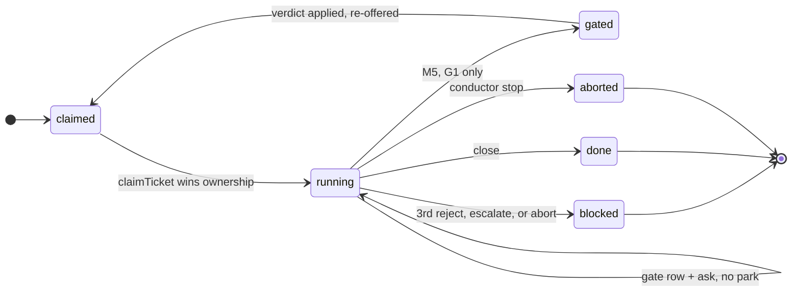
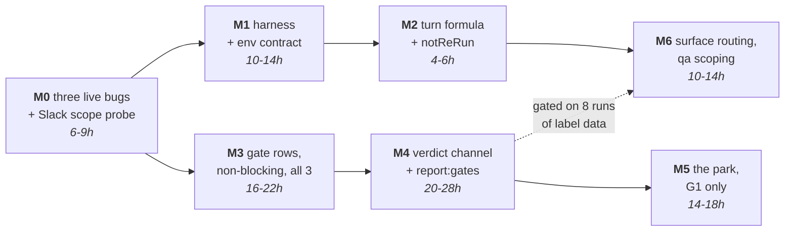
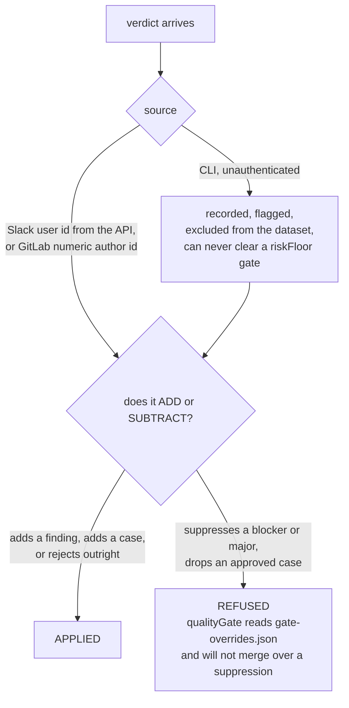
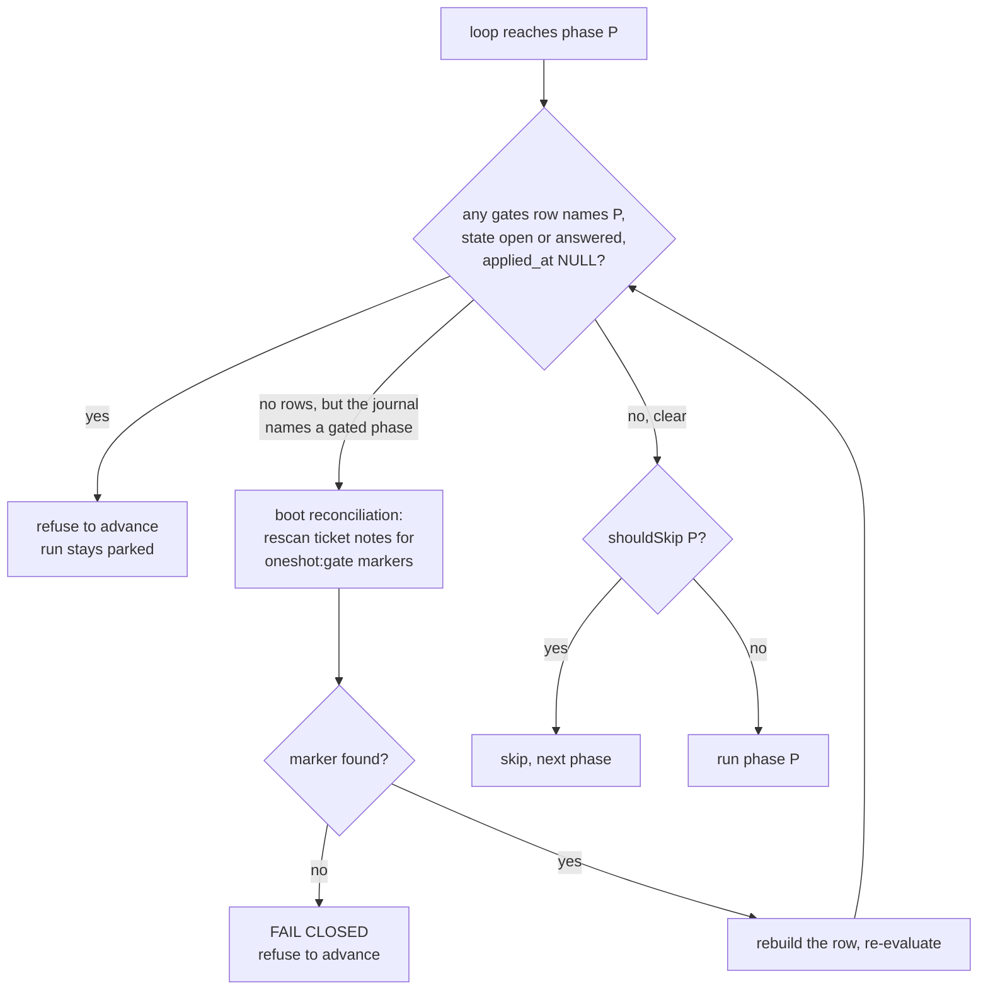

<!-- AUTHORITATIVE. Supersedes 01 and 02 where they conflict. -->
# Oneshot Confidence Gates — Remediation and Revised Build Order

*Chief architect's ruling. Every claim below is checked against the tree at `/Users/hassam.azam/Documents/oneshot` and `/Users/hassam.azam/Documents/erp` as read today. Finding ids are namespaced: **D**=distributed, **S**=security, **M**=measurement, **O**=operator.*

---

## 0. What the replay actually showed

I re-ran the adversaries' two load-bearing empirical claims myself rather than taking them.

**The C axis is a constant.** Over the four runs that reached the gated phases (#16, #18, #20, #21), all twelve gate opportunities record `plan/testcases/review` as `ok` — so `failedLapsOf` is 0 for every gated phase. No gated phase writes a `<phase>-partial.json` (`runner.ts:594` salvages only `verify`/`qa`). `implement.lintClean` is `true` 4/4, so the G2 cross-check never fires. `recall.priorTickets` is `[]` 4/4. Every remediation in every journal is timestamped at or after `testcases` — none exists at G1, and only #16's (`fixed:true`, −0.10) exists at G2. `plan.reuse` is 6/6/6/11, so the +0.05 fires every time. **C = 0.90–1.00 on 12 of 12. `confBand` has one observed value.**

**The R axis is saturated.** `blastRadius` is 7/8/10/9 against a cap reached at 4; `unknowns` is 7/10/10/9 against a cap reached at 3; `risks` is 7/7/7/8, all ≥3. That is +0.51 before anything ticket-specific. G1: medium ×3, high ×1. G2/G3 (adding the high-blast term, 8/6/6/11 cases): **high ×4**. `riskBand === 'low'` is unreachable; the `auto` cell cannot exist; the autonomy ladder would relax the *highest*-risk stratum first because it is the only one that accumulates n.

**The failure mass is elsewhere.** 22 failed `phase_runs` rows: `mr` 4, `merge` 4, `verify` 4, `deploy` 3, `research` 3, `testcases` 2, `review` 1, `implement` 1, **`plan` 0**. `mr+merge+deploy` = 50% of all failures and are permanently gate-free by hard rule. Three of seven runs died at `research` before G1 could fire. All seven runs live inside one 25.2-hour burst — there is no measured weekly rate, so every "weeks to months" estimate in the HLD is an n=1 extrapolation.

Three of the four adversaries independently found the same thing from different directions. That is not four opinions; that is a measurement.

---

## 1. Triage table

### Fatal

| id | Title | Ruling | Justification |
|---|---|---|---|
| D-01 | One reply answering two gates applies only the first | **ACCEPT-FIX** | Verified against the DDL: `UNIQUE(source_id)` alone + `ingested===0 → superseded` before the CAS. One message, two clauses, one applies. `UNIQUE(gate_id, source_id)`. |
| D-02 | Any park that loses journal status ships the gate unasked | **ACCEPT-FIX** | Verified: `writeJournal` is a bare `writeFileSync` (`artifacts.ts:118`), `decideResume` falls through to `fresh` on an unknown status, `shouldSkip` steps over `ok` records. This is decision (d). |
| D-03 | Reject silently refunds every retry budget in the run | **ACCEPT-FIX** | Verified at `unblock.ts:250`: with `forcePhase` set and `only` undefined the second disjunct drops every non-`ok` record in every phase. `failedLapsOf` resets to 0 fleet-wide. |
| S-01 | A phase can self-approve its own gate via unguarded Bash | **ACCEPT-FIX** | Verified: `hooks.ts:143-146` attaches write-scope to Write/Edit only, Bash gets git-guard + deploy-guard; `phase.ts:290` is `bypassPermissions`. Decision (c). |
| S-02 | G2 amend either bypasses `qualityGate` or is inert | **ACCEPT-FIX** | Verified `codephases.ts:819-843`. A `noise` suppression of a blocker/major edits the only deterministic merge veto in the system. |
| S-03 | An ask that never landed still auto-proceeds on a timer | **ACCEPT-FIX** | `expires_at` stamped at open, `asked_at` at delivery, 6 of 9 cells default `proceed`, `slack.ts:52` swallows every failure. Clock must start at `asked_at`. |
| M-01 | Holdout gates expire on the tick they open | **ACCEPT-FIX** | `A('notify', 0, …)` promoted to `ask` never raises the TTL. Correct and lethal. Moot under decision (a) but the invariant ships anyway. |
| M-02 | Confidence axis is a constant on every gate that can exist | **ACCEPT** | Replayed independently. 12/12 `high`. Decision (a). |
| M-03 / O-01 | Risk saturated; stratifier has no variance; ladder inverted | **ACCEPT** | Replayed independently. Caps are hit at 2–3× by every run. Decision (a). |
| M-04 | Rubber-stamp detector is agent-self-reported and never fires | **ACCEPT-FIX (modified)** | `regressions[]` is agent-authored, `[]` 4/4, and costs a lap when non-empty. Primary detector becomes M-05's reading token; canary **deferred** — see §7. |
| O-02 | Human minutes never costed; six parks in 100 minutes | **ACCEPT** | Timestamps confirm three G1 boundaries in four minutes and three G2/G3 by 20:09. Decision (b). |
| O-03 | Phase 0 ambiguity: "every gate asks" vs "no auto cells" | **ACCEPT-FIX** | Two incompatible rules, one tenfold apart in operator cost. Resolved by a declared assignment probability. |

### Major

| id | Title | Ruling | Justification |
|---|---|---|---|
| D-04 / S-05 | `claimOwnership` cannot see `'gated'`; two conductors resume | **ACCEPT-FIX** | Verified `db.ts:304` filters `claimed\|running`; `foreign` is empty so `claimOwnership` returns true unconditionally. One duplicate, one edit. |
| D-05 | `gate_id` omits `run_id` while every index and reader keys on it | **ACCEPT-FIX** | Content addressing was promoted to identity without checking the run-scoped indexes built on it. |
| D-06 | G3 re-asked on every later lap after an amend | **ACCEPT-FIX** | Closed by the same edit as S-02: the conductor never rewrites `testcases.json`. |
| D-07 / O-08 | Harness writes its partial to a path that does not exist | **ACCEPT-FIX** | Verified: `grep ONESHOT_RUN_DIR ONESHOT_BASE_URL` returns nothing in the tree. `phaseEnv` (`ids.ts:51-65`) sets neither. |
| D-08 / S-06 | Human-authored text reaches a `bypassPermissions` prompt | **ACCEPT-FIX** | `locref` paths and `addspec` scenarios are human prose inside the "structured" payload and render verbatim via `prompts.ts:172-179`, `:623`. |
| D-09 | Park decision ignores `openGate`'s answer | **ACCEPT-FIX** | Verified the `package` group (`ui-evidence`+`mr`) is a second clean boundary; artifacts still on disk re-derive applied rows and re-park. |
| D-10 | Warm server never reaches the phase it warmed; pass 2 leases an occupied port | **ACCEPT-FIX (scoped)** | (b) verified against `worktrees.ts:147-153`, whose comment forbids exactly this. (a) is real but mostly moot — the gate-park warm server is cut (O-07). |
| D-11 | Two incompatible `gate_answers` DDLs across LLD parts | **ACCEPT-FIX** | Straight contradiction. One DDL, the union, in Core §1. |
| D-12 | Two different `verify.maxTurns` formulas; `previousLapCap` has nowhere to live | **ACCEPT-FIX** | Verified `phase_runs` has no cap column but does have `detail`. Take UIVerify's derivation; carry `timeoutMin` with it. |
| D-13 | Pre-upgrade `testcases.json` routes a UI list to a shell script | **ACCEPT-FIX** | Fail expensive: absent `surface` defaults to `'ui'`. |
| D-14 / S-13 | `call()` cannot GET; poll cadence has no scheduler; expiry-escalate writes without ownership | **ACCEPT-FIX** | Verified `slack.ts:34-46` hardcodes POST+JSON. The transport as specified cannot be made. |
| S-04 | A workspace member can starve the poller into the timeout default | **ACCEPT-FIX** | Per-message watermark, newest-first, and `expireGates` refuses to decide on a poll that did not reach the thread end. Cheap. |
| S-07 | Gate dataset commits internal ticket content to a personal GitHub repo | **ACCEPT-FIX** | Verified: `origin` is `github.com/HassamAzam/oneshot.git`. Export by explicit field allowlist, to a gitignored path or internal GitLab. |
| S-08 | Sibling `check`-group phases can rewrite each other's artifacts | **ACCEPT-FIX** | Verified: `testcases` and `review` both declare `writes:['run']` and dispatch concurrently. Narrow the scope to `<phase>-*`. |
| S-09 | No revocation path; allowlist grants a delegable identity | **ACCEPT-FIX in part, REJECT in part** | Uncached read + doctor membership check: accepted, cheap. **Reject** the "two channels for any `high` risk band": R is `high` on 4/4 G2/G3, so this makes dual confirmation the norm and doubles the cost of every verdict against a threat strictly rarer than S-01. Fix the local write first. |
| S-10 | GitLab verdicts not tamper-evident; bot-id resolution has no failure policy | **ACCEPT-FIX** | `created_at === updated_at` is one comparison; bot-id must FAIL CLOSED — the ask body contains the grammar. |
| S-11 | The park is weaker than the block it replaces; its only lock is deletable cache | **ACCEPT-FIX** | `db.ts:2-4` blesses `rm -rf state/`. Converges with D-02 into decision (d), plus a GitLab-side reconstruction leg. |
| M-05 | The cheapest reply is the maximum score on every metric | **ACCEPT-FIX** | Bare `approve` scores precision 1.0, recall 1.0, re-label rate 0. Reading token required for a verdict to be *scored*. |
| M-06 | Two agent-authored C terms lower oversight, contradicting the monotone claim | **ACCEPT-FIX** | Delete both. Verified the +0.05 fires 4/4 and the gotchas term never has. |
| M-07 | `skill_sha` cannot identify a version here | **ACCEPT-FIX** | Verified: `test-case-writing`, `ticket-recall`, `ticket-research` are **untracked** — `git rev-parse HEAD:` errors. The two tracked skills return the committed blob under a never-commit policy. Replace with a composed-tree digest. |
| M-08 | The unit is a runtime-chosen skill set, not a skill | **ACCEPT-FIX** | Verified structurally: `plan` declares 2 skills, `review` 2, `implement` 6; `cfg.agents` is read by no code and the real list is computed in `prompts.ts:699-705`. Score treatment tuples, not names. |
| M-09 | The holdout measures a configuration that never ships | **ACCEPT-FIX** | Freeze effort during calibration; a sampled decision must run the shipped configuration. |
| M-10 | Omitting the band does not control anchoring | **ACCEPT-FIX** | Constant TTL, one message shape. Leak (a) — being asked at all — is closed only by randomization. |
| M-11 | Set-difference deltas are one cluster, not twenty observations | **ACCEPT-FIX** | Correct statistics. Trial unit is the gate. Free to fix, fatal to leave. |
| M-12 | Wilson threshold unreachable at n=20; n=20 is far away | **ACCEPT-FIX** | `20/(20+3.84)=0.839`. Declare threshold and min-n together, derived. |
| M-13 | Gates contaminate dev's only measurement channel, with no control arm | **ACCEPT-FIX** | Randomization supplies the ungated arm; amended laps tagged and never pooled. |
| M-14 | The metric with power over the pipeline rewards conservatism | **ACCEPT-DEFER** | Correct, but relaxation is ≥6 months away at observed volume. Two-sided relaxation is written into the config `_why` now, implemented when a cell approaches min-n. |
| O-04 | G2+G3 in one park spends the whole timeout budget in one expiry | **ACCEPT-FIX** | Count timeouts per *park*. Add 24h-silence self-demotion — a kill switch needing three restarts is one nobody throws in time. |
| O-05 | Gates sit on the three phases that have never caused a failure | **ACCEPT-FIX (as prose)** | Verified: `plan` 0 failures, `mr+merge+deploy` 11/22. Not a defect to fix; a sentence the report must carry. |
| O-06 | The seam's stated rationale is factually wrong about `review` | **ACCEPT-FIX, REJECT the remedy** | Verified: `codephases.ts:809-812` and #21 (`review ok`, verdict `changes-requested`). Delete the false sentence. **Reject** skipping G2 — that discards 25% of G2's historical data. Instead G2 on `changes-requested` writes its row non-blockingly and never parks. |
| O-07 | The one UI saving attributed to gates is defeated by the park | **ACCEPT the conclusion, REJECT the mechanism** | macOS sleep suspends a process; it does not drop a bound listener, so `portListeners` still finds the pid on wake. The conclusion stands on capacity: a 4–8h park holding 1 of 3 pool ports is a real cost and pass-2 preemption evicts it anyway. Cut the gate-park warm server; keep the verify→ui-evidence handoff. |
| O-09 | The deliverable the project exists for has no design | **ACCEPT-FIX** | §9 below. |
| O-10 | Total-consumption grammar does not survive a phone | **ACCEPT-FIX** | Split the surfaces: approve is a reaction, amend is a desk activity. |
| O-11 | Reject desynchronises `lap` from `quota_usage` | **ACCEPT-FIX** | Verified `quota.ts:165-172` (`perAttempt × (lap+1)` vs undeleted `phaseUsage`) and `unblock.ts:346-348`, which refunds for exactly this reason. Latent only because `budgets.json:11` is `enabled:false`. |

### Minor

| id | Title | Ruling | Justification |
|---|---|---|---|
| S-12 | Reject apply is not atomic; a crash re-prunes the approved plan | **ACCEPT-FIX** | Mark applied first; the prune is already idempotent. Two lines. |
| O-12 | Inbound Slack is greenfield on an unverified scope | **ACCEPT-FIX** | Verified `verifyAuth` (`slack.ts:161`) has **zero call sites**. Hour-one probe, before any design commitment. |
| O-13 | Ratifying 20 `surface` labels trades scarce human minutes for abundant machine ones | **ACCEPT-FIX** | 10 operator minutes to save ~14 machine minutes, against `budgets.json:11` disabled. Keep the label, cut the in-park ratification, audit in batch. |

**Already covered:** none. Every finding names something the design got wrong or left undecided.

---

## 2. Design changes to the HLD

**§1, the invariant.** Before: *"a gate is a park, never a hold… the gate row is the lock."* After: *"a gate is a **row**, never a hold. The row is written at every boundary unconditionally. Whether it parks is a separate, randomized, and initially-off decision. When it does park, the lock is a **phase-list invariant** — no phase may be stepped over while a gate row names it with no `applied_at` — and the gate row is only its index."* Closes D-02, S-11.

**§3, the state diagram.** `finish(j,'gated')` is no longer the only park path and is not on the milestone-1 critical path at all. The `operator abort ──► aborted (gate row survives, re-asked on resume)` edge is deleted: it is false, because resume enters at i=0 and `shouldSkip` walks past every `ok` record. Replaced by the loop-level refusal. Closes D-02.

**Diagram 1 — the run lifecycle as ruled.** The important edge is the self-loop: in M3–M4 a boundary
writes a gate row and posts a real ask, and the run *keeps going*. Only M5 introduces a park, only on
G1, and only when `askProbability` selects it or `riskFloor` forces it.

A parked run holds no port lease, no promotion lease, no dispatch slot and no conductor liveness, so
the conductor that asked may die between `gated` and `claimed` without costing anything.

**§3, gate placement.** Add: *"G2 never parks. Its verdict is a measurement and, where it adds a finding, an input to the next `implement` lap; its negative verdict is already a deterministic merge veto in `qualityGate()` (`codephases.ts:819-843`), so a park buys nothing the machine will not enforce four phases later. G3 never parks: the list it approves is not executed until phase 6, so a verdict landing before `verify` starts is exactly as binding without a park. **G1 is the only gate that may park**, because it is the only one where a wrong artifact is compounded by everything downstream and where a reject is trivially cheap — nothing downstream exists yet."* Closes O-02, O-05, O-06, O-07; carries decision (b).

**§4, the C×R matrix — deleted.** Replaced by: a single declared assignment probability `askProbability` (start 0.6), one non-random override (`riskFloor`: any `plan.steps[].files` under `apps/auth/`, `common/permissions.py`, `apps/payroll/`, `apps/leaves/`, `apps/project_logs/` **or their frontend mirrors** `frontend/src/components/{leaves,payroll,project_logs}/` always asks and always blocks), one constant TTL across every asking gate. C and R are computed, stored, and **scored as predictions**; neither is an assignment rule. The two agent-authored C corroboration terms are deleted; the `blastRadius`/`unknowns` cap terms are deleted as constants. Closes M-01, M-02, M-03, M-06, M-10, O-01, O-03; carries decision (a).

**§4, anti-gaming.** Before: *"Agent-authored fields are monotone raise-only."* After: *"No agent-authored field may raise C or lower R — asserted as a property test over the term table in `verify-gates.ts`, so a future term cannot violate it silently."* Closes M-06.

**§5, the scoring table.** Rows are renamed from skill names to **boundary + treatment tuple**. `skill_sha` is replaced by `skills_digest` (sha256 over the sorted (relative-path, content-sha256) list of the composed `.claude/skills` tree `claudedir.ts` materialises) plus the resolved skill and subagent lists parsed from the transcript. Add: *"n_gates and n_deltas are printed separately; deltas are clustered within a gate and the trial unit is the gate."* Closes M-07, M-08, M-11.

**§5, validity.** Add the base-rate paragraph verbatim from §0 above, and: *"dev's consequence numbers describe a pipeline that includes a human from the moment G1 lands. Amended and unamended `implement` laps are reported separately and never pooled."* Closes M-13, O-05.

**§5, graduated autonomy.** Add the arithmetic: `LB = n/(n+3.8416)`; a threshold of 0.90 requires n ≥ 37 clean gates; declare threshold and min-n together in `config/gates.json` with the arithmetic in its `_why`; a stratum with fewer than k=8 distinct tickets never relaxes. Closes M-12, M-03's inverted-ladder half.

**§6, prerequisites.** Promote (i) heartbeat off `tick()`, (ii) the sleep-discontinuity reap guard, (iii) atomic artifact/journal writes from "prerequisites this design does not get to skip" to **"three bugs in the shipped system today, which ship first and alone."** All three verified: `heartbeat()` has exactly two call sites (`index.ts:247`, `:344`); `reconcileForeignRuns` buries on `owner_seen_at < now - TTL` with no discontinuity test; `writeJournal`/`writeArtifact` are bare `writeFileSync`.

**§8, UI verification.** Delete *"The gates make this cheaper, and G3 is why."* Replace with: *"The UI programme is independent of the gates and ships first. The measured 300→75 turn drop came from a driver file surviving in `.verify-scratch/`; making that survival deliberate needs no human in the loop."* Closes O-07.

**§10.** Question 5 (`qa` subsetting) stands. Questions 1 (holdout) and 4 (Socket Mode) are closed by decision (a) and by the batch surface respectively. Question 2 (run volume) is upgraded to a blocker on any calibration claim. Question 3 (second rater) is upgraded: the rubber-stamp detector is not credible with one rater who authors the skills.

---

## 3. Design changes to the LLD

### Core

- **One `gate_answers` DDL**, the union of both parts: `gate_id, verdict_source_id, source, channel_id, thread_ts, actor, actor_name, verdict, deltas_json, raw_sha256, note_redacted, parsed_json, parse_status, received_at, applied_at`. `UNIQUE(gate_id, verdict_source_id)` — **not** `source_id` alone. `outcome` is deleted; `parse_status` subsumes it. Final stamp keys on `WHERE gate_id=? AND verdict_source_id=?`. (D-01, D-11)
- **`gate_id = sha1(run_id | gate | artifact_sha)`.** The degraded-`check`-group case is handled explicitly: before opening, look up `(run_id, gate, artifact_sha)` and skip if already `applied`. (D-05)
- **The artifact of record is immutable.** The conductor never rewrites `testcases.json` or `findings.json`. Amendments live in `state/runs/<iid>/gate-overrides.json`. `qualityGate()` reads it explicitly and **refuses to merge over a suppressed blocker/major**, full stop, under the authority ruling in decision (c). (S-02, S-08, D-06)
- **The park is a loop invariant.** Immediately before `shouldSkip` at `runner.ts:718`: refuse to advance past phase P while any gate row for this iid names P with `state IN ('open','answered')` and no `applied_at`. Fail closed: a journal whose records include a gated phase and whose `gates` table is empty refuses to advance until boot reconciliation has re-scanned the ticket's notes for `<!-- oneshot:gate -->` markers. (D-02, S-11)
- **`claimOwnership` sees `'gated'`.** Split the query: `activeRowsFor` keeps `claimed|running` for capacity; a new `ownableRowsFor` adds `'gated'` for the claim, and `runs_one_active_per_iid` is widened to match. (D-04, S-05)
- **The reject prunes one phase.** `doomedRecords(j, { only: g.phase, forcePhase: g.phase })`, never `only: undefined`. `markApplied` runs **before** the prune. Quota rows for the pruned phase are deleted, same statement as `unblock.ts:346-348`. (D-03, S-12, O-11)
- **The seam parks only on rows it opened.** `const opened = asks.filter(a => openGate(a) === 'opened' && a.parks)`, and `decideGates` is scoped to `members`. (D-09)
- **`--as` is deleted.** See decision (c).
- **`export-gates.ts`** writes an explicit field allowlist (gate id, boundary, bands, verdict, actor id, timings, delta *ids*) to a **gitignored** `state/exports/gates.jsonl` with a documented backup — never to a git-tracked path in a repo whose origin is `github.com/HassamAzam/oneshot.git`. (S-07)
- **Delete Core §6's turn formula.** UIVerify §5's derivation wins; `timeoutMin` travels in the same `turnScale` object; `previousLapCap` is stored in the existing `phase_runs.detail` JSON. (D-12)

### Channel

- **`call()` learns GET + querystring + `Retry-After`** before anything else in this part is written. The doctor probe must assert a *successful* `conversations.replies` against a real thread, not the absence of a scope error. (D-14, S-13)
- **Clock starts at `asked_at`.** `openGate` refuses to insert `state='open'` with `expires_at <= opened_at`. A gate with `asked_at IS NULL` **never** expires to `proceed` — it escalates to `blocked` with the `@mention`, which is behaviour that already exists and works. (S-03, M-01)
- **Watermark advances per message, newest-first**, and `expireGates` refuses to decide on any gate whose last poll did not reach the thread end. (S-04)
- **No human token reaches a prompt.** A `missed` locref carries a path validated against the worktree's git index plus a line number, and nothing else. `addspec` scenarios are stored for the dataset and **never** prompted; an added case is obtained by re-running `testcases` with a conductor-authored note. The invariant sentence in §4 is rewritten to match. (D-08, S-06)
- **Timeouts are counted per park**, not per row; 24h with no verdict from any allowlisted actor self-demotes every open and future gate to notify-only and says so on the card. (O-04)
- **The allowlist is read uncached at every verdict.** Doctor resolves each id to an active member. GitLab notes require `created_at === updated_at` and store `raw_sha256`; the bot id FAILS CLOSED. (S-09, S-10)
- **Grammar splits by surface.** `approve` is a reaction (`reactions:write`, already the one optional scope). Every `amend` and `reject` goes through `npm run gate -- <iid> --review`, a local page rendering the artifact and writing `deltas_json` directly. Case-insensitive terminals and smart-quote normalisation are mandatory for the text path that remains. (O-10)
- **A verdict is scored only if it carries a reading token** — a named noise id, a named missed locref, a named drop/add, or the literal `read:none`. Bare `approve` is operationally accepted and recorded `parse_status='unscored'`. (M-05)

### UI-verification

- **`phaseEnv` gains `ONESHOT_RUN_DIR`, `ONESHOT_BASE_URL`, `ONESHOT_HARNESS`, `ONESHOT_PLAYWRIGHT`** in one edit, and `harness.js` throws at require time if `ONESHOT_RUN_DIR` is unset. The smoke test asserts the partial appears under `state/runs/<iid>/`. (D-07, O-08)
- **The salvage guard keeps its freshness comparison but not its coupling to it**: `fresh = (partial?.startedAt ?? 0) >= r.startedAt` is correct only once `ONESHOT_RUN_DIR` exists; both land together or neither does. (D-07)
- **Absent `surface` defaults to `'ui'`.** Fail expensive. (D-13)
- **The warm server is a verify→ui-evidence handoff only.** No gate-park warming. `leasePortFor` gains a `prefer` argument so a run gets its own warm port; pass-2 preemption kills and **waits** for `portListeners` to empty before the INSERT, honouring `worktrees.ts:147-152`. (D-10, O-07)
- **In-park `surface` ratification is cut.** The label ships; disagreement is audited in the batch review. (O-13)

---

## 4. The open-loophole register

Everything still unclosed after all of the above. Short on purpose.

| # | Residual risk | Why accepted | Tripwire |
|---|---|---|---|
| 1 | **A phase session can still forge a verdict.** The Bash guard raises the cost from one command to a deliberate forgery; it does not make it impossible on a single-user machine with `bypassPermissions`. | No achievable authority model on this machine defeats a determined local session. What *is* achievable is removing the incentive: a forged verdict can only ADD work, never subtract a merge blocker. | Any `gate-guard.cjs` denial recorded in `state/hook-events.jsonl` from a phase session. One is an incident, not a warning. |
| 2 | **No blocking gate on G2/G3.** A wrong findings list or a wrong case list proceeds. | `qualityGate()` already vetoes the merge on `changes-requested` or any blocker/major; G3's list is not executed for two more phases. The park buys latency, not safety. | A `verify` or `qa` failure whose root cause is a case the human would have added at G3, or a finding he would have added at G2. Two of these and G3 gets a park. |
| 3 | **A wrong plan is implemented before the human sees it**, except on high-scrutiny paths. | Decision (b): the operator explicitly trades this for shipping the dataset. `plan` has 0 failures in 22. | `implement` lap count rising, or any G1 `reject` arriving after `implement` has already run. Three in a month and G1's park becomes unconditional. |
| 4 | **One rater, who also authors the skills.** Every label is confounded with his priors. | HLD §10.3 conceded it; no fix exists that Hassam can execute alone. | The report prints `raters=1` on every page. It cannot be silenced. |
| 5 | **`qa` has n=1.** Every qa number, including the 63% verify/qa agreement that motivates re-scoping qa, is one observation. | It is the truth. The report refuses to render qa scores. | n≥4 unlocks the section; until then the number is printed as `n=1`. |
| 6 | **A stale bundle can pass verify green.** `rev-parse HEAD` proves the checkout moved, not that webpack recompiled. | No build marker exists in the ERP app to compare against. | Any `verify` pass followed by a `qa` fail on the same case id. |
| 7 | **`surface` routing can hide a rendering bug.** Human ratification is cut (O-13); the label is agent-authored and audited only in batch. | Routing does not ship until milestone 5, after ≥8 runs of label data. | Any `regressions[]` entry or `qa` fail on a case labelled `api`/`orm`. One event disables routing for that module permanently. |
| 8 | **Slack scope is unverified.** `verifyAuth` has zero call sites; nobody has observed what this app holds. | Costs one probe to close, and it is milestone 0's first task. | A `missing_scope` on `conversations.replies` re-decides the transport as GitLab-note-plus-CLI, a materially smaller build. |
| 9 | **A poll flood can still delay a verdict** past a deadline on the restricted Slack tier. | Newest-first + the starved-poll refusal converts loss into latency. Latency on a non-blocking gate costs nothing. | The timeout:answer ratio in `doctor`. Above 30% the gates are theatre. |
| 10 | **`state/` is still deletable and the gate table dies with it.** Boot reconstruction from GitLab markers needs the VPN up. | Fail-closed refusal (§3) converts data loss into a refusal to advance, which is the safe direction. | Any boot where a journal names a gated phase and the reconstruction found no marker. `doctor` FAILs. |

---

## 5. The revised build order

Estimates are for one person who knows this codebase. They assume no Jest, `verify-*.ts` assertions, and the repo's existing `_why` discipline.

**Diagram 4 — build order and what depends on what.** M0 is three bugs live in the shipped system
today; two of them corrupt any gate data collected before they land, which is why nothing else may go
first. M1–M2 are the UI-verification programme and need no human anywhere.

**M0 — Three bugs, shipped before anything else. 6–9 h.**
These are defects in the shipped system today, independent of gates, and two of them will corrupt any gate data collected before they land. (i) `setInterval(heartbeat, 15_000).unref()` armed in `main()` — verified `heartbeat()` has two call sites and a `--ticket` run goes silent until a peer buries its port lease and promotion lock. (ii) `reconcileForeignRuns` refuses to reap when `now - last_tick_at > 2 × CONDUCTOR_TTL_MS`. (iii) tmp + `renameSync` in `writeJournal` and `writeArtifact`. Plus: call `verifyAuth()` from `doctor` and fire one real `conversations.replies` probe (O-12), because the answer re-decides milestone 3's transport.
*Exit:* `fleet:verify` green with the interval armed; a simulated 8h clock jump reaps nothing; a `kill -9` mid-write leaves a readable journal; doctor prints the Slack team, bot user id, and the exact scope set.
*Rollback:* `git revert`; four independent commits.

**M1 — The harness and the env contract. 10–14 h.**
`skills/local-browser-verify/scripts/harness.js` with `record`/`shot`/`retry`/`waitForData`/`readByHeader`/`session`/`runCases`, atomic partial write, supersede-by-seq. `phaseEnv` gains all four variables. Teardown contradiction inverted, absolute Playwright path, `setsid`→`nohup`. Salvage freshness guard. Harness smoke test in `npm run check`.
*Exit:* one real `verify` run at ≤5 turns/case against the 8–15 pre-harness band; zero `find /` calls in the transcript; the partial lands under `state/runs/<iid>/`.
*Rollback:* delete the "require the harness" prompt paragraph; the file goes inert. The salvage guard stays — it is correct independently.

**M2 — Turn formula + `notReRun[]`. 4–6 h.**
`turnScale {base:160, perCase:10, max:450}` with `timeoutMin` in the same object, applied in `runOne` via `withDerivedTurns`, `previousLapCap` in `phase_runs.detail`. `QA_SCHEMA` gains required `notReRun[]`, defaulting `[]`, **before** any scoping exists.
*Exit:* an 8-case list reserves 240 instead of 450; `ui-evidence` rows at cap fall from 2/4 to 0; `notReRun[]` prints on the ticket.
*Rollback:* drop `turnScale` from `phases.json`; the function returns `p` unchanged.

**M3 — Gate rows, non-blocking, all three gates. 16–22 h.**
`state/gates.db` (separate file), the unified DDL, `gates.ts` with `openGate`/`applyVerdict` CAS/`expireGates`, `confidence.ts` as a pure scorer, the seam at `runner.ts:697` writing rows and posting a notify — **no park, no `'gated'` status, no resume changes.** `gate-guard.cjs` FAIL_CLOSED. `skills_digest`. `scripts/gate.ts` with the authenticated-source rule. GitLab ask notes with markers.
*Exit:* three consecutive runs each produce three gate rows with C, R, digests, and a posted ask; `verify-gates.ts` proves ONE VERDICT (both the distinct- and identical-`source_id` shapes, plus one `source_id` across two gate ids), IDEMPOTENT ASK, and the scorer property test (no agent field raises C or lowers R); zero rows where `expires_at <= opened_at`.
*Rollback:* `ONESHOT_GATES=off`. Rows still written, nothing posted.

**M4 — The verdict channel and the review surface. 20–28 h.**
`call()` GET + `Retry-After`; the poller with per-message watermark, poller lease, bot/self filter, authenticated actor; `npm run gate -- <iid> --review` as the desk surface that writes `deltas_json`; reaction-as-approve; reading token; `npm run report:gates` (§9); `export-gates.ts` with the field allowlist.
*Exit:* one real amend verdict round-trips from Slack into `deltas_json` with an authenticated actor; `report:gates` renders the census and refuses every score below min-n; a second, later reply is recorded `superseded` and never applied.
*Rollback:* the poller is one `setInterval`; unarm it. Rows and the CLI surface survive.

**M5 — The park, G1 only. 14–18 h.**
The phase-list invariant before `shouldSkip`; `'gated'` in the `Control` union, `RunJournal`, `ownableRowsFor` and `runs_one_active_per_iid`; `gatedForced` persistence; the single-phase reject prune with quota refund and mark-applied-first; GitLab-marker boot reconstruction with fail-closed refusal; randomized assignment at `askProbability` with the path floor override.
*Exit:* `verify-gates.ts` proves PARK IS NOT A HOLD, LOCK IS THE ROW, two children racing a gated resume with exactly one winner, a reject leaving `failedLapsOf('implement')` unchanged, and a wiped `state/` refusing to advance past `plan`.
*Rollback:* `askProbability = 0` and the path floor to notify. The invariant is inert with no unapplied rows.

**M6 — `surface` routing, qa scoping, ui-evidence curation. 10–14 h.** Only after ≥8 runs of label data. Gated on the batch-audited disagreement rate being <20%.

Total to a complete dataset (M0–M4): **56–79 h.** Total to the full stated ask (through M5): **70–97 h.**

---

## 6. The minimum viable subset

**If Hassam builds one milestone this month, it is M1 — with M0 as its unavoidable 6–9 h preface.** Fifteen to twenty-three hours.

He gets: the measured 300→75 turn drop made deliberate rather than accidental; a `verify` that cannot silently write its partial to nowhere; a `ui-evidence` that stops re-paying a webpack compile; the end of two-minute `find /` scans; and three real bugs closed — a heartbeat that goes silent on `--ticket`, a boot sweep that buries every live run after a sleep, and a journal that reads as `null` when a write is truncated. That last one restarts a ticket from phase 0 without archiving, which is a data-loss bug live in the system right now.

He does not get: a single gate, a single labelled verdict, or one row of the skill dataset. Nothing about plan, review or qa strength is measured.

**That is the operator adversary's challenge answered directly, and I am rejecting his framing of it.** He is right that M0–M2 is the highest ratio of measured value to hours in this entire document, and right that it is the only part touching Hassam's named complaint. He is wrong that it should displace the ask. The user asked for an instrument to measure four skills; a 4× speedup on `verify` measures nothing. M1 is the right *first* month because it is a prerequisite for trustworthy gate data — a `verify` that dies at its cap and salvages a stale partial poisons the consequence track that G2's scores are validated against. It is not a substitute for the ask, and I will not present it as one.

---

## 7. What we are choosing not to build

- **The 3×3 C×R policy matrix.** One reachable cell on real data. Replaced by one probability and one path floor.
- **The blocking holdout.** Under randomized assignment every asked gate is drawn from the same population, so a separate holdout has nothing left to sample. Its `ttl=0` bug (M-01) dies with it.
- **Tier demotion and risk-scaled subagent counts, during calibration.** Effort as a function of the stratifier makes skill quality unidentifiable (M-09). Frozen. Revisit as an explicit A/B after a baseline exists.
- **G2 and G3 parks.** Decision (b). `qualityGate()` already enforces G2's negative verdict; G3's list is not executed for two phases.
- **The gate-park warm server.** Its stated value depended on a park we are not building; its stated failure mode (sleep drops the listener) is wrong; its real cost — holding 1 of 3 pool ports for hours — is not. The verify→ui-evidence handoff, where all the measured value actually is, survives.
- **In-park `surface` ratification.** Ten operator minutes to save fourteen machine minutes, against disabled token ceilings.
- **Socket Mode, `files:write`, `reactions:read`, `users:read`, `im:*`, `chat:write.public`.** Unchanged from the LLD, and now the scope list in `.env.example:36-37` gets trimmed to what is actually used, so it stops describing an install nobody made.
- **Rubber-stamp canaries, for now.** The reading token is the honest detector and costs nothing. A disclosed canary aimed at the person who wrote both the skill and the canary measures fatigue at best; it is not credible until a second rater exists. Deferred to M6+, and only then.
- **Beads and Gastown.** HLD §9 stands unchallenged by any adversary. Steal the three ideas; install neither.
- **Slash commands, modals, buttons, Block Kit.** No public request URL exists behind FortiClient.

---

## 8. The four decisions

**(a) Randomized assignment — ADOPT-MODIFIED.** I replayed both scorers myself and the degeneracy is exactly as reported: C is `high` on 12 of 12, R is `high` on 4 of 4 at G2/G3. A predictor with one value cannot be gated on, stratified by, or Brier-scored. Confidence-gating is dead and I am not going to show terms that rescue it, because on the data that exists there are none — every anomaly term fires only on the phases that are not gated.

The modification is threefold. First, randomization governs **whether the verdict blocks**, not whether the row is written: every boundary writes a row with C, R, artifact digest and skills digest, unconditionally and forever, because that row is the dataset and it costs nothing. Second, there is exactly one non-random override — the high-scrutiny path floor, extended to the frontend mirrors of the same modules, which always asks and always blocks. That is the one place where "the machine decided alone" is not an acceptable outcome, and it fired on 1 of 4 historical runs. Third, `askProbability` is a single declared number in `config/gates.json` with its `_why`, not a matrix; it starts at 0.6 because that is roughly what the observed distribution implies and because a number you can move in one place is a number you will actually tune.

C and R survive as scored predictions, and R keeps a small legible score built only from terms that varied across the four runs — `plan.migrations`, a `migration`-layer step, the path floor, max finding severity. The `blastRadius` and `unknowns` cap terms are deleted outright: they are constants wearing the costume of signals. Brier is not reported below n=30.

This one change closes M-01, M-02, M-03, M-06, M-10, M-13 and O-03, and it is the reason dev finally has a control arm.

**(b) Build order versus the batch alternative — BUILD ALL THREE INTERVENTIONS; DEFER BLOCKING.** The user asked for three interventions and he gets three: G1 on plan, G2 on the agent's code review, G3 on the test cases. Each is a real ask, on a real channel, with a real authenticated verdict, from M3 and M4. What is deferred is the park.

I am deferring it because the park is where the money goes and not where the data comes from. The phase-list invariant (decision d), the authority model (decision c), the resume path, `gatedForced` rehydration and the fail-closed boot reconstruction are roughly 30 of the ~85 hours and produce zero rows. Against that: the human-minute cost was never computed anywhere in the design, and the one real timing sample — six gate boundaries inside 100 minutes on a Sunday evening, against artifacts of 9–26 KB — says the blocking design's equilibrium is `g2 approve` typed on a phone, which the HLD itself calls the one bit worth nothing. And operationally the parks buy almost nothing: `qualityGate()` already refuses to merge over a `changes-requested` review or any blocker/major, and G3's list is not run until phase 6.

**What is plainly being deferred, and the cost:** under M3–M4 a human verdict does not stop a bad plan from being implemented. That is a real loss and Hassam must accept it knowingly rather than discover it. Two mitigations: the path floor blocks unconditionally at G1 from M3 on high-scrutiny modules — about 1 park a month at observed volume, and exactly where the loss would hurt; and M5 turns G1's park on generally, at four to six weeks' distance, informed by real data about what the verdicts actually said.

**Recommendation: M0 → M1 → M2 → M3 → M4, then decide M5 on the evidence.** The alternative — build M5 first — is defensible only if Hassam's real requirement is "a human must be able to stop a plan," in which case say so and I will reorder M5 ahead of M4. **This is his call, not mine.** I have told him what each order costs.

**(c) Authority — the verdict channel must be authenticated, and a human verdict may add but not subtract.** I verified the attack: `hooks.ts:143-146` puts write-scope on Write/Edit only and gives Bash git-guard and deploy-guard, whose local checks sit behind `if (!deploying) continue`; `phase.ts:290` is `bypassPermissions`; `sqlite3` is on PATH and `state/` is whitelisted for `cd` in git-guard. The reviewed agent can approve its own review with one command.

Ruling: `--as` is deleted as a free-form assertion. The only authenticated sources are Slack (`user`, populated by the API from the session, not the message) and GitLab (`author.id`, numeric). The gate store moves to `state/gates.db`, and a new `gate-guard.cjs` — FAIL_CLOSED, like deploy-guard — denies any phase-session Bash naming `gates.db`, `oneshot.db`, `scripts/`, `skills/` or `.env`. No phase has a legitimate need for any of them. CLI verdicts survive as an escape hatch, are recorded `verdict_source='cli'` and flagged unauthenticated, are excluded from the dataset by default, and can never clear a path-floor gate.

**Diagram 3 — the authority rule: a verdict may add, never subtract.** A gated phase runs
`bypassPermissions` with Bash unguarded by write-scope, so it can forge its own approval. The fix that
actually works is removing the incentive rather than the capability: the worst a forged verdict can do
is make the pipeline work harder.

**May a human verdict influence merge before that model exists? Additions yes, subtractions never.** A verdict may add a missed finding, add a case, or reject — a forged addition costs the pipeline effort and buys a forger nothing. A verdict may **not** suppress a blocker or major finding, drop a case, or otherwise remove an operand from `qualityGate()`. Artifacts are never rewritten; suppressions live in `gate-overrides.json`, `qualityGate()` reads it explicitly, and it cannot clear a blocker/major at all until the guard has shipped and been verified — and even then it needs a second authenticated channel. This closes S-01 and S-02 with one rule, and it means the residual forgery risk in loophole #1 is real but harmless: the worst a forged verdict can do is make the pipeline work harder.

**(d) The phase-list invariant — ADOPT, as a prerequisite for any park.** The distributed lens is right and its argument is the strongest single piece of analysis in the four attacks. The park as designed is enforced in one place, `decideResume`'s `status === 'gated'` clause, and that place reads a non-atomic `writeFileSync`. I verified all three desync paths: a second SIGINT hard-exits after the gate INSERT commits but before the journal write; `reconcileForeignRuns` rewrites the status to `aborted` on the next boot; and `rm -rf state/oneshot.db` is blessed at `db.ts:2-4`. In every case `shouldSkip` walks over three `ok` records and the run reaches `merge` with three unanswered questions.

The check goes in the loop, immediately before `shouldSkip` at `runner.ts:718`: refuse to advance past phase P while any gate row for this iid names P with no `applied_at`. Same discipline as `claimTicket`'s ownership test and `releasePromotion`'s conditional DELETE — the invariant test lives inside the statement that acts.

**Diagram 2 — the park is a loop invariant, not a status.** This is the D-02 / S-11 fix. A status flag
on a non-atomically written journal desynchronises on a hard SIGINT, a boot reap, or the `rm -rf state/`
that `db.ts:2` blesses — and then `shouldSkip` walks over three green records to `merge`. The check
therefore lives inside the loop that acts, immediately before `shouldSkip` at `runner.ts:718`.

I add one leg the lens did not ask for, because S-11 forces it: SQLite is declared deletable cache, so the invariant must be reconstructible without it. Boot reconciliation re-scans the ticket's GitLab notes for `<!-- oneshot:gate -->` markers before the first `scan()`, and a ticket whose journal names a gated phase with an empty `gates` table **refuses to advance past that phase** rather than treating absence as "no gate." Fail closed. When M5 lands, this invariant is the park; there is no other park.

---

## 9. The report surface

`npm run report:gates [--boundary G1|G2|G3] [--since <iso>] [--json]`. A `scripts/report-gates.ts` sibling of `scripts/doctor.ts`, deliberately outside `src/lib/report.ts`, whose stated scope omits cost and weight columns (`report.ts:6`).

**What it renders, in order.**

1. **The census, always, at any n.** Gates opened, asked, delivered, answered, unanswered, timed out, expired-undelivered, refused-by-parse, and **unscored** (bare approvals with no reading token). `n_gates` and `n_deltas` printed on separate lines and never conflated. The timeout:answer ratio. Assignment probability in force and the count of path-floor overrides.
2. **The base rates, unprompted, on page one.** Runs to date, completion rate, the failure distribution by phase, and the sentence: *"the three gates sit on the three phases with the fewest failures in the pipeline; 50% of observed failures are in `mr`/`merge`/`deploy`, which are permanently gate-free."*
3. **Per boundary, per treatment tuple** — `(skills_digest, resolved skills, subagent list)`, never pooled across tuples. For each: n_gates, verdict mix, and — at n_gates ≥ 12 — per-gate precision and per-gate recall as medians with bootstrapped intervals **over gates**, plus the `missed` rate, which is the one recall signal that does not come from the scored agent.
4. **The prediction track**, at n ≥ 30 only: Brier for C and R against the verdict, and a reliability table by decile.
5. **The rater track:** unscored fraction, median latency (flagged, never a weight), reading-token rate, unauthorised-attempt count, and `raters=N` on every page.
6. **Time to n:** answered gates per boundary, current weekly rate, projected date — refusing to project on fewer than four calendar weeks of data.

**What it refuses to render.** Any per-treatment score below n_gates = 12. Any calibration curve below n = 30. Any projection below four weeks. Any qa score at all until n ≥ 4. Any figure pooled across treatment tuples, or across amended and unamended `implement` laps. Any score computed on an unscored verdict. Every refusal prints the reason and the shortfall — *"G3: n=4, minimum 12, projected 2026-11 at the current rate"* — never a blank and never a placeholder.

**What it may honestly claim.** "Over N gates of this treatment, the human removed X% of findings as noise and added Y the review missed." "These are per-gate medians over N gates, not N×k independent trials." "Assignment was randomized at p=0.6, so this describes the shipped population, not a selected one." "This treatment's skills digest changed on <date>; n resets there."

**What it may never claim.** That any skill is stronger or weaker than another. That a threshold has been cleared. That confidence is calibrated, until the Brier section unlocks. Anything attributing a change in score to a skill when the treatment tuple moved. Anything about `dev` without the sentence that its consequence numbers describe a pipeline containing a human. And it may never print a number derived from a verdict whose actor was not authenticated.
